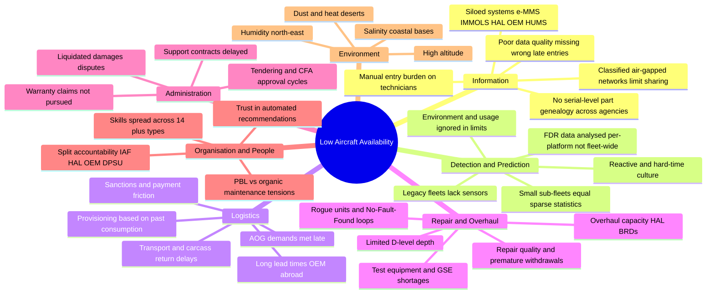
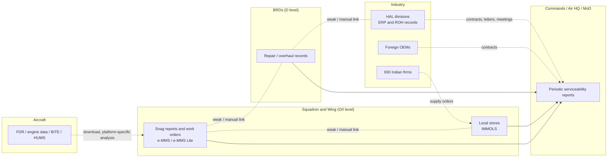

# NIRANTAR — Document 1 of 3
# The Problem: Low Aircraft Availability in India's Military Air Fleets

> **Project:** NIRANTAR — *National Intelligent Readiness & Airworthiness Network for Total Asset Reliability*
> (*nirantar* / निरंतर = "continuous, uninterrupted" — exactly what fleet availability should be)
>
> **Problem source:** Smart India Hackathon (SIH) 2026, Problem Statement **SIH26249 — "Air Power – Predictive Maintenance & Fleet Availability"**, Ministry of Defence (Defence Services Staff College), theme *Transportation & Logistics*.
>
> **This document:** a complete dossier on the problem: what it is, how big it is, where it comes from, why it is still unsolved, who suffers from it, and what any credible solution has to satisfy.
>
> **Companion documents:**
> - `02_EXISTING_SOLUTIONS_LANDSCAPE.md`: everything others have built (governments, OEMs, vendors, academia, GitHub, other SIH teams).
> - `03_NIRANTAR_PROPOSED_SOLUTION.md`: our proposed solution.

---

## Table of Contents

0. [How to read this document](#0-how-to-read-this-document)
1. [The problem statement (as issued)](#1-the-problem-statement-as-issued)
2. [Executive summary: the problem in 15 facts](#2-executive-summary-the-problem-in-15-facts)
3. [Why availability is the metric that matters](#3-why-availability-is-the-metric-that-matters)
4. [Strategic context: why this matters now](#4-strategic-context-why-this-matters-now)
5. [The fleet: a multi-origin "museum" of aircraft](#5-the-fleet-a-multi-origin-museum-of-aircraft)
6. [Evidence: fleet-by-fleet case files](#6-evidence-fleet-by-fleet-case-files)
7. [Anatomy of downtime: the root-cause tree](#7-anatomy-of-downtime-the-root-cause-tree)
8. [The data landscape: what exists today](#8-the-data-landscape-what-exists-today)
9. [What India is already doing (and the gaps)](#9-what-india-is-already-doing-and-the-gaps)
10. [Why has this still not been solved? (18 reasons)](#10-why-has-this-still-not-been-solved-18-reasons)
11. [It is a global problem: international benchmarks](#11-it-is-a-global-problem-international-benchmarks)
12. [Stakeholders, users and their pain points](#12-stakeholders-users-and-their-pain-points)
13. [Requirements that any solution must satisfy](#13-requirements-that-any-solution-must-satisfy)
14. [How success should be measured](#14-how-success-should-be-measured)
15. [Constraints, assumptions and boundaries](#15-constraints-assumptions-and-boundaries)
16. [Open questions to validate with the Services](#16-open-questions-to-validate-with-the-services)
17. [Glossary](#17-glossary)
18. [References](#18-references)

---

## 0. How to read this document

- **Facts** carry a source link. Where public numbers disagree (they often do for military serviceability), all of them are shown with their dates.
- **Analysis** (our reasoning) is labelled as such. Illustrative numbers are **marked "illustrative"**. They are not IAF data.
- **Open-source only.** Everything here comes from public reporting: CAG audits, parliamentary answers, press, think-tanks and vendor material. Real serviceability data is classified. Public numbers are snapshots, often old, and should be treated as *order-of-magnitude evidence of a structural problem*, not current operational status.
- **Confidence tags** used below: 🟢 official/audited source · 🟡 credible press/think-tank · 🟠 single-source or opinion piece; treat as indicative.

---

## 1. The problem statement (as issued)

> **Air Power – Predictive Maintenance & Fleet Availability**
>
> **Problem Statement:** Low aircraft availability due to fragmented and largely reactive maintenance practices across the air fleet. Maintenance data from aircraft health-monitoring systems, technical records, spares and maintenance agencies is not adequately integrated, resulting in delayed fault prediction, avoidable aircraft downtime and sub-optimal utilisation of critical assets.
>
> **Technology Opportunity:** AI/ML-based predictive maintenance, IoT/aircraft health monitoring, digital twins and an integrated maintenance analytics platform.

**Metadata (from public SIH 2026 catalogues):** ID SIH26249 · Organisation: Ministry of Defence (MoD) / Defence Services Staff College (DSSC) · Theme: Transportation & Logistics. ([SIH problem-statement trackers, e.g. sih2026-ps-viewer](https://sih2026-ps-viewer.vercel.app/); [team repos citing it, e.g. AERO-READY](https://github.com/satyaganesh35/aero-ready))

### 1.1 Decoding the statement, phrase by phrase

| Phrase in the statement | What it really means | Implication for a solution |
|---|---|---|
| "**Low aircraft availability**" | The *outcome metric* is availability (aircraft ready to fly the mission), not prediction accuracy | The solution must be judged on availability gained, so it must model availability explicitly |
| "**fragmented** … maintenance practices **across the air fleet**" | Different fleets, units, depots and agencies do things differently and do not share a common picture | Integration and standardisation layer; fleet-wide (not single-aircraft) scope |
| "**largely reactive**" | Fix-on-fail and calendar/hard-time maintenance dominate; few condition-based decisions | Move to predictive and prescriptive. Prescriptive matters most, because prediction alone does not change the outcome |
| "**aircraft health-monitoring systems**" | Flight data recorders, engine monitoring, HUMS, BITE (Built-In Test) logs | Sensor/telemetry ingestion where it exists. Note that many legacy fleets have little of it |
| "**technical records**" | Logbooks, Form-700-type records, e-MMS work orders, snag reports, modification status, component life cards | Records-based reliability analytics: the richest data source India actually has |
| "**spares**" | Inventory, provisioning, procurement, IMMOLS | Prediction has to drive provisioning |
| "**maintenance agencies**" | Squadron (O-level), wings/ASPs, Base Repair Depots (BRDs), HAL divisions, DPSUs, OEMs abroad, private MRO/MSMEs | Model the multi-agency repair network, its capacity, turnaround and *quality* |
| "**not adequately integrated**" | Data is siloed in separate systems and organisations | An integration layer is required, ideally *on top of* existing systems, not replacing them |
| "**delayed fault prediction**" | Faults are found late, at failure or at inspection | Early warning: prognostics plus reliability models |
| "**avoidable aircraft downtime**" | Downtime that better information or decisions could have prevented | Quantify *avoidable* downtime and attribute it to causes |
| "**sub-optimal utilisation of critical assets**" | Aircraft, engines, test equipment, repair capacity and skilled people are not used optimally | Optimise across *all* constrained assets (the "Total Asset" in NIRANTAR) |
| "**digital twins**" | Living models of assets | Twin of the aircraft *and* of the sustainment enterprise |
| "**integrated maintenance analytics platform**" | One platform, many users | Multi-role product, not a one-off model |

---

## 2. Executive summary: the problem in 15 facts

1. 🟢 **The IAF's best-known fleet ran far below its own norm.** CAG found Su-30MKI serviceability at about **55–60% against a prescribed 75%**, with low operational readiness from a high **Aircraft-on-Ground (AOG)** rate, mainly because of **spares shortages and inadequate repair facilities**. ([Defense News on CAG, Dec 2015](https://www.defensenews.com/home/2015/12/21/india-s-auditing-agency-punches-holes-in-russian-sukhoi/))
2. 🟡 **Availability is cheaper than acquisition.** HAL argued that raising Su-30MKI availability by 20% would make **40 more aircraft available, the equivalent of two fighter squadrons**. ([Ajai Shukla, 2014](https://ajaishukla.com/2014/10/government-takes-note-of-su-30mkis-poor.html))
3. 🟡 **The force is short of squadrons.** After the MiG-21's retirement on 26 Sep 2025 the IAF fell to about **29 fighter squadrons against a sanctioned 42**. In 2026, reporting gives figures of 29–31. ([Vajiram/IAF restructuring](https://vajiramandravi.com/current-affairs/iaf-restructures-fighter-fleet-after-mig-21-retirement/), [The Week, Sep 2026](https://www.theweek.in/news/defence/2026/09/23/whats-next-for-indias-fighter-fleet-iaf-vice-chief-gives-update-on-tejas-mk1a-amca.amp.html))
4. 🟡 **New aircraft are arriving late.** Tejas Mk1A deliveries slipped because GE F404 engines arrived late. HAL had about 30 airframes built but could not deliver jets without engines. ([The Defense Post, Jun 2025](https://thedefensepost.com/2025/06/25/india-tejas-jets-hal); [Aaj Tak, Dec 2025](https://www.aajtak.in/defence-news/story/tejas-mk1a-delays-continue-fifth-ge-engine-dispatched-first-iaf-delivery-now-pushed-to-2026-rptc-2410308-2025-12-11)) **Therefore the near-term lever is getting more availability out of the aircraft India already owns.**
5. 🟢 **Repair depth is shallow.** CAG noted that the Su-30MKI "D-level" facility at HAL was **limited to diagnostics and repair**, so major repair and overhaul still depended on the OEM, which took a long time and hurt serviceability. ([CAG Report 38 of 2015](https://www.cag.gov.in/webroot/uploads/download_audit_report/2015/Union_Compliance_Defence_Air_Force_Report_38_2015.pdf))
6. 🟢 **Spares provisioning failures send work abroad.** For the Mi-8/Mi-17 fleets, delayed and inadequate provisioning stalled engine overhauls. **210 engines were sent abroad for overhaul (₹68.49 crore)**, some depot-overhauled engines were withdrawn prematurely, and serviceability fluctuated between **45% and 75%** (2003–09). ([CAG Report 7 of 2010](https://cag.gov.in/uploads/download_audit_report/2010/Union_Performance_Defence_Union_Government_Air_Force_and_Navy_7_2010.pdf))
7. 🟡 **Some fleets are worse.** IL-76/78 average serviceability was reported at **38% against a 70% requirement**, with more than 40% grounded for want of spares and support contracts. ([Tribune](https://www.tribuneindia.com/news/archive/nation/iaf-flew-9-unairworthy-il-76s-443813)) A CAG audit found Navy MiG-29K availability at **15.93%–37.63%** (2014–16), and **40 of 65 engines (62%) withdrawn or rejected** for design-related defects. ([The Wire](https://thewire.in/security/another-crash-brings-inherent-technical-problems-with-mig-29kub-to-the-fore); [Hindustan Times via PressReader](https://www.pressreader.com/india/hindustan-times-patiala/20160727/281835758064762))
8. 🟡 **One fault can ground a fleet across all services.** After the 5 Jan 2025 Porbandar crash, traced to a swashplate fracture, about **330 ALH Dhruv helicopters of the Army, Navy, Air Force and Coast Guard were grounded**. Saline exposure was suspected, and the maritime fleets stayed grounded longest. ([The Week, Apr 2025](https://www.theweek.in/news/defence/2025/04/03/330-dhruv-advanced-light-helicopters-out-of-action-for-another-three-months-why-the-alh-fleet-continue-to-be-grounded.amp.html))
9. 🟡 **Geopolitics directly hits serviceability.** The Russia–Ukraine war delayed spares for Russian-origin fleets. The IAF issued a **~600-item indigenisation list** for Russian-origin platforms. ([EurAsian Times](https://www.eurasiantimes.com/ukraine-war-could-impact-s-400-delivery-to-india-iaf/)) Reports said **fewer than 30% of Mi-17/Mi-17V5s** were airworthy at one point for want of VK-2500 engines and spares. 🟠 ([Shephard](https://shephardmedia.com/news/air-warfare/iaf-needs-engines-for-ageing-russian-mi-17-helicopters))
10. 🟡 **Records are digital but siloed.** The IAF runs **e-MMS** (Wipro-built, IBM Maximo-based, across 170 bases and 13 BRDs), its mobile version **e-MMS Lite**, and **IMMOLS** (TCS-built materials management). The records exist. They are just not connected to health data or to repair agencies in a decision loop. ([GKToday on e-MMS](https://www.gktoday.in/indian-air-forces-electronic-maintenance-management-system-launched/); [OneIndia on IMMOLS](https://www.oneindia.com/2006/10/09/defence-minister-dedicates-tcs-immol-for-iaf-to-nation-1160400889.html); [defence.in on e-MMS Lite](https://defence.in/threads/iaf-embraces-mobile-maintenance-management-with-e-mms-lite.4325/latest))
11. 🟡 **Activity is high but fragmented.** On 27 May 2026 the IAF signed three contracts with IIT Bombay for Su-30MKI predictive maintenance (an engine health index). It also runs about 180 Make/iDEX/TDF innovation projects, uses digital twins, AI and 3D printing, and now has **930 Indian firms and 62,300 indigenised spare parts** in its maintenance network. ([IIT Bombay on X](https://x.com/iitbombay/status/2059612674691158121); [Adda247](https://currentaffairs.adda247.com/iaf-expands-indigenous-maintenance-network-with-930-indian-firms/)) Each of these is a *component*. **No public initiative ties them together into a fleet-level decision system.**
12. 🟡 **Accountability is split.** The IAF has historically resisted HAL's Performance-Based Logistics (PBL) offer for the Su-30MKI, partly to protect its own BRD maintenance organisation. Meanwhile Rafale support is contracted with a **minimum 75% availability** under PBL. ([Ajai Shukla](https://ajaishukla.com/2014/10/government-takes-note-of-su-30mkis-poor.html); [Defence Security Asia](https://defencesecurityasia.com/en/india-rafale-french-support-deal-indo-pacific-airpower-balance/))
13. 🟢 **Prediction alone does not raise availability.** Downtime is dominated by *waiting* for spares, repair agencies, contracts and approvals. CAG audits show these delays fleet after fleet: Su-30 spares, Mi-17 overhauls, IL-76 contracts, PC-7 follow-on support. A 30-day early warning is useless if the spare has a 90-day lead time.
14. 🟢 **This is a global problem too.** Of 49 US aircraft types reviewed, **only 4 met mission-capable goals in most years (FY2011–21)**. ([GAO-23-106217](https://www.gao.gov/products/gao-23-106217)) The F-35 fleet was **55% mission capable** in March 2023. ([Breaking Defense](https://breakingdefense.com/2023/09/only-55-percent-of-f-35s-mission-capable-putting-depot-work-in-spotlight-gao/))
15. 🟢 **The cure is known in principle but rarely executed.** The US Navy raised F/A-18 mission-capable rates from about **50% to 80%** in a year by fixing *people, parts and processes* with a data-driven Maintenance Operations Center. ([USNI News](https://news.usni.org/2019/09/25/navy-surpasses-80-aircraft-readiness-goal-reaches-stretch-goal-of-341-up-fighters)) USAF PANDA AI **eliminated unscheduled breaks** on targeted B-1 systems and cut related unscheduled man-hours by **51%**. ([DefenseScoop](https://defensescoop.com/2023/05/10/air-force-selects-ai-enabled-predictive-maintenance-program-as-system-of-record/)) The F-35's $17-billion ALIS shows the opposite: bad data and low maintainer trust can sink a system that works on paper. ([BloombergQuint/GAO](https://www.bloombergquint.com/business/f-35-s-17-billion-diagnostic-system-rife-with-flaws-gao-says))

> **The one-line diagnosis.** India's military air fleets do not lack data, aircraft or effort. They lack a **closed decision loop** that turns scattered evidence (health signals, records, stock levels, repair-agency status) into timely, trusted *actions* (provision, repair, schedule, indigenise, extend), and that measures every action by the one number that matters: **aircraft ready to fly**.

---

## 3. Why availability is the metric that matters

### 3.1 Definitions used in military aviation

| Term | Meaning | Notes |
|---|---|---|
| **Serviceability** (Indian usage) | Share of aircraft held that are serviceable (fit to fly) at a point in time | The IAF/CAG norm for the Su-30MKI was 75% |
| **Mission Capable (MC)** | Aircraft can perform at least one assigned mission | US usage; = FMC + PMC |
| **Fully Mission Capable (FMC)** | Can perform *all* assigned missions | |
| **Partially Mission Capable (PMC)** | Can perform some missions | |
| **Not Mission Capable (NMC)** | Cannot fly any mission. Split into **NMCM** (maintenance) and **NMCS** (supply/waiting for parts) | NMCS is the "waiting for spares" bucket |
| **AOG** (Aircraft on Ground) | Grounded awaiting a part or repair. An "AOG demand" is the most urgent spare demand | CAG repeatedly flags delays in meeting AOG demands |
| **Inherent availability (Ai)** | MTBF / (MTBF + MTTR) | Design-driven, ignores logistics |
| **Achieved availability (Aa)** | Includes preventive maintenance | |
| **Operational availability (Ao)** | Uptime / (Uptime + Downtime), with *all* delays included | **The real-world metric** |
| **Cannibalisation (CANN)** | Taking a serviceable part from one aircraft to fix another | Masks shortages, doubles labour, adds damage risk |
| **TAT** | Turn-around time of a repair agency | |
| **TBO / TTL / Calendar life** | Time between overhauls / total technical life / calendar life limit | Common "hard-time" limits in Russian-origin fleets |
| **MTBUR / NFF** | Mean time between unscheduled removals / No Fault Found | High NFF signals wasted removals or rogue units |

### 3.2 The availability equation, and why prediction alone is not enough

$$
A_o \;=\; \frac{\text{MTBM}}{\text{MTBM} + \text{MDT}}, \qquad
\text{MDT} \;=\; \underbrace{\text{MTTR}}_{\text{hands-on repair}} \;+\; \underbrace{\text{MLDT}}_{\text{logistics delay}} \;+\; \underbrace{\text{MAdmDT}}_{\text{administrative delay}}
$$

- **MTBM**: mean time between maintenance events that take the aircraft out of service. Better *reliability* and *prediction* raise it, and so does converting unscheduled events into planned ones bundled with existing downtime.
- **MTTR**: hands-on repair time, cut by better diagnostics, skills, tools and manuals.
- **MLDT**: waiting for spares, repair-agency turnaround and transport. **Prediction only helps here if it triggers provisioning early enough.**
- **MAdmDT**: approvals, contracts, sanctions, paperwork.

**Worked example (illustrative numbers, not IAF data).** Take an aircraft type that suffers a grounding event every 20 days on average (MTBM = 20 days). Each event costs 1 day of hands-on repair, 9 days waiting for parts or repair agencies, and 2 days of administration (MDT = 12 days).

| Scenario | MTBM | MTTR | MLDT | MAdmDT | **Ao** | Gain |
|---|---|---|---|---|---|---|
| Baseline (reactive) | 20 | 1 | 9 | 2 | **62.5%** | — |
| A. "Prediction-only": +30% MTBM from early fault detection, but logistics unchanged | 26 | 1 | 9 | 2 | **68.4%** | +5.9 pts |
| B. "Logistics-only": predicted demand drives pre-positioning (MLDT 9→4) and faster approvals (2→1) | 20 | 1 | 4 | 1 | **76.9%** | +14.4 pts |
| C. **Prediction + provisioning + scheduling** (A + B, plus repair bundled into planned windows, MTTR 1→0.8) | 26 | 0.8 | 4 | 1 | **82.0%** | **+19.5 pts** |

**Lesson:** In fleets where *waiting* dominates downtime, and every audit says that is true of Indian fleets, **a solution that only predicts failures captures a minority of the available gain.** The rest comes from translating predictions into provisioning, repair-routing and scheduling decisions. This is the central design insight that NIRANTAR builds on (Document 3).

### 3.3 Availability expressed as squadrons ("virtual squadrons")

For a fleet of size $N$, availability change $\Delta A$, and squadron establishment $U$ (≈16–18 aircraft for IAF fighters):

$$
\Delta \text{Squadrons} \;=\; \frac{N \cdot \Delta A}{U}
$$

| Fleet (approx. size) | +5 pts | +10 pts | +20 pts |
|---|---|---|---|
| Su-30MKI (~260) | 13 aircraft ≈ **0.7 sqn** | 26 ≈ **1.4 sqn** | 52 ≈ **2.9 sqn** |
| Whole fighter fleet (~550, illustrative) | 27 ≈ **1.5 sqn** | 55 ≈ **3.1 sqn** | 110 ≈ **6.1 sqn** |

The table is consistent with HAL's own claim that +20% on the (then ~200-strong) Su-30 fleet equals ~40 aircraft, about two squadrons. In a force that is ~11–13 squadrons short of its sanctioned 42, **availability is the fastest, cheapest "acquisition" available**. A new fighter costs hundreds of crores and takes years. An availability point costs analytics, process and spares money, and can be gained in months. BCG's July 2026 study likewise concludes that forces can raise mission-capable rates **30–50% within 6–12 months without additional inputs** by fixing the maintenance "operating system". ([BCG, 2026](https://www.bcg.com/publications/2026/how-to-improve-defense-aviation-mission-readiness))

---

## 4. Strategic context: why this matters now

### 4.1 The squadron gap

- **Sanctioned strength:** 42 fighter squadrons. This target has never been met.
- **Current strength:** ~29 after the MiG-21's retirement (26 Sep 2025, Nos. 3 and 23 Squadrons, 36 jets). 2026 reporting gives 29–31 depending on how squadrons in conversion are counted. ([Vajiram](https://vajiramandravi.com/current-affairs/iaf-restructures-fighter-fleet-after-mig-21-retirement/); [The Week](https://www.theweek.in/news/defence/2026/09/23/whats-next-for-indias-fighter-fleet-iaf-vice-chief-gives-update-on-tejas-mk1a-amca.amp.html))
- **Adversary comparison (press estimates):** China >60 squadrons, Pakistan ~20–25. ([Vajiram](https://vajiramandravi.com/current-affairs/iaf-restructures-fighter-fleet-after-mig-21-retirement/))
- **More retirements are coming:** Jaguars (three crashes in 2025: Panchkula 7 Mar, Jamnagar 2 Apr, Churu 9 Jul), early MiG-29s and Mirage 2000s age out through 2030–35. ([The Week, Jul 2025](https://www.theweek.in/news/defence/2025/07/09/3-iaf-jaguar-fighter-jet-crashes-in-six-months-how-these-accidents-happened.amp.html))
- **Inflow is slow:** Tejas Mk1A (83 + 97 ordered) slipped because of engine supply. The VCAS said in Sep 2026 that engines "have started coming in" and deliveries were expected to begin. AMCA squadrons are not expected before the mid-2030s. ([The Week, Sep 2026](https://www.theweek.in/news/defence/2026/09/23/whats-next-for-indias-fighter-fleet-iaf-vice-chief-gives-update-on-tejas-mk1a-amca.amp.html))

**Implication:** For roughly the next decade, India must fight with the aircraft it has. **Every percentage point of availability is a strategic asset.**

### 4.2 Operation Sindoor (May 2025): sustainment is combat power

Operation Sindoor (7–10 May 2025) was a short, intense, multi-domain exchange. Post-conflict analysis stressed that **"sortie generation and sustainment depend as much on domestic maintenance ecosystems and spares resilience as on frontline platforms"**, and that emergency procurement became the preferred route because regular procurement remains cumbersome. ([Carnegie, Oct 2025](https://carnegieendowment.org/research/2025/10/military-lessons-from-operation-sindoor); [Aviation & Defence Universe](https://www.aviation-defence-universe.com/2025-the-year-indias-armed-forces-fought-reformed-and-fast-tracked-indigenisation))

Future conflicts are likely to be short, high-tempo and two-front. The question a commander needs answered is not "which aircraft will fail?" but **"how many sorties can I generate in the next 72 hours, 7 days and 30 days, and what will break first?"**

### 4.3 Supply-chain sovereignty

- About **65% of the IAF fleet is of Soviet/Russian origin**. ([AirPowerAsia, 2023](https://airpowerasia.com/2023/06/06/multiple-origin-fleets-complexities-for-iaf-time-to-rationalise/))
- The Russia–Ukraine war disrupted spares, engines and upgrade programmes. The Su-30 upgrade was stalled at times. ([Raksha Anirveda](https://raksha-anirveda.com/ukraine-russia-war-pushes-iaf-to-stall-plans-to-modernise-its-su-30-mki-fighter-fleet/))
- Western supply is not immune either: GE's F404 supply-chain problems held up Tejas Mk1A deliveries.
- India's answer is **indigenisation**: SRIJAN (33,000+ items offered; 15,700+ indigenised; ~₹9,000 crore import substitution over five years), Positive Indigenisation Lists (the 6th, Aug 2026, adds 405 items worth ₹3,070 crore), the IAF's Sankalp-2026 compendium focused on Su-30MKI/MiG-29 sustainment, and "Plant-in-Plant" private-industry cells inside BRDs. ([Outlook, Aug 2026](https://outlookindia.com/national/defence-ministry-notifies-6th-indigenisation-list-of-405-items-including-advanced-helicopters-worth-rs-3070-crore); [Indian Defence News, Aug 2026](https://www.indiandefensenews.in/2026/08/indian-air-force-launches-sankalp-2026.html))
- **The open question nobody publicly answers:** *which* parts, if indigenised first, buy the most availability per rupee and per month? Indigenisation is currently prioritised mainly by import value, obsolescence and feasibility, not by **readiness impact under supply risk**.

### 4.4 Policy tailwinds (2024–2026)

| Initiative | Relevance |
|---|---|
| **2025 "Year of Reforms"** (MoD) | Mandate to modernise processes, including sustainment |
| **Defence Procurement Manual (DPM) 2025** (approved Sep 2025; governs ~₹1 lakh crore/yr of revenue procurement) | Faster CFA decisions, softer liquidated damages, **15% upfront growth provision for repair/refit/maintenance of aerial and naval platforms** to cut downtime ([Outlook Business](https://www.outlookbusiness.com/news/defence-ministry-unveils-new-framework-to-streamline-revenue-procurement)) |
| **ETAI Framework** (DRDO, 17 Oct 2024): Evaluating Trustworthy AI | Any AI for maintenance must satisfy reliability and robustness, safety and security, transparency, fairness and privacy ([IndiaAI](https://indiaai.gov.in/news/trustworthy-ai-framework-launched-for-critical-defence-operations)) |
| **IAF UDAAN AI CoE** (9 Jul 2022) | A Big Data Analytics and AI platform already commissioned inside the IAF ([Indian Defence Review](https://indiandefencereview.com/artificial-intelligence-ai-centre-of-excellence-coe-launched-by-indian-air-force-iaf/)) |
| **iDEX / TDF / Make** | Funding routes for startups and MSMEs; about 180 IAF projects |
| **Sankalp-2026**, **Plant-in-Plant**, **930-firm network** | Industrial base for indigenous repair and spares |

---

## 5. The fleet: a multi-origin "museum" of aircraft

The IAF (plus Navy, Army Aviation and Coast Guard) operates one of the world's most **heterogeneous** military fleets, sourced over seven decades from Russia/USSR, France, the UK/Anglo-French programmes, the USA, Switzerland, Europe (Airbus), Israel (payloads) and India. Approximate, open-source, indicative numbers:

| Category | Type | Origin | Approx. number (open sources) | Support / maintenance model | Health data richness (assessment) |
|---|---|---|---|---|---|
| Heavy fighter | **Su-30MKI** | Russia (licence-built by HAL Nashik; AL-31FP engines by HAL Koraput) | ~260 | IAF O/I-level + BRDs + HAL (ROH) + Russian OEMs | Medium: FDR data, engine parameters, limited structured HUMS |
| Omni-role | **Rafale** | France | 36 (+ Navy Rafale M on order) | PBL with Dassault/Safran, **75% minimum availability**; M88 MRO Hyderabad (~2027) | High: modern digital platform |
| Multirole | **Mirage 2000H/I/TH/TI** | France | ~46 | Upgraded; Dassault/Thales/HAL support | Medium |
| Air superiority | **MiG-29 UPG** | Russia | ~59 | BRD + Russian OEM | Low–medium |
| Strike | **Jaguar** | Anglo-French (HAL licence) | ~112 | HAL + BRD; Adour engine spares scarce | Low |
| Light fighter | **Tejas Mk1 / Mk1A** | India (HAL; GE F404 engine) | ~40 Mk1 + Mk1A inducting | HAL | Medium–high: indigenous avionics; AI snag system at HAL |
| Retired | MiG-21 Bison | Russia | 0 (retired Sep 2025) | — | — |
| Strategic airlift | **C-17** | USA | 11 | US FMS/PBL | High |
| Tactical airlift | **C-130J** | USA | 12 | US + Tata MRO (Ramco software) | High |
| Heavy transport/tanker | **IL-76 / IL-78** | Russia/Uzbekistan | ~17 + 6 | OEM support contracts; historically 38% serviceability | Low |
| Medium transport | **An-32 (RE)** | USSR/Ukraine | ~100 | Ukraine-upgraded (TTL extension contract 2009) | Low |
| Medium transport | **C-295** | Spain/Airbus + Tata | inducting (56 ordered) | Airbus/Tata | High |
| Light transport | **Do-228** | Germany/HAL | dozens | HAL | Low–medium |
| AEW&C | A-50EI Phalcon, Netra | Russia/Israel, India | few | Mixed | Medium |
| Medium-lift helo | **Mi-17 / Mi-17-1V / Mi-17V5** | Russia | 200+ | BRD + Russian OEM; VK-2500 engine supply issues | Low–medium |
| Heavy-lift helo | Mi-26, **CH-47F Chinook** | Russia, USA | few, 15 | OEM | Chinook: high (HUMS) |
| Attack helo | **AH-64E Apache**, **LCH Prachand** | USA, India | 22 (+Army), 10+ | Boeing, HAL | High (HUMS) |
| Utility helo | **ALH Dhruv** (all services, ~330), Chetak/Cheetah | India (HAL) | ~330 tri-service | HAL | Medium: varies by variant |
| Trainers | **PC-7 Mk II**, Hawk Mk132, Kiran, HTT-40 (coming) | Switzerland, UK/HAL, India | 75, ~100+, few | Pilatus FoSC long unsigned; HAL | Low–medium |
| Navy fighters | **MiG-29K/KUB** | Russia | ~40 | Russian OEM | Medium: SMS/DRDO ML-HUMS on FDR data |

Sources: [Tribune age-profile explainer](https://www.tribuneindia.com/news/defence/explainer-from-five-to-62-years-a-look-at-the-age-profile-of-iafs-aircraft-fleet); [SSBCrack/press inventories](https://www.ssbcrack.com/?p=806); [AirPowerAsia](https://airpowerasia.com/2023/06/06/multiple-origin-fleets-complexities-for-iaf-time-to-rationalise/). Numbers are approximate and change frequently.

### 5.1 Why heterogeneity multiplies the problem

1. **Different maintenance philosophies.** Russian-origin fleets traditionally rely on **hard-time limits** (TBO, TTL, calendar life set by the OEM). Western fleets increasingly use **MSG-3/RCM on-condition** logic. One analytics approach does not fit both.
2. **Different documentation and data.** Russian technical publications (often translated), Western S1000D/iSpec 2200 conventions, and indigenous HAL documentation each use different part-numbering and fault-coding schemes.
3. **Different intellectual-property regimes.** OEMs restrict access to design data, so analytics, repair development and life extension may need OEM consent.
4. **Different supply chains and risk profiles.** Russia faces sanctions and payment frictions. US supply comes through FMS rules and supply-chain constraints. France works mainly through PBL contracts. Ukraine (An-32) has war-disrupted industry.
5. **Small sub-fleets.** Many types have tens, not hundreds, of airframes. Statistical learning per type is data-starved, so knowledge has to be **pooled** across similar components, types and services.
6. **Skills dilution.** Technicians must master many types, avionics generations and documentation languages.

---

## 6. Evidence: fleet-by-fleet case files

### 6.1 Su-30MKI: the flagship that couldn't fly enough

| Year | Finding | Source |
|---|---|---|
| 2013 | ~55% of the fleet (≈110 aircraft) operationally ready; steps to raise it to ~70%. Another account gives 48% serviceability in 2013 | 🟡 [Ajai Shukla, Oct 2014](https://ajaishukla.com/2014/10/government-takes-note-of-su-30mkis-poor.html) |
| 2013–14 | **35 AL-31FP engine problems** recorded (Jan 2013–Dec 2014), as told to Parliament (Mar 2015). Of 69 malfunctions investigated since 2012, **33** were metal chips in the oil system, **11** abnormal vibration, **8** low oil pressure; bearing metal fatigue was the root cause. Engines went to HAL Koraput for repair (~50 a year). The OEM offered nine modifications covering lubrication, bearing fitment and oil quality | 🟢/🟡 [FlightGlobal](https://www.flightglobal.com/engine-fault-risks-indias-su-30mki-purchase/52221.article) |
| 2015 | CAG: serviceability **55–60% vs a 75% norm**; high AOG; lack of spares and of adequate repair facilities; technical problems in fly-by-wire and radar-warning receivers; of ~210 aircraft, 115–126 were reported affected by repairs and serviceability issues | 🟢 [Defense News](https://www.defensenews.com/home/2015/12/21/india-s-auditing-agency-punches-holes-in-russian-sukhoi/) |
| 2015 | CAG Report 38: HAL's "D-level" facility for upgraded systems limited to **diagnostics and repair**; major repair and overhaul still depended on the OEM, with long durations hurting serviceability | 🟢 [CAG 38/2015](https://www.cag.gov.in/webroot/uploads/download_audit_report/2015/Union_Compliance_Defence_Air_Force_Report_38_2015.pdf) |
| 2014 | HAL proposed **PBL**, under which HAL would guarantee serviceability for a fee. The IAF reportedly disliked it because outsourcing would threaten the BRD maintenance organisation. HAL stockpiled **₹400 crore of spares** at Nashik, sized from five years of consumption, so that 13–14% of the fleet would not be grounded | 🟡 [Ajai Shukla](https://ajaishukla.com/2014/10/government-takes-note-of-su-30mkis-poor.html) |
| 2022–25 | Russia–Ukraine war: AL-31FP spares stalled; upgrade ("Super Sukhoi") plans slowed; Russia unable to deliver engines on earlier timelines | 🟡 [EurAsian Times](https://www.eurasiantimes.com/s0-30mki-fighters-a-prolonged-russia-ukraine-war-could-severely-impact-india/), [Raksha Anirveda](https://raksha-anirveda.com/ukraine-russia-war-pushes-iaf-to-stall-plans-to-modernise-its-su-30-mki-fighter-fleet/) |
| 2024 | **₹26,000 crore contract for 240 AL-31FP engines** from HAL Koraput (30/yr over 8 years; indigenous content averaging 54%, rising to 63%) | 🟢 [Aviation & Defence Universe](https://www.aviation-defence-universe.com/aatmanirbharta-in-defence-mod-signs-rs-26000-crore-contract-with-hal-for-240-al-31fp-aero-engines-for-su-30mki-aircraft) |
| 2026 | **27 May:** IAF signs three contracts with IIT Bombay (C-MInDS + Mechanical Engineering) for predictive and prescriptive maintenance, starting with an AI "health index" for engines undergoing mid-life maintenance. **Aug:** Sankalp-2026 says "the heaviest focus should remain on sustaining the Sukhoi-30MKI and MiG-29 fleets" | 🟡 [Indian Masterminds](https://indianmasterminds.com/news/defence/iaf-iit-bombay-deal-su-30-mki-maintenance-system-206904/), [GKToday](https://www.gktoday.in/iaf-signs-contracts-with-iit-bombay-for-su-30mki-maintenance/), [Indian Defence News](https://www.indiandefensenews.in/2026/08/indian-air-force-launches-sankalp-2026.html) |

**What the Su-30 story teaches**
- The causes are **multi-factor**: spares, repair depth, OEM dependence, engine design defects and geopolitics.
- **Engine health is a big lever**, which is why the IIT Bombay work starts there. But **engine availability is a logistics problem too**: modules, bearings, overhaul slots and spare engines in the pipeline.
- The **PBL debate** is really a debate about *who is accountable for availability* and *on what evidence*. A neutral, data-driven availability model would let MoD settle such debates on facts.

### 6.2 Mi-8 / Mi-17 family: overhaul pipelines and depot quality

- 🟢 **CAG Report 7 of 2010** (Mi-series operation and maintenance): engine overhauls and repairs fell short of targets because of **delayed and inadequate provisioning of spares**. **210 engines** were sent abroad for overhaul at **₹68.49 crore**. The designated BRD could not complete many allotted overhauls for want of spares. **"Quality of work done by the depot was a matter of concern as several engines overhauled by it had to be prematurely withdrawn."** Serviceability fluctuated between **45% and 75%**, and flying-task shortfalls ran at **47–67%** for medium-lift helicopters (2003–09). ([CAG 7/2010](https://cag.gov.in/uploads/download_audit_report/2010/Union_Performance_Defence_Union_Government_Air_Force_and_Navy_7_2010.pdf))
- 🟠 Reports during the Ukraine war said **under 30% of Mi-17s/Mi-17V5s** were airworthy at one point. The IAF sought domestic sources for **VK-2500-03 engines** (an EoI for 25) and considered outsourcing repair and overhaul of 90 Mi-17V5s to private industry. ([Shephard](https://shephardmedia.com/news/air-warfare/iaf-needs-engines-for-ageing-russian-mi-17-helicopters))

**Lessons**
1. *Overhaul pipeline* is the binding constraint, not fault detection.
2. **Repair quality is measurable and matters.** Premature withdrawals after overhaul are a signature of poor repair effectiveness, which shows up in time-to-removal data.
3. Provisioning has to be *forward-looking*: demand must be forecast early enough to cover long lead times.

### 6.3 IL-76 / IL-78: contracts as the bottleneck

- 🟡 Average serviceability of **38% against a 70% requirement**, with more than 40% of aircraft grounded because spares were poor and contracts were delayed. The IAF floated a global tender for five-year (extendable) support with a **minimum 70% serviceability** clause. Old (1985-vintage) avionics restricted international corridors. ([Tribune](https://www.tribuneindia.com/news/archive/nation/iaf-flew-9-unairworthy-il-76s-443813))

**Lesson:** *Administrative delay* (contracting) can dominate downtime. A solution should be able to put a price on **"cost of delay"**: each day a support contract is unsigned costs X aircraft-days.

### 6.4 PC-7 Mk II trainer: the follow-on support gap

- 🟡 A 2019 CAG report found the 75-strong PC-7 Mk II fleet's serviceability "severely impacted". Pilatus warranty support ended **31 Jan 2018** and the **Follow-on Support Contract (FoSC)** and **Maintenance Transfer of Technology (MToT)** were not concluded in time. MoD later had to partially revoke a suspension on Pilatus to restore support. ([FlightGlobal](https://www.flightglobal.com/investigation-sustainment-cloud-indian-pc-7-deal/133440.article); [Raksha Anirveda](https://raksha-anirveda.com/mod-partially-revokes-suspension-against-swiss-company-pilatus/))
- 🟢 A later CAG report recorded **38 engine oil leaks on 16 of 64 PC-7 Mk IIs (25%)** between 2013 and 2021, still under investigation in Aug 2023. ([Tribune](https://www.tribuneindia.com/news/india/cag-flags-deficiencies-in-training-of-iaf-pilots))

**Lessons:** (1) Grounded *trainers* damage pilot pipelines, a second-order readiness effect. (2) A **recurring defect pattern** (oil leaks on a quarter of the fleet over eight years) is exactly what automated defect-pattern mining on snag records should flag early.

### 6.5 ALH Dhruv: a tri-service, environment-specific failure

- 🟡 The **5 Jan 2025** Coast Guard ALH crash at Porbandar (3 killed) was traced to a **swashplate fracture**. About **330 ALHs** of the Army, Navy, Air Force and Coast Guard were grounded. Fleet inspection found the same problem on a few more airframes. Saline exposure was implicated: the maritime fleets were affected and stayed grounded longer. Army/IAF fleets resumed around **May 2025**, Navy/CG later (reported Jan 2026). ([The Week](https://www.theweek.in/news/defence/2025/04/03/330-dhruv-advanced-light-helicopters-out-of-action-for-another-three-months-why-the-alh-fleet-continue-to-be-grounded.amp.html); [Deccan Herald](https://www.deccanherald.com/amp/story/india%2Farmy-iaf-resume-dhruv-helicopter-ops-after-jan-5-crash-probe-3520777); [Kaypius](https://kaypius.com/2026/01/06/indian-navy-alh-dhruv-fleet-set-to-resume-flying/))
- 🟢 Earlier, CAG found ALH **associated spares supply ranged only 60–91%** even where aircraft deliveries were complete, which directly hurt availability at bases. ([Hindustan Times via PressReader, 2018](https://www.pressreader.com/india/hindustan-times-delhi/20181017/281694025750164))

**Lessons**
1. **One fleet, four operators, four record systems.** A failure signal in one service (maritime) should automatically warn the others. Today there is no shared reliability layer across services.
2. **Environment is a covariate.** The same part fails differently at a coastal base than at a desert or high-altitude one. Reliability models must include environment and usage.
3. **Fleet-wide groundings are the worst case for availability.** Early, statistically sound signal detection that leads to *targeted* inspections can prevent blanket groundings.

### 6.6 Jaguar: obsolescence and vanishing supply

- 🟡 Three crashes in 2025. The fleet has a long accident history. **Adour engine spares have "largely dried up"** because no other country still operates the Jaguar. ([The Week](https://www.theweek.in/news/defence/2025/07/09/3-iaf-jaguar-fighter-jet-crashes-in-six-months-how-these-accidents-happened.amp.html); [idrw](https://idrw.org/?p=379982))

**Lesson:** For sunset fleets the question becomes *which* tails to keep flying, *which* to retire first, and *where* to find parts (cannibalising retired airframes, reverse engineering, indigenisation). That is **life-cycle and obsolescence management (DMSMS)**, not only prediction.

### 6.7 Navy MiG-29K: engine design defects

- 🟡 CAG (2016): MiG-29K availability **15.93%–37.63%** and KUB **21.20%–47.14%** (2014–16). **40 of 65 RD-33MK engines (62%) were withdrawn or rejected** for design-related defects, with at least 10 single-engine landings. ([The Wire](https://thewire.in/security/another-crash-brings-inherent-technical-problems-with-mig-29kub-to-the-fore); [UK Defence Journal](https://ukdefencejournal.org.uk/indian-carrier-aircraft-riddled-problems/))
- 🟡 Response: DRDO and Hyderabad-based **Smart Machines & Structures (SMS)** built a TDF-funded **ML-based HUMS** that processes flight-data-recorder data to flag components likely to fail, with timelines. It was handed to the Navy at Aero India 2023 and saves 10–15 minutes of checks per flight. ([Deccan Herald](https://deccanherald.com/amp/city/an-artificial-intelligence-push-to-prediction-of-flight-failures-1191860.html); [TDF](https://tdf.drdo.gov.in/node/4884))

**Lesson:** FDR data on legacy Russian fleets **can** support useful ML. The SMS system proves it. But it is a **single-platform point solution**, not a fleet-wide decision system.

### 6.8 Tejas Mk1A: when the bottleneck is upstream

- 🟡 GE F404-IN20 engine deliveries slipped from 2023. About 30 airframes were built, but only a few engines had arrived by 2025. The VCAS said in Sep 2026 that engines were now arriving and deliveries would begin. ([The Defense Post](https://thedefensepost.com/2025/06/25/india-tejas-jets-hal); [The Week, Sep 2026](https://www.theweek.in/news/defence/2026/09/23/whats-next-for-indias-fighter-fleet-iaf-vice-chief-gives-update-on-tejas-mk1a-amca.amp.html))
- 🟡 HAL's Tejas Division built an **AI-based Snag Disposition Information Management System** (Aug 2025) to automate snag identification, categorisation, tracking and resolution. ([Indian Defence News](https://www.indiandefensenews.in/2025/08/hals-tejas-bangalore-unit-develops-ai.html))

**Lesson:** Even new fleets have availability problems caused by single-source supply. **Supply-risk modelling** belongs inside any availability platform.

### 6.9 Rafale: the counter-example

- 🟡 India's Rafale support is structured as **Performance-Based Logistics** with Dassault and Safran and a **75% minimum availability** commitment. Bridge contracts (5 months, 150 FH per aircraft per year) were used between support phases. Safran's M88 MRO in Hyderabad (~Feb 2027) will be the first M88 overhaul centre outside France. ([Defence Security Asia](https://defencesecurityasia.com/en/india-rafale-french-support-deal-indo-pacific-airpower-balance/); [The Wire](https://m.thewire.in/article/security/whats-the-real-story-behind-iafs-rafale-bridge-support-contract))

**Lesson:** Clear *accountability for availability*, backed by data, works. The challenge is to bring the same discipline to fleets where India itself (IAF + HAL + BRDs) is the integrator.

### 6.10 The cross-cutting pattern

Across every case the same failure modes recur:

```
            ┌──────────────────────────────────────────────────────────────┐
            │  FAULT OCCURS / IS PREDICTED                                 │
            └──────────────┬───────────────────────────────────────────────┘
                           │  (information delay: found late, recorded late, recorded badly)
            ┌──────────────▼───────────────────────────────────────────────┐
            │  DEMAND FOR SPARE / REPAIR RAISED                             │
            └──────────────┬───────────────────────────────────────────────┘
                           │  (logistics delay: stock-out, long lead time, OEM abroad,
                           │   sanctions, overhaul pipeline full, transport)
            ┌──────────────▼───────────────────────────────────────────────┐
            │  REPAIR AGENCY (BRD / HAL / OEM / MSME)                       │
            └──────────────┬───────────────────────────────────────────────┘
                           │  (repair delay + repair QUALITY: premature withdrawal,
                           │   rogue units, NFF loops)
            ┌──────────────▼───────────────────────────────────────────────┐
            │  CONTRACTS / APPROVALS                                        │
            └──────────────┬───────────────────────────────────────────────┘
                           │  (administrative delay: FoSC unsigned, CFA approvals,
                           │   tendering, payment channels)
            ┌──────────────▼───────────────────────────────────────────────┐
            │  AIRCRAFT RETURNS TO SERVICE (or is cannibalised)             │
            └──────────────────────────────────────────────────────────────┘
```

**The problem is a chain.** Optimising one link, such as prediction, without the others gives disappointing availability gains.

---

## 7. Anatomy of downtime: the root-cause tree



### 7.1 Root causes ranked by likely contribution (our assessment)

We assess the share of downtime by cause *qualitatively* from the audit evidence. Real shares must be measured from e-MMS/IMMOLS data, and measuring them should be the first deliverable of any solution:

| Rank | Cause bucket | Evidence strength | Can AI/analytics help? | How |
|---|---|---|---|---|
| 1 | **Spares unavailability (NMCS)** | Very strong (every CAG audit) | **Yes, a lot** | Demand forecasting from reliability and prognostics; readiness-based sparing; supply-risk modelling; expediting priorities |
| 2 | **Repair/overhaul pipeline (TAT, capacity, OEM dependence)** | Very strong | **Yes** | Repair-queue prioritisation by readiness impact; agency routing; capacity planning |
| 3 | **Administrative/contract delay** | Strong (IL-76, PC-7) | **Partly** | Quantify cost of delay; early-warning on expiring support coverage |
| 4 | **Unscheduled failures (reliability)** | Strong (engines, MiG-29K, PC-7 leaks) | **Yes** | Prognostics; reliability-growth tracking; fleet signal detection |
| 5 | **Repair quality (premature withdrawals, rogues, NFF)** | Moderate (CAG 2010) | **Yes; rarely done** | Repair-effectiveness estimation per agency; rogue detection |
| 6 | **Information delay and data quality** | Strong globally (ALIS); implicit in India | **Yes** | Data-quality engine; capture at source (voice/mobile); integration |
| 7 | **Scheduling inefficiency** (double groundings, unbundled tasks) | Inferred | **Yes** | Opportunistic bundling; phased inspections |
| 8 | **Skills/manpower** | Inferred | Partly | Troubleshooting copilot; skills-gap analytics |
| 9 | **Environment** | Strong for ALH | Yes | Environment-aware reliability models; targeted inspections |

---

## 8. The data landscape: what exists today

### 8.1 Known IAF systems

| System | What it is | Builder / date | Scope | Source |
|---|---|---|---|---|
| **e-MMS** (Electronic Maintenance Management System) | Maintenance ERP; core application **IDM-MAXIMO** (IBM Maximo-based) | Wipro as System Integrator, contract 2013 (~₹960 crore reported); launched ~2016–2021 | Record keeping, inventory and MRO across **170 bases and 13 BRDs**; meant to connect squadrons, wings, commands and Air HQ; "one of the largest MRO IT implementations in the world" | [GKToday](https://www.gktoday.in/indian-air-forces-electronic-maintenance-management-system-launched/), [Deccan Herald](https://www.deccanherald.com/business/wipro-set-clinch-rs-960.html), [Ajai Shukla 2021](https://www.ajaishukla.com/2021/02/indian-air-force-goes-high-tech-in.html) |
| **e-MMS Lite** | Mobile version for recording maintenance in the field | Wipro / IAF | Field capture, real-time data | [defence.in](https://defence.in/threads/iaf-embraces-mobile-maintenance-management-with-e-mms-lite.4325/latest) |
| **IMMOLS** (Integrated Materials Management On-Line System) | Logistics/inventory ERP | Conceived 1994; TCS; ~₹55 crore; live 2006 at **108 sites** | e-logistics across the IAF | [OneIndia](https://www.oneindia.com/2006/10/09/defence-minister-dedicates-tcs-immol-for-iaf-to-nation-1160400889.html), [eGov](https://egov.eletsonline.com/2006/10/tata-consultancy-services-to-aid-indian-air-force-in-material-management/) |
| **AFNet** | IAF's dedicated digital network (since 2010) | — | Secure backbone | Public reporting |
| **UDAAN AI CoE** | Unit for Digitisation, Automation, AI and Application Networking; **Big Data Analytics and AI platform** | IAF, AFS Rajokri, 9 Jul 2022 | Analytics, ML, NLP, deep learning; supply logistics among its focus areas | [Indian Defence Review](https://indiandefencereview.com/artificial-intelligence-ai-centre-of-excellence-coe-launched-by-indian-air-force-iaf/) |
| **On-aircraft data** | FDRs, engine monitoring, BITE; HUMS on Apache/Chinook; FDR-based ML-HUMS on Navy MiG-29K | OEMs, SMS/DRDO | Platform-specific | [Deccan Herald](https://deccanherald.com/amp/city/an-artificial-intelligence-push-to-prediction-of-flight-failures-1191860.html) |
| **HAL systems** | ERP, production and overhaul records; AI snag system (Tejas) | HAL | HAL divisions | [Indian Defence News](https://www.indiandefensenews.in/2025/08/hals-tejas-bangalore-unit-develops-ai.html) |
| **OEM portals / contracts** | Russian, French and US OEM support data | OEMs | Varies; often not shared at item level | — |
| **SRIJAN portal** | Indigenisation item catalogue | MoD DDP | 33,000+ items | [Outlook](https://outlookindia.com/national/defence-ministry-notifies-6th-indigenisation-list-of-405-items-including-advanced-helicopters-worth-rs-3070-crore) |

### 8.2 Current-state data flow (inferred)



**What is missing (the gap NIRANTAR targets):**
1. **Serial-level genealogy:** one traceable life history for every serialised part as it moves aircraft → base → BRD → HAL → OEM → back.
2. **Semantic alignment:** a common data model across e-MMS, IMMOLS, HAL and OEM records (part numbers, alternates, fault codes, ATA-like chapters).
3. **A forward-looking model:** today's systems record *what happened*. Nothing simulates *what will happen* to availability under current plans.
4. **Decision loops:** predictions → provisioning → repair priority → schedule → indigenisation, with feedback on outcomes.
5. **Trust instrumentation:** data-quality scores, evidence trails, override logging.

### 8.3 Characteristics of the data a solution must expect

| Characteristic | Expected reality | Design consequence |
|---|---|---|
| Volume | Tens of millions of maintenance records over 10+ years; FDR data at Hz rates per flight | Scalable storage; edge pre-processing for FDR |
| Variety | Structured ERP tables, semi-structured logbooks, **free-text snags** (English with abbreviations; spoken Hindi/regional languages on the flight line), PDFs of manuals (some translated from Russian), sensor time series | Multimodal ingestion; domain NLP |
| Veracity | Missing removals, wrong serials, back-dated entries, inconsistent part numbers, duplicated records, unit-specific habits | **Data-quality engine as a first-class module** |
| Velocity | Daily transactions; batch FDR downloads after flights | Near-real-time is enough for most decisions; surge mode needs faster |
| Classification | Secret / restricted; air-gapped; on AFNet | On-premise, offline-capable, no cloud |
| Censoring | Most parts have *not yet failed* (right-censored); some removed before failure (preventive) | Survival analysis, not naive regression |
| Small-n | Many types/parts with few failures | Hierarchical/Bayesian pooling; transfer learning |

---

## 9. What India is already doing (and the gaps)

| Initiative | What it addresses | What it does **not** address (gap) |
|---|---|---|
| **IAF–IIT Bombay Su-30MKI predictive maintenance** (May 2026) | Engine health index; prognostic/prescriptive maintenance for one fleet's engines ([GKToday](https://www.gktoday.in/iaf-signs-contracts-with-iit-bombay-for-su-30mki-maintenance/)) | Other subsystems and fleets; spares and repair-pipeline integration; fleet-level availability optimisation |
| **SMS/DRDO ML-HUMS for MiG-29K** (2023) | FDR-based failure prediction for one naval type | Cross-platform reuse; logistics link |
| **HAL Tejas AI Snag Disposition System** (2025) | Automates snag handling in production and maintenance | Fleet-wide reliability; cross-agency |
| **IAF digital twins, AI, 3D printing; ~180 Make/iDEX/TDF projects** | Component technologies | No unifying decision layer or common data model reported |
| **e-MMS / e-MMS Lite / IMMOLS** | Digital records and inventory | Analytics, prediction, optimisation, integration with health data and agencies |
| **UDAAN AI CoE big-data platform** | Compute and analytics capacity | A specific maintenance-to-readiness product |
| **Indigenisation drive** (62,300 parts, 930 firms, SRIJAN, Sankalp-2026, Plant-in-Plant) | Supply sovereignty | **Readiness-weighted prioritisation**; field-reliability tracking of indigenised parts |
| **DPM 2025** | Faster revenue procurement; 15% growth provision for repairs | Data-driven triggers for *what* to procure and *when* |
| **ETAI framework** | Trustworthy AI evaluation | Domain-specific operationalisation for maintenance AI |
| **Navy iDEX AI-based condition-based predictive maintenance** (winners: Edgeforce Solutions, Guardinger Advanced Technologies) | Naval machinery CBPM ([iDEX](https://idex.gov.in/disc-category/5)) | Aviation; fleet-availability linkage |

**Gap statement.** India has the **data foundations** (e-MMS, IMMOLS), **AI capacity** (UDAAN, IIT Bombay, DRDO, startups), **component prognostics** (engine health index, HUMS) and an **industrial base** (930 firms). It does **not** have a **sovereign, fleet-wide, multi-agency decision layer** that:
1. turns evidence into availability forecasts,
2. ranks actions by their availability payoff under uncertainty,
3. closes the loop with supply, repair and indigenisation,
4. is trusted by maintainers and auditable by CAG.

---

## 10. Why has this still not been solved? (18 reasons)

These are *structural* reasons. Better algorithms alone will not overcome them, which is why many earlier efforts produced dashboards and pilots rather than higher availability.

### A. Organisational and institutional

1. **Split accountability.** Availability depends on the IAF (O/I-level, BRDs), HAL (licence production, repair/overhaul), DPSUs (avionics, e.g. BEL), foreign OEMs and now 930 private firms. No single actor owns the end-to-end number, and each optimises its own metric (HAL: production and contract deliveries; BRDs: overhaul tasks; logistics: stock value). ([Ajai Shukla on PBL tensions](https://ajaishukla.com/2014/10/government-takes-note-of-su-30mkis-poor.html))
2. **Incentives oppose transparency.** A system that exposes *where* time is lost (an agency's turnaround, a depot's repair quality, a vendor's indigenised-part reliability) is threatening, so data-sharing is resisted. ALIS showed that resistance and distrust can stall even well-funded systems.
3. **Pilot purgatory.** India runs many pilots and point projects (iDEX, TDF, institute contracts) but rarely designates a **system of record** that is scaled, funded and mandated. The USAF did exactly that with PANDA in 2023. ([DefenseScoop](https://defensescoop.com/2023/05/10/air-force-selects-ai-enabled-predictive-maintenance-program-as-system-of-record/))
4. **Metrics are inconsistent.** "Serviceability" is defined and reported differently across services, commands and fleets. Without a common metric and data dictionary there is nothing stable to optimise.

### B. Technical and data

5. **The data exists but is not decision-grade.** Records are digital but suffer from missing or wrong serials, late entries, inconsistent part numbering, and free-text that varies by unit. GAO and DOT&E found ALIS records "frequently incorrect, corrupt or missing", which led to wrongly grounded aircraft. One USAF unit spent ~45,000 hours a year on workarounds. ([Military.com/GAO](https://mst.military.com/daily-news/2020/03/20/watchdog-pentagon-needs-answer-questions-new-f-35-logistics-system.html)) India's data will have similar issues. **Data quality is the hidden bottleneck.**
6. **Legacy fleets lack sensors, and retrofits are hard.** Russian-origin and older aircraft have limited onboard health monitoring. Retrofits need OEM consent, airworthiness certification (CEMILAC/DGAQA) and money. So "IoT predictive maintenance" as usually pitched does not fit most of the fleet. *Records-based reliability* has to carry most of the load.
7. **Small fleets mean sparse failures.** Per-type, per-part failure counts are small. Naive ML overfits. Hierarchical models and pooled learning across types and services are needed but rarely built.
8. **Heterogeneous semantics.** Part numbers, alternates, superseded numbers, fault codes and documentation languages differ by origin. Linking records across e-MMS, IMMOLS, HAL and OEMs is a hard **entity-resolution problem** that gets little funding because it is unglamorous.
9. **Systems integration under classification.** Everything sits on secure, air-gapped networks. Cloud-based commercial products (Skywise-style, PANDA on cloud) cannot simply be bought. Edge, offline and on-premise designs are mandatory, and they cost more to build.
10. **The prediction-to-action gap.** Most prognostics work (including the hundreds of C-MAPSS RUL papers) stops at a number. Converting it into *what to order, where, which aircraft to fly, which carcass to repair first* is an operations-research and organisational problem that sits between disciplines and between organisations.

### C. Supply chain and industrial

11. **Long, volatile lead times.** OEM spares and overhauls abroad take months. Sanctions and payment channels (Russia) add volatility, and Western supply-chain shocks (GE F404) add more. Consumption-based provisioning cannot cope with structural breaks.
12. **Shallow repair depth.** Limited D-level capability (CAG 38/2015) and dependence on OEMs for overhauls keep MLDT high whatever the prediction quality.
13. **Indigenisation is not readiness-targeted.** Tens of thousands of parts have been indigenised, but prioritisation is not openly linked to availability impact, and the *field reliability* of indigenised parts is not systematically tracked. That creates a new quality-risk blind spot.

### D. Regulatory, safety and trust

14. **Airworthiness conservatism.** Maintenance decisions are safety-critical. No defined path exists for **certifying or accepting AI recommendations** in military airworthiness, and no commander wants to be the first to defer a task on an algorithm's advice. Solutions must be *advisory*, evidence-backed and auditable, and must fit ETAI.
15. **OEM control of life limits.** For Russian-origin fleets, TBO, TTL and calendar-life extensions are often OEM-controlled. Even good evidence of actual usage may not translate into extensions without negotiation.

### E. People and process

16. **Workload and skills.** Technicians already carry heavy documentation loads. New systems that add data entry fail, as ALIS did. Data-science talent inside the services is scarce, and frequent postings break continuity.
17. **Culture of reactive and calendar maintenance.** Decades of fix-on-fail and hard-time practice, reinforced by audit and blame dynamics, discourage the probabilistic, risk-based decisions that predictive maintenance needs.
18. **Procurement and budgeting structure.** Revenue (O&M) budgets are under pressure. Analytics platforms fall between capital and revenue heads. Procurement rules (L1, lengthy RFPs) favour hardware over iterative software. DPM 2025 helps, but software-as-capability procurement is still immature.

> **Summary.** The problem persists not because no one can predict failures, but because **prediction, provisioning, repair, contracting and indigenisation live in different organisations, with different data and different incentives, and no shared, trusted "readiness ledger" links them.** Any credible solution must be as much an *institutional* design as a technical one.

---

## 11. It is a global problem: international benchmarks

| Force / programme | Finding | What worked / failed | Source |
|---|---|---|---|
| **US DoD (49 aircraft types)** | Only **4** met mission-capable goals in most years FY2011–21; in FY2021 only 2 did; 30 were >10 pts below goal. Causes: aging, maintenance, parts | Structural, chronic | [GAO-23-106217](https://www.gao.gov/products/gao-23-106217) |
| **F-35 (US)** | 55% MC (Mar 2023) vs 85–90% targets; 10,000+ parts awaiting repair; depot shortfalls cost up to 10 MC pts; parts unavailable ~27% of the time | Depot capacity, contractor control | [Breaking Defense](https://breakingdefense.com/2023/09/only-55-percent-of-f-35s-mission-capable-putting-depot-work-in-spotlight-gao/) |
| **F-35 ALIS** | ~$17B system; data errors grounded flyable jets; huge workaround hours; replaced by ODIN (fielding slipped to 2025+) | **Failed on data quality and trust** | [BloombergQuint](https://www.bloombergquint.com/business/f-35-s-17-billion-diagnostic-system-rife-with-flaws-gao-says), [Defense Daily](https://defensedaily.com/start-of-f-35-odin-software-fielding-to-squadrons-delayed-until-2025/air-force) |
| **US Navy F/A-18 (NSS-A)** | ~50% → **80% MC** in about a year (2018–19) | **Worked:** people-parts-processes reform, Maintenance Operations Center, commercial best practice | [USNI](https://news.usni.org/2019/09/25/navy-surpasses-80-aircraft-readiness-goal-reaches-stretch-goal-of-341-up-fighters) |
| **USAF PANDA / CBM+** | B-1: unscheduled breaks eliminated on targeted systems; −51% unscheduled man-hours; 16 platforms; 30,000+ recommendations | **Worked:** system of record; maintainers validate; supply analysts consume forecasts | [DefenseScoop](https://defensescoop.com/2023/05/10/air-force-selects-ai-enabled-predictive-maintenance-program-as-system-of-record/) |
| **UK F-35 / Typhoon** | Only ~1/3 of UK F-35s fully mission capable in 2024; Typhoon uses predictive simulation (BAE/Lanner) and LLM-assisted maintenance optimisation | Mixed | [BCG 2026](https://www.bcg.com/publications/2026/how-to-improve-defense-aviation-mission-readiness), [DE&S](https://des.mod.uk/what-we-do/defence-experts-case-studies/delivering-change-to-drive-excellence) |
| **BCG cross-force study (2026)** | ~1,900 US aircraft out of service on any day; MC can improve **30–50% in 6–12 months without new inputs** by fixing the "operating system" (velocity, prioritisation, demand discipline, governance) | Process > technology | [BCG](https://www.bcg.com/publications/2026/how-to-improve-defense-aviation-mission-readiness) |

**Takeaways for India**
1. **Nobody has fully solved this.** India is not uniquely behind; it has unique *constraints*.
2. **Success came from the closed loop and governance** (NSS-A, PANDA as system of record), not from algorithms alone.
3. **Failure came from data quality, poor usability and lack of trust** (ALIS).
4. India's distinctive constraints (multi-origin fleet, sanctions exposure, air-gapped networks, IAF/HAL split, indigenisation drive) mean **imported templates will not fit as-is**.

---

## 12. Stakeholders, users and their pain points

| Stakeholder | Role | Top pain points | What they need from a solution |
|---|---|---|---|
| **Chief of Air Staff / VCAS / Air HQ (Air Officer Maintenance)** | Force readiness owner | No reliable forward view of availability; surprises; arguing with HAL/OEMs without hard data | Fleet-wide readiness forecast in "squadron-equivalents"; what-if analysis; levers ranked by payoff |
| **HQ Maintenance Command (Nagpur)** | Runs BRDs, indigenisation, maintenance policy | Overhaul backlogs; capacity planning; indigenisation prioritisation | Repair-queue prioritisation; capacity scenarios; readiness-weighted indigenisation list |
| **Command / Station / Wing engineering officers** | Day-to-day serviceability | Firefighting AOG; cannibalisation decisions; scheduling | Daily action list: what to fix, order or swap, and why |
| **Squadron engineering officer / technicians** | Hands-on maintenance | Data-entry burden; unclear troubleshooting; repeat defects; long waits for parts | Fast capture (voice/mobile); troubleshooting help; parts ETA visibility |
| **Equipment/logistics officers (IMMOLS users)** | Spares provisioning | Consumption-based forecasts fail; long lead times; AOG pressure | Forward demand forecasts tied to fleet health; risk flags; expediting priorities |
| **BRD commanders** | D-level repair and overhaul | Carcass flow uncertainty; spares for overhauls; quality complaints | Inflow forecasts; kit availability; quality feedback loop |
| **HAL divisions** (Nashik, Koraput, Barrackpore, Helicopter, etc.) | Licence production, ROH, product support | Blame for low serviceability; unclear demand signals | Shared demand forecasts; neutral performance data; PBL readiness |
| **DPSUs / 930 MSMEs / startups** | Indigenous parts and repair | Unclear priorities; slow qualification; no field feedback | Prioritised needs; reliability feedback on supplied parts |
| **Foreign OEMs** | Spares, overhaul, life extension | — | Evidence for life-extension and warranty discussions |
| **CEMILAC / DGAQA** | Airworthiness and quality assurance | Assurance of AI advice; traceability | Auditable evidence trails; human-in-the-loop guarantees |
| **Navy / Army Aviation / Coast Guard** | Operators of common types (ALH, MiG-29K, Do-228, Hawk, Chetak) | Isolated data; late warnings | Cross-service reliability signals without exposing raw data |
| **Department of Military Affairs / MoD (DDP, Acquisition, Finance)** | Policy, budgets, indigenisation | Value-for-money questions; CAG scrutiny | Readiness-per-rupee analytics; cost of delay; audit-ready reports |
| **CAG / Parliament (Standing Committee on Defence)** | Oversight | Recurring findings, opaque causes | Transparent, tamper-evident records; standard metrics |

### 12.1 User personas (for design)

1. **Wg Cdr Meera, Chief Engineering Officer, Su-30 base.** *"Every morning I learn which aircraft are down. I want to know which will be down next week, and what I can do today to prevent it."*
2. **Sgt Rajesh, airframe/engine technician.** *"I spend more time on paperwork than on the aircraft. If I could just say what I found and the system wrote it up correctly, I'd do it every time."*
3. **Sqn Ldr Arjun, logistics officer.** *"I provision from last year's consumption. When a war or a sanction hits, last year means nothing."*
4. **Gp Capt Iqbal, BRD Chief Engineer.** *"I have 60 carcasses in my queue. Which ten should I repair first to put the most aircraft back in the air?"*
5. **AVM Kapoor, Air Officer Maintenance.** *"HAL says it is our spares planning; we say it is their turnaround. I need one neutral picture that both sides accept."*
6. **Joint Secretary (MoD).** *"I have ₹500 crore for indigenisation this year. Which items buy the most readiness?"*

---

## 13. Requirements that any solution must satisfy

### 13.1 Functional requirements (derived)

| ID | Requirement | Traces to |
|---|---|---|
| FR-1 | Ingest and **integrate** maintenance records (e-MMS), inventory (IMMOLS), health data (FDR/HUMS/BITE), repair-agency status (BRD/HAL/OEM) and contracts | "not adequately integrated" |
| FR-2 | Build a **serial-level part genealogy** across agencies | Fragmentation; repair-quality evidence |
| FR-3 | Score and improve **data quality**; never let bad data silently drive decisions | ALIS lesson |
| FR-4 | Predict failures and removals at component level, using **reliability models for records-only parts** and **prognostics for sensor-rich parts**, with calibrated uncertainty | "delayed fault prediction" |
| FR-5 | Detect **fleet-wide emerging failure signals**, including across services and environments | ALH grounding |
| FR-6 | Forecast **fleet availability** forward (days to months) with uncertainty | "low aircraft availability" |
| FR-7 | Convert predictions into **spares demand** and recommend provisioning, positioning and expediting | Spares as top cause |
| FR-8 | **Prioritise repair/overhaul queues** and route work to agencies by readiness impact, TAT and quality | Repair pipeline |
| FR-9 | Recommend **maintenance scheduling**: bundle tasks into planned windows; stagger inspections; health-aware tasking | Avoidable downtime |
| FR-10 | Measure **repair-agency effectiveness** and detect **rogue units** | CAG premature withdrawals |
| FR-11 | Model **supply risk** (lead-time volatility, sanctions, single source) and run what-if scenarios | Geopolitics |
| FR-12 | Prioritise **indigenisation** by readiness impact and supply risk; track field reliability of indigenised parts | Atmanirbhar Bharat |
| FR-13 | Support **surge/war** planning: sortie-generation capacity over 72 h / 7 d / 30 d | Operation Sindoor lesson |
| FR-14 | Provide **explainable recommendations** with evidence and confidence; capture human decisions and overrides | Trust; ETAI |
| FR-15 | Keep a **tamper-evident audit trail** of data, recommendations and decisions | CAG; accountability |
| FR-16 | Offer **low-burden data capture** at the flight line (mobile/voice; multilingual) | ALIS workload lesson |
| FR-17 | Role-based views for commanders, engineers, technicians, logisticians, depots, HAL/industry and MoD | Stakeholders |
| FR-18 | Express value in **readiness units** (aircraft-days, squadron-equivalents) and **rupees** | Strategic relevance |

### 13.2 Non-functional requirements

| ID | Requirement |
|---|---|
| NFR-1 **Sovereignty** | Indigenous IP; no dependence on foreign cloud; deployable on AFNet/on-premise; source code escrow with the government |
| NFR-2 **Air-gapped & offline-first** | Full function at isolated bases (DDIL: disconnected, intermittent, low-bandwidth); sync when connected |
| NFR-3 **Security** | Zero-trust, role-based and attribute-based access, encryption at rest and in transit, CERT-In and defence cyber norms; signed artefacts |
| NFR-4 **Safety** | Advisory only; never auto-grounds or auto-releases aircraft; human-in-the-loop for airworthiness decisions |
| NFR-5 **Trustworthy AI** | Conforms to the DRDO ETAI principles: reliability and robustness, safety and security, transparency, fairness, privacy |
| NFR-6 **Interoperability** | Sits *on top of* e-MMS/IMMOLS (no rip-and-replace); open standards (S5000F feedback, ISO 13374/MIMOSA OSA-CBM, S1000D references) |
| NFR-7 **Scalability** | 1,500+ aircraft, ~100k serialised parts per fleet, 10+ years of history; tri-service |
| NFR-8 **Usability** | Under 60 seconds for a commander to grasp the readiness picture; under 30 seconds for a technician to log a snag |
| NFR-9 **Auditability** | Every number reproducible from versioned data and models |
| NFR-10 **Maintainability** | Indian-maintainable stack; model retraining by in-service teams (UDAAN) |

---

## 14. How success should be measured

| Level | KPI | Definition | Target direction |
|---|---|---|---|
| **Outcome** | Operational availability (Ao) / serviceability | % aircraft serviceable (daily average) per fleet | ↑ |
| Outcome | **Squadron-equivalents recovered** | ΔAo × fleet size / squadron UE | ↑ |
| Outcome | Surge sortie capacity | Sustainable sorties per day over 7/14/30 days | ↑ |
| **Driver** | NMCS hours (waiting for parts) | Aircraft-hours not mission capable for supply | ↓ |
| Driver | AOG demand satisfaction time | Median/90th-percentile days to meet AOG | ↓ |
| Driver | Repair TAT per agency | Days from carcass receipt to serviceable | ↓ |
| Driver | **Repair effectiveness** | Post-repair mean time to next removal vs new | ↑ |
| Driver | Unscheduled removal rate / MTBUR | Removals per 1,000 FH | ↓ |
| Driver | NFF rate | % removals with no fault found | ↓ |
| Driver | Cannibalisation rate | CANN actions per 100 sorties | ↓ |
| Driver | Planned vs unplanned maintenance ratio | % maintenance hours planned | ↑ |
| **Model** | Prediction lead time | Days between alert and failure/removal | ↑ (≥ spares lead time) |
| Model | Alert precision / recall | Validated alerts / total; failures caught / total | ↑ |
| Model | Calibration | Coverage of prediction intervals (e.g. 90% intervals cover ~90%) | ≈ nominal |
| **Data** | Data-quality index | Completeness, consistency, timeliness, validity | ↑ |
| Data | Record latency | Time from event to record | ↓ |
| **Adoption** | Recommendation acceptance rate | Accepted / issued (with reasons for rejection) | ↑ (with quality) |
| Adoption | Technician time on documentation | Minutes per snag | ↓ |
| **Economic** | Readiness per rupee | Aircraft-days gained per ₹ crore | ↑ |
| Economic | Emergency procurement value | ₹ of emergency/AOG procurement | ↓ |

---

## 15. Constraints, assumptions and boundaries

**Constraints**
- Real IAF data will not be available to students or startups at the prototype stage. Prototypes must use **public and synthetic data** with realistic structure (Document 3 describes how).
- All deployment must be **on-premise / air-gapped**.
- Recommendations cannot bypass existing airworthiness authority (CEMILAC/DGAQA, IAF orders).
- Integration with e-MMS/IMMOLS must be **read-mostly** at first, through exports, database replicas or APIs approved by the IAF, without changing those systems.

**Assumptions**
- e-MMS holds removal and installation events with serial numbers, flight hours and dates, defect descriptions and actions taken, at least for major fleets.
- IMMOLS holds stock levels, demands, issues, receipts and lead times.
- FDR data can be exported for analysis for the major fleets.
- BRD/HAL repair records can be shared at least as summaries (receipt and dispatch dates, findings).

**Out of scope**
- Flight-control or weapons-system integration.
- Autonomous release-to-service decisions.
- Replacing e-MMS/IMMOLS.

---

## 16. Open questions to validate with the Services

1. What share of NMC time is NMCS (supply) vs NMCM (maintenance) per fleet today?
2. How complete are serial-number histories in e-MMS for rotables (engines, LRUs)?
3. How are BRD and HAL repair findings recorded, and can they be linked to e-MMS removals?
4. Which fleets have exportable FDR/engine data, at what rate, and is it already analysed (e.g. by SMS, IIT Bombay)?
5. How are provisioning reviews done today (frequency, method, horizon)?
6. How is cannibalisation recorded?
7. What is the approval path for a new analytics tool on AFNet (security accreditation)?
8. Which decisions do commanders most want support for: daily readiness, provisioning, repair priority, indigenisation, surge?
9. What languages and devices do technicians actually use on the flight line?
10. What evidence would CEMILAC/DGAQA need to accept analytics-driven maintenance-interval adjustments?

---

## 17. Glossary

| Term | Meaning |
|---|---|
| **AOG** | Aircraft on Ground: grounded awaiting part or repair |
| **ATA chapters** | Air Transport Association system numbering (e.g. 72 = engine). Used widely for fault coding |
| **BITE** | Built-In Test Equipment: onboard self-test |
| **BRD** | Base Repair Depot: IAF's depot-level (D-level) repair facilities (13) |
| **CANN** | Cannibalisation |
| **CBM+** | Condition-Based Maintenance Plus (US DoD policy) |
| **CEMILAC** | Centre for Military Airworthiness and Certification (DRDO) |
| **DGAQA** | Directorate General of Aeronautical Quality Assurance |
| **DMSMS** | Diminishing Manufacturing Sources and Material Shortages (obsolescence) |
| **DPM** | Defence Procurement Manual (revenue procurement) |
| **e-MMS / IMMOLS** | IAF maintenance / materials ERPs |
| **FDR** | Flight Data Recorder |
| **FoSC** | Follow-on Support Contract |
| **HUMS** | Health and Usage Monitoring System |
| **LRU** | Line Replaceable Unit |
| **MC / FMC / PMC / NMC / NMCS / NMCM** | Mission-capable status categories |
| **MLDT** | Mean Logistics Delay Time |
| **MSG-3** | Maintenance Steering Group-3: logic for deriving maintenance programmes |
| **MTBF / MTBM / MTBUR / MTTR** | Mean time between failures / maintenance / unscheduled removals; mean time to repair |
| **NFF** | No Fault Found |
| **O/I/D level** | Organisational / Intermediate / Depot maintenance levels |
| **PBL** | Performance-Based Logistics: support contract paid for outcomes such as availability |
| **RBS** | Readiness-Based Sparing: stock levels optimised for availability, not fill rate |
| **RCM** | Reliability-Centred Maintenance |
| **ROH** | Repair and Overhaul |
| **RUL** | Remaining Useful Life |
| **TBO / TTL** | Time Between Overhauls / Total Technical Life |
| **TAT** | Turn-Around Time |
| **UE** | Unit Establishment: authorised aircraft per squadron |

---

## 18. References

**Indian official / audit / parliamentary**
1. CAG Report 38 of 2015 (Air Force compliance audit). https://www.cag.gov.in/webroot/uploads/download_audit_report/2015/Union_Compliance_Defence_Air_Force_Report_38_2015.pdf
2. CAG Report 7 of 2010 (Air Force and Navy performance audit; Mi-series helicopters). https://cag.gov.in/uploads/download_audit_report/2010/Union_Performance_Defence_Union_Government_Air_Force_and_Navy_7_2010.pdf
3. CAG Report 24 of 2017 (Air Force compliance audit). https://saiindia.gov.in/webroot/uploads/download_audit_report/2017/Report_No.24_of_2017_-_Compliance_audit_Union_Government_Air_Force_Reports_of_Defence_Services.pdf
4. CAG press release, Report No. 15 of 2024 (pilot training). https://cag.gov.in/uploads/PressRelease/PR-English-Press-Release-on-Audit-Report-No-15-of-2024-0676195177db573-54646160.pdf
5. DRDO ETAI Framework launch (17 Oct 2024). https://indiaai.gov.in/news/trustworthy-ai-framework-launched-for-critical-defence-operations
6. TDF: Leveraging HUMS for enhancing aircraft serviceability. https://tdf.drdo.gov.in/node/4884
7. iDEX DISC challenges. https://idex.gov.in/disc-category/5
8. Parliamentary Standing Committee: 34 IAF accidents 2017–22. https://www.aajtak.in/defence-news/story/34-iaf-accidents-in-five-years-19-due-to-human-error-parliamentary-committee-flags-concerns-rptc-2125455-2024-12-20

**Indian press / think-tanks**
9. Defense News: CAG on Su-30MKI (Dec 2015). https://www.defensenews.com/home/2015/12/21/india-s-auditing-agency-punches-holes-in-russian-sukhoi/
10. Ajai Shukla: Government takes note of Su-30MKI's poor serviceability (2014). https://ajaishukla.com/2014/10/government-takes-note-of-su-30mkis-poor.html
11. FlightGlobal: Engine fault risks India's Su-30MKI. https://www.flightglobal.com/engine-fault-risks-indias-su-30mki-purchase/52221.article
12. Indian Masterminds: IAF–IIT Bombay Su-30 MKI predictive maintenance. https://indianmasterminds.com/news/defence/iaf-iit-bombay-deal-su-30-mki-maintenance-system-206904/
13. GKToday: IAF signs contracts with IIT Bombay. https://www.gktoday.in/iaf-signs-contracts-with-iit-bombay-for-su-30mki-maintenance/
14. MP-IDSA Issue Brief (Wg Cdr Anamika Choudhary, 1 Jul 2026): From Reactive Repairs to Predictive Power: an AI digital-twin "health index" for the Su-30 MKI. https://idsa.in/publisher/issuebrief/from-reactive-repairs-to-predictive-power-an-ai-digital-twin-health-index-for-the-su-30-mki
15. The Week (opinion, 3 Aug 2026): Keeping IAF's Sukhoi and Tejas fleets combat-ready with machine learning. https://www.theweek.in/news/defence/2026/08/03/opinion-or-keeping-iafs-sukhoi-and-tejas-fleets-combat-ready-with-machine-learning.html
16. GKToday: e-MMS launched. https://www.gktoday.in/indian-air-forces-electronic-maintenance-management-system-launched/
17. Ajai Shukla: IAF goes high-tech in maintenance (2021). https://www.ajaishukla.com/2021/02/indian-air-force-goes-high-tech-in.html
18. defence.in: e-MMS Lite. https://defence.in/threads/iaf-embraces-mobile-maintenance-management-with-e-mms-lite.4325/latest
19. OneIndia: IMMOLS dedicated (2006). https://www.oneindia.com/2006/10/09/defence-minister-dedicates-tcs-immol-for-iaf-to-nation-1160400889.html
20. Indian Defence Review: IAF AI CoE (UDAAN). https://indiandefencereview.com/artificial-intelligence-ai-centre-of-excellence-coe-launched-by-indian-air-force-iaf/
21. Deccan Herald: AI push to prediction of flight failures (SMS/DRDO MiG-29K HUMS). https://deccanherald.com/amp/city/an-artificial-intelligence-push-to-prediction-of-flight-failures-1191860.html
22. Indian Defence News: HAL Tejas AI-based Snag Disposition System (Aug 2025). https://www.indiandefensenews.in/2025/08/hals-tejas-bangalore-unit-develops-ai.html
23. The Week: 330 Dhruv ALHs grounded (Apr 2025). https://www.theweek.in/news/defence/2025/04/03/330-dhruv-advanced-light-helicopters-out-of-action-for-another-three-months-why-the-alh-fleet-continue-to-be-grounded.amp.html
24. Tribune: IAF flew 9 unairworthy IL-76s. https://www.tribuneindia.com/news/archive/nation/iaf-flew-9-unairworthy-il-76s-443813
25. FlightGlobal: PC-7 sustainment. https://www.flightglobal.com/investigation-sustainment-cloud-indian-pc-7-deal/133440.article
26. Tribune: CAG flags deficiencies in training of IAF pilots. https://www.tribuneindia.com/news/india/cag-flags-deficiencies-in-training-of-iaf-pilots
27. The Wire: MiG-29K technical problems. https://thewire.in/security/another-crash-brings-inherent-technical-problems-with-mig-29kub-to-the-fore
28. The Week: Three Jaguar crashes (Jul 2025). https://www.theweek.in/news/defence/2025/07/09/3-iaf-jaguar-fighter-jet-crashes-in-six-months-how-these-accidents-happened.amp.html
29. The Defense Post: Tejas deliveries and GE engines (Jun 2025). https://thedefensepost.com/2025/06/25/india-tejas-jets-hal
30. The Week: VCAS update on Tejas Mk1A, AMCA (Sep 2026). https://www.theweek.in/news/defence/2026/09/23/whats-next-for-indias-fighter-fleet-iaf-vice-chief-gives-update-on-tejas-mk1a-amca.amp.html
31. Vajiram: IAF restructures fighter fleet after MiG-21 retirement. https://vajiramandravi.com/current-affairs/iaf-restructures-fighter-fleet-after-mig-21-retirement/
32. EurAsian Times: IAF 600-item indigenisation list. https://www.eurasiantimes.com/ukraine-war-could-impact-s-400-delivery-to-india-iaf/
33. Shephard: IAF needs engines for Mi-17s. https://shephardmedia.com/news/air-warfare/iaf-needs-engines-for-ageing-russian-mi-17-helicopters
34. Tribune: IAF saved ₹160 crore by indigenising spares after the Russia–Ukraine war. https://www.tribuneindia.com/news/chandigarh/iaf-saved-160-cr-by-indigenising-spares-after-russia-ukraine-war-567972
35. Adda247: IAF network of 930 firms, 62,300 spares indigenised (Sep 2026). https://currentaffairs.adda247.com/iaf-expands-indigenous-maintenance-network-with-930-indian-firms/
36. Indian Defence News: Sankalp-2026. https://www.indiandefensenews.in/2026/08/indian-air-force-launches-sankalp-2026.html
37. Outlook: 6th Positive Indigenisation List (Aug 2026). https://outlookindia.com/national/defence-ministry-notifies-6th-indigenisation-list-of-405-items-including-advanced-helicopters-worth-rs-3070-crore
38. Outlook Business: DPM 2025. https://www.outlookbusiness.com/news/defence-ministry-unveils-new-framework-to-streamline-revenue-procurement
39. Aviation & Defence Universe: 240 AL-31FP engines contract. https://www.aviation-defence-universe.com/aatmanirbharta-in-defence-mod-signs-rs-26000-crore-contract-with-hal-for-240-al-31fp-aero-engines-for-su-30mki-aircraft
40. Defence Security Asia: Rafale support / PBL. https://defencesecurityasia.com/en/india-rafale-french-support-deal-indo-pacific-airpower-balance/
41. AirPowerAsia: Multiple-origin fleets (2023). https://airpowerasia.com/2023/06/06/multiple-origin-fleets-complexities-for-iaf-time-to-rationalise/
42. Carnegie: Military lessons from Operation Sindoor (Oct 2025). https://carnegieendowment.org/research/2025/10/military-lessons-from-operation-sindoor
43. Raksha Anirveda: Ukraine war stalls Su-30 upgrade. https://raksha-anirveda.com/ukraine-russia-war-pushes-iaf-to-stall-plans-to-modernise-its-su-30-mki-fighter-fleet/

**International**
44. GAO-23-106217: Weapon System Sustainment, aircraft mission capable goals. https://www.gao.gov/products/gao-23-106217
45. Breaking Defense: only 55% of F-35s mission capable (Sep 2023). https://breakingdefense.com/2023/09/only-55-percent-of-f-35s-mission-capable-putting-depot-work-in-spotlight-gao/
46. BloombergQuint: F-35's $17 billion diagnostic system rife with flaws. https://www.bloombergquint.com/business/f-35-s-17-billion-diagnostic-system-rife-with-flaws-gao-says
47. Military.com: Watchdog on the new F-35 logistics system. https://mst.military.com/daily-news/2020/03/20/watchdog-pentagon-needs-answer-questions-new-f-35-logistics-system.html
48. USNI News: Navy surpasses 80% aircraft readiness (Sep 2019). https://news.usni.org/2019/09/25/navy-surpasses-80-aircraft-readiness-goal-reaches-stretch-goal-of-341-up-fighters
49. DefenseScoop: PANDA as system of record (May 2023). https://defensescoop.com/2023/05/10/air-force-selects-ai-enabled-predictive-maintenance-program-as-system-of-record/
50. BCG: How to improve defense aviation mission readiness (2026). https://www.bcg.com/publications/2026/how-to-improve-defense-aviation-mission-readiness
51. DE&S: Delivering change to drive excellence (Typhoon AI). https://des.mod.uk/what-we-do/defence-experts-case-studies/delivering-change-to-drive-excellence

---
*End of Document 1. Continue to `02_EXISTING_SOLUTIONS_LANDSCAPE.md`.*
