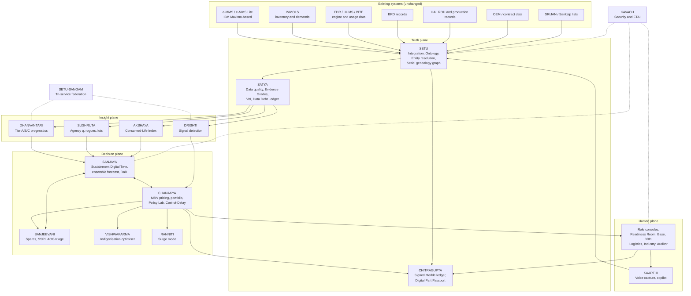

# NIRANTAR — Document 3 of 3
# The Proposed Solution

## **N**ational **I**ntelligent **R**eadiness & **A**irworthiness **N**etwork for **T**otal **A**sset **R**eliability

> **निरंतर (nirantar)**: *continuous, uninterrupted.*
>
> **Tagline:** *From predicting failures to pricing readiness.* Every maintenance, supply, repair and industrial decision is priced in one currency: **aircraft ready to fly**.
>
> **Reads with:** `01_PROBLEM_STATEMENT_DEEP_DIVE.md` (the problem) and `02_EXISTING_SOLUTIONS_LANDSCAPE.md` (what already exists). Every novelty claim here was checked against Document 2.

---

## Table of Contents

0. [The 60-second pitch](#0-the-60-second-pitch)
1. [The big idea: readiness as a currency](#1-the-big-idea-readiness-as-a-currency)
2. [What is genuinely new: 3 core + 9 supporting innovations](#2-what-is-genuinely-new-3-core--9-supporting-innovations)
3. [How NIRANTAR answers every phrase of the problem statement](#3-how-nirantar-answers-every-phrase-of-the-problem-statement)
4. [Concept of operations: the readiness rhythm](#4-concept-of-operations-the-readiness-rhythm)
5. [System architecture](#5-system-architecture)
6. [Module deep-dives (14 modules)](#6-module-deep-dives-14-modules)
7. [The mathematics in one place](#7-the-mathematics-in-one-place)
8. [Novelty analysis vs the landscape](#8-novelty-analysis-vs-the-landscape)
9. [User experience: who sees what](#9-user-experience-who-sees-what)
10. [Trust, safety and governance](#10-trust-safety-and-governance)
11. [Security, sovereignty and deployment](#11-security-sovereignty-and-deployment)
12. [Data strategy without IAF data: BHARAT-FLEET](#12-data-strategy-without-iaf-data-bharat-fleet)
13. [Hackathon MVP: what we build and demo](#13-hackathon-mvp-what-we-build-and-demo)
14. [Validation and experiments](#14-validation-and-experiments)
15. [Roadmap from hackathon to system of record](#15-roadmap-from-hackathon-to-system-of-record)
16. [Cost, value and return on investment](#16-cost-value-and-return-on-investment)
17. [Risks and mitigations](#17-risks-and-mitigations)
18. [IP, open-source and ethics](#18-ip-open-source-and-ethics)
19. [Pitch script and judge Q&A](#19-pitch-script-and-judge-qa)
20. [Appendices](#20-appendices)

---

## 0. The 60-second pitch

India is ~11–13 fighter squadrons short of its sanctioned 42. Its best fleets have flown at 55–60% serviceability against a 75% norm. **Every audit says the same thing:** aircraft wait more than they break. They wait for spares, for overhauls abroad, for depot slots, for contracts, for signatures. Meanwhile the data that could prevent this already exists in e-MMS, IMMOLS, flight-data recorders, BRD and HAL records. It is just scattered, and nobody turns it into decisions.

Most teams answer this problem with an RUL model and a dashboard. **NIRANTAR answers it with a decision economy.** It builds a sovereign **digital twin of the whole sustainment enterprise**: aircraft, every serialised part, squadrons, Base Repair Depots, HAL divisions, foreign OEMs, 930 Indian suppliers, contracts and flying programmes. On that twin it prices **every possible action** in one unit, **aircraft-available-days**, rolled up into **squadron-equivalents**. The actions range from expediting a bearing or re-ordering a depot queue to indigenising a valve, routing a carcass to a better repair agency, or signing a support contract a month earlier. It also reports **Readiness-at-Risk**: how bad availability could get if Russian supplies stop, an engine OEM slips, or a war starts next week.

Every recommendation carries an **evidence grade**. Weak data can never trigger a safety-relaxing action. Every human decision is signed into a **tamper-evident ledger** that CAG can verify. Technicians speak their snags in Hindi or English, offline, instead of typing forms. Common fleets like the ALH share failure signals across the Army, Navy, Air Force and Coast Guard **without sharing raw data**, so a cracked swashplate at sea becomes a targeted inspection everywhere else instead of a 330-helicopter grounding.

**NIRANTAR's promise:** squadrons recovered from the fleet India already owns, measured, audited and continuous. *Nirantar.*

---

## 1. The big idea: readiness as a currency

### 1.1 The insight

Availability is not produced by one model. It emerges from **thousands of interacting decisions**, made daily by different people in different organisations with different data:

| Who | Decides | Today optimises for |
|---|---|---|
| Squadron engineering officer | Which aircraft to fix first, whether to cannibalise | Tomorrow's flying programme |
| Logistics officer | What to indent, how many, where | Stock value, last year's consumption |
| BRD Chief Engineer | Which carcass to overhaul first | Task completion counts |
| HAL division | Production vs repair capacity | Contractual deliveries |
| Air HQ / MoD | Contracts, budgets, indigenisation | Budget execution, import substitution value |
| OEM | Lead times, overhaul slots | Its own commercial priorities |

**None of these decisions is priced in the outcome the nation actually wants: aircraft ready to fly.** Each actor optimises a local proxy, so the system as a whole under-performs. This is the "operating-system" failure that BCG (2026) and NSS-A identified, and it is why prediction-only systems disappoint (Document 1, §3.2).

### 1.2 The idea in one sentence

> **NIRANTAR gives every sustainment decision a price, measured in expected aircraft-available-days and their tail risk, computed on a continuously calibrated digital twin of the national sustainment enterprise, and delivers those prices to the right decision-maker with evidence they can trust and an audit trail CAG can verify.**

### 1.3 Three analogies that explain NIRANTAR to anyone

| Analogy | Field | NIRANTAR equivalent |
|---|---|---|
| **The treasury risk desk** | Finance: every trade is priced, portfolio risk is measured by Value-at-Risk, and stress tests run against crises | Every action priced by **Marginal Readiness Value (MRV)**; fleet risk measured by **Readiness-at-Risk (RaR)**; stress tests against sanctions, OEM failure or war |
| **The weather forecast** | Meteorology: ensemble numerical forecasts, re-initialised from observations every cycle, verified against what happened | The **Sustainment Digital Twin** re-initialises daily from e-MMS/IMMOLS, runs ensemble forecasts of availability ("readiness weather"), and is scored on calibration |
| **Pharmacovigilance** | Drug safety: spontaneous reports pooled nationally; statistics detect emerging signals early | **Airworthiness pharmacovigilance**: snag/defect reports pooled across services; disproportionality statistics detect emerging fleet hazards early |

### 1.4 Three shifts from the status quo

```
  STATUS QUO                                   NIRANTAR
  ───────────────────────────────────────────  ───────────────────────────────────────────────
  1. Component health ("engine #2 RUL = 41h")  →  Enterprise readiness ("fleet will be at 63%
                                                   next month; 5% chance below 52%")
  2. Point predictions & alerts                →  Priced decisions under uncertainty
                                                   ("expedite carcass A-1123: +37 ± 9 aircraft-days")
  3. Records                                   →  Evidence (graded truth, signed accountability)
```

### 1.5 The units

| Unit | Definition | Why |
|---|---|---|
| **AAD (Aircraft-Available-Day)** | One aircraft mission-capable for one day | Atomic, additive, intuitive |
| **wAAD (weighted AAD)** | AAD weighted by role/type value $w_k$ and time weight $\omega(t)$ (e.g. surge periods weigh more) | Not every aircraft-day is equal: an AEW&C day ≠ a trainer day |
| **SqE (Squadron-Equivalent)** | Sustained gain of $U_k$ available aircraft of type $k$ ($U$≈18 fighters) over a horizon $H$: $\Delta\text{SqE} = \Delta\text{AAD}/(U_k H)$ | The language of the Air Staff and Parliament |
| **RaR$_\alpha$ (Readiness-at-Risk)** | The $\alpha$-quantile (e.g. 5%) of fleet availability over horizon $H$ across simulated futures | Tail risk: "how bad could it get?" |
| **CRaR$_\alpha$** | Expected availability *given* we are in the worst $\alpha$ of futures | Coherent risk measure (expected shortfall) |
| **MRV (Marginal Readiness Value)** | Expected change in wAAD (and in CRaR) from taking an action vs not taking it | Price of a decision |
| **CoD (Cost of Delay)** | Rate of MRV loss per day of delaying an action | Price of bureaucratic waiting |

---

## 2. What is genuinely new: 3 core + 9 supporting innovations

"Novel" here means: **we found no public system, product, programme or SIH team solution that does this** (search scope in Document 2). Building blocks may exist. Where they do, we say so and state precisely what NIRANTAR adds.

### 2.1 Core innovations (the heart of NIRANTAR)

#### C1. The Readiness Currency and Marginal Readiness Value (MRV) engine: **CHANAKYA**
- **What:** A typed catalogue of ~16 action classes (provision, expedite, transfer, repair-priority, route-to-agency, bundle, assign-sortie, controlled-cannibalise, inspect, defer, indigenise, contract-timing, life-extend, sensor-retrofit, data-fix, surge-shift). Each candidate action is priced by **paired, common-random-number simulation** on the digital twin, giving **MRV ± confidence interval** in wAAD and SqE, per rupee and per man-hour.
- **Closest prior art:** RBS/METRIC marginal analysis prices *stock units only* (by backorders); EXPRESS prioritises *depot repair only*; PANDA issues *alerts*; SIH teams compute *risk scores* and solve *one* scheduling MILP.
- **What is new:** *one currency across all action classes and across organisations*, with uncertainty, with **counterfactual trace-diff explanations** ("this action prevents these 3 grounding episodes"), and with **Cost-of-Delay clocks** for administrative actions.

#### C2. Sustainment Digital Twin with ensemble forecasting and Readiness-at-Risk: **SANJAYA**
- **What:** A national, multi-echelon, multi-agency stochastic twin of the sustainment enterprise. It is **re-initialised daily from live records** (as numerical weather prediction re-initialises from observations), produces **ensemble availability forecasts** (fan charts, 7–180 days) that are **scored for calibration** (CRPS, PIT), and computes **RaR/CRaR** under a **regime-switching geopolitical supply model** with a stress-test library (e.g. "Russian supply disruption 180 days", "OEM engine slip", "Red Sea shipping disruption", "two-front surge").
- **Closest prior art:** LCOM, SIMLOX, BAE TPS/WITNESS and Dyna-METRIC are simulation and readiness models, mostly *study tools* run by analysts, often proprietary, not continuously assimilated from records or fused with condition-based failure predictions, and not reporting tail-risk metrics.
- **What is new:** *continuous data assimilation + ensemble verification + tail-risk (RaR) + condition-based failure inputs + geopolitical regime switching*, as an always-on operational service rather than a periodic study.

#### C3. Truth & Trust stack: Evidence Grades → Action Authority, Value-of-Information pricing of data, signed evidence chain: **SATYA + CHITRAGUPTA**
- **What:**
  1. Every input record gets a **data-quality score**. Every prediction gets an **Evidence Grade (E1–E5)** from data quality, calibration, effective sample size, out-of-distribution score and model agreement.
  2. An **Action Authority Matrix** governs which decisions a recommendation may influence at which grade and who must approve. It follows an **Asymmetric Evidence Principle**: *recommendations that increase safety margins need less evidence than those that relax them; NIRANTAR can never relax a safety margin on its own.*
  3. **Value-of-Information (VoI)** pricing turns data quality into readiness: *"Fixing serial histories for HP fuel pumps at Base X is worth +14 AAD/quarter"*, *"Retrofitting oil-debris monitors on Engine Type Y is worth 0.3 SqE/year"*. This creates a **Data Debt Ledger** and a **Sensor Retrofit Advisor**.
  4. A **Ed25519-signed, Merkle hash-chained ledger** of data batches, model versions, recommendations, human decisions and overrides, plus a **Digital Part Passport** for serialised parts.
- **Closest prior art:** C3 AI evidence packages; FleetAvail and READYFLEET SIH teams fuse data quality and provenance; transparency logs (Rekor/Trillian) exist in software supply chains.
- **What is new:** *formal coupling of data quality to decision authority*, *pricing data quality and sensors in readiness units*, and *a cryptographic, CAG-verifiable chain from sensor to decision*. This directly answers ALIS's failure mode (bad data → wrong groundings → lost trust).

### 2.2 Supporting innovations

| # | Innovation | Module | Closest prior art | What NIRANTAR adds |
|---|---|---|---|---|
| S1 | **Repair-Agency Effectiveness Intelligence:** per-agency repair-effectiveness factor *q* (Kijima virtual age), serial frailty (rogue units), lot frailty (bad batches), **effectiveness-aware routing** of carcasses | SUSHRUTA | Airline rogue-unit programmes; Ramco/AVIATAR reliability; GRP theory | Agency-level quality *measurement* in a multi-agency military network (BRD, HAL, OEM, MSME); routing optimises TAT *and* future failures; evidence packs for warranty/LD claims under DPM 2025 |
| S2 | **Airworthiness Pharmacovigilance:** cross-service, privacy-preserving disproportionality signal detection (PRR/ROR/BCPNN/MGPS + sequential tests) across type × part × environment × lot × agency × service | DRISHTI | Pharmacovigilance (WHO/EMA); FL for airline RUL | First application of PV signal statistics to military defect reports; **federated counts** across services; environment-stratified signals → **targeted inspections instead of blanket groundings** |
| S3 | **Readiness-weighted Indigenisation** with a **post-indigenisation reliability learning loop** | VISHWAKARMA | SRIJAN, PILs, Sankalp-2026 (catalogues/policy) | Ranks items by *ΔwAAD and ΔCRaR per rupee per month-to-qualify*; tracks field reliability of indigenised parts vs OEM parts (hazard ratios); learns priors for future items; vendor reliability scorecards for the 930-firm network |
| S4 | **Three-tier evidence-matched prognostics:** sensor-rich (A), usage-only (B), records-only (C), with **hierarchical Bayesian pooling** across parts, types, environments and services, fused by Bayesian updating | DHANVANTARI | ERCM (records), PANDA (sensor), RUL papers | Tiers matched to India's actual data; environment classes (saline, dust, altitude, humidity) as first-class covariates; plug-in slots for IIT Bombay's engine HI and SMS HUMS models |
| S5 | **Consumed-Life Index and evidence-based retirement sequencing / life-extension dossiers** | AKSHAYA | USAF ASIP/ADT individual aircraft tracking | Applied to India's squadron-gap problem: retire the most-consumed tails first, rebalance usage, generate OEM/CEMILAC negotiation dossiers for Russian-origin fleets whose lifing is OEM-controlled |
| S6 | **Surge Sortie-Generation Capacity:** sustainable sorties/day for 72 h / 7 d / 14 d / 30 d with **"what breaks first"** attribution, live from current health and stock | RANNITI | LCOM, ASM, Dyna-METRIC (study tools) | Live, condition-aware, DDIL-capable edge operation; pre-surge actions ranked by surge-weighted MRV |
| S7 | **Cost-of-Delay clocks** on files, contracts and approvals | CHANAKYA | None found | Shows decision-makers the readiness lost per day a file waits |
| S8 | **Voice-first, multilingual, offline snag capture** + citation-locked troubleshooting copilot | SAARTHI | HAL AI snag system; RAG copilots (SIH AERO-READY, DE&S) | Reduces data burden at source (ALIS lesson), Hindi/Hinglish/regional ASR offline (IndicConformer), schema-constrained structuring into e-MMS; copilot refuses to answer without an approved citation |
| S9 | **Tri-service federation by design** | SETU-SANGAM | FL research (airlines) | One reliability commons for the ALH, MiG-29/29K, Hawk, Do-228, Chetak/Cheetah and Mi-17 across IAF/Navy/Army/CG/HAL, with no raw-record exchange, aligned to jointness and theatre commands |

### 2.3 Why the *combination* is the real novelty

Each competitor in Document 2 covers 1–4 of the 12 white-space gaps (Document 2, §13). NIRANTAR is designed around **all twelve**, and, more importantly, **connects them through one currency (MRV/RaR) and one truth layer (SATYA/CHITRAGUPTA)**. A rogue-unit finding, an indigenisation proposal, a data-quality defect, a contract delay and an engine-health alert all appear **in the same ranked list, in the same unit, with the same evidence standard**. That is what nobody has built.

---

## 3. How NIRANTAR answers every phrase of the problem statement

| Problem-statement phrase | NIRANTAR response | Module(s) |
|---|---|---|
| "Low aircraft availability" | Availability is the objective function; forecast, priced, risk-measured | SANJAYA, CHANAKYA |
| "fragmented … maintenance practices across the air fleet" | Common Readiness Ontology; tri-service federation; daily readiness rhythm | SETU, SETU-SANGAM, §4 |
| "largely reactive" | Prognostics + reliability + signal detection + MRV-ranked proactive actions | DHANVANTARI, DRISHTI, CHANAKYA |
| "aircraft health-monitoring systems" | Tier-A ingestion of FDR/HUMS/BITE; edge processing; sensor retrofit advisor (VoI) | DHANVANTARI, SATYA, edge |
| "technical records" | Serial genealogy graph; Tier-C records-based reliability; data-quality engine | SETU, SATYA, DHANVANTARI |
| "spares" | Dynamic, prognostics-driven, risk-aware readiness-based sparing; AOG triage; SSRI | SANJEEVANI |
| "maintenance agencies" | Agency network in the twin; TAT *and* quality per agency; effectiveness-aware routing | SANJAYA, SUSHRUTA |
| "not adequately integrated" | Integration layer over e-MMS/IMMOLS/HAL/OEM, S5000F-aligned; no rip-and-replace | SETU |
| "delayed fault prediction" | Earlier, calibrated, evidence-graded predictions; fleet-level early signals | DHANVANTARI, DRISHTI |
| "avoidable aircraft downtime" | Downtime decomposed by cause (information, logistics, repair, admin); avoidable share priced; CoD clocks | SANJAYA, CHANAKYA |
| "sub-optimal utilisation of critical assets" | Aircraft, engines, depot slots, test sets, technicians and money all optimised in one currency | CHANAKYA, RANNITI |
| "AI/ML-based predictive maintenance" | Tiered Bayesian + deep prognostics with conformal calibration | DHANVANTARI |
| "IoT/aircraft health monitoring" | Edge nodes; FDR/HUMS pipelines; VoI-driven retrofit roadmap | DHANVANTARI, SATYA |
| "digital twins" | Three twins: **component health twin** (per serial), **airframe usage twin** (per tail, AKSHAYA), **sustainment enterprise twin** (SANJAYA) | DHANVANTARI, AKSHAYA, SANJAYA |
| "integrated maintenance analytics platform" | One sovereign platform, role-based, air-gapped, auditable | All |

---

## 4. Concept of operations: the readiness rhythm

Technology alone did not raise US Navy readiness from ~50% to 80%. A **daily, data-driven operating rhythm** did (NSS-A's Maintenance Operations Center). NIRANTAR therefore ships with an **operating model**, not just software.

### 4.1 The rhythm

| Cadence | Forum | Who | NIRANTAR inputs | Decisions |
|---|---|---|---|---|
| **Continuous** | — | System | Ingestion, data-quality checks, health updates, signal detection | Alerts (graded), passport updates |
| **Daily 0700** | **Base Readiness Huddle** (10 min) | Station/Wing CEngO, SEngOs, Logistics | Today's top-10 MRV opportunities for the base; aircraft due/at risk next 7 days; AOG triage; SAARTHI shift digest | Fix order, controlled CANN, transfers, expedites |
| **Daily** | **BRD Queue Review** | BRD Chief Engineer | Carcass queue ranked by MRV; inflow forecast; agency routing advice | Repair order, kit issues, overtime |
| **Weekly** | **Command Readiness Review** | Command AOM staff | Command fan charts; RaR; inter-base transfers; cross-base patterns | Re-allocation, escalations |
| **Monthly** | **National Readiness Board** | Air HQ AOM, HQMC, HAL divisions, DPSUs | National forecast & RaR per fleet; repair capacity; provisioning portfolio; **Cost-of-Delay clocks**; agency scorecards | Provisioning, contracts, capacity, HAL tasking |
| **Quarterly** | **Readiness Investment Committee** | MoD (DDP, DMA, Finance), Air HQ | **Policy Lab** results (PBL vs organic, new overhaul lines, buffers); indigenisation portfolio (VISHWAKARMA); sensor retrofit (VoI) | Budgets, indigenisation lists → SRIJAN/Sankalp/iDEX, policy |
| **Event-driven** | **Surge Cell** | Ops + Maintenance | RANNITI surge capacity, "what breaks first", pre-positioning list | Pre-positioning, surge shifts, deferral policies (within authority) |
| **Event-driven** | **Joint Airworthiness Signal Review** | IAF/Navy/Army/CG/HAL + CEMILAC/DGAQA | DRISHTI signals on common platforms | Targeted inspections, fleet advisories |

### 4.2 The institution: NIRANTAR Readiness Cell
- A small cell under the **Air Officer-in-Charge Maintenance (AOM)**, supported by the **UDAAN AI CoE**, that owns the model, data stewardship and the rhythm.
- **Data stewards** (one per base/BRD; part-time) own data-quality scores and fix the Data Debt Ledger.
- **Model owners** (UDAAN + academia + startup partner) handle retraining, validation and ETAI evidence.
- **Industry interface** (HAL, DPSUs, MSMEs) receives sanitised demand forecasts and reliability feedback through a one-way, sanitised industry portal.

### 4.3 A day in the life (narrative)

> **06:30.** Sgt Rajesh finishes a post-flight on SB-221. On his rugged tablet he says, in Hinglish: *"Number two engine pe oil filter bypass indicator pop hua, chip detector clean, oil sample bhej diya."* (The No. 2 engine's oil-filter bypass indicator popped, the chip detector is clean, and an oil sample has been sent.) SAARTHI transcribes offline, structures the snag (aircraft, ATA 79, part, symptom, action) and shows a card. Rajesh taps *Confirm*. The entry goes to the e-MMS queue, signed with his smart card.
>
> **06:45.** DHANVANTARI updates SB-221's No. 2 engine oil-system hazard. The evidence grade is E2 because three similar cases were recorded fleet-wide this quarter. DRISHTI checks: is "oil-filter bypass" disproportionately frequent on engines overhauled by Agency K in the last 6 months? IC₀₂₅ = 0.4 > 0: **a weak signal**, flagged for review, no action authority yet.
>
> **07:00.** At the Base Readiness Huddle, Wg Cdr Meera sees: *"Top opportunity #1: request priority overhaul slot for module M-17 carcass at BRD (+21 ± 6 AAD/90 days, ₹0). #2: transfer one oil-pump assembly from Base Y (+9 ± 3 AAD, transport 2 days). #3: bundle SB-221 oil-system inspection into tomorrow's scheduled 50-hour check (+3 AAD, avoids a second grounding)."* She approves #2 and #3. #1 needs BRD approval, so it is forwarded automatically.
>
> **10:00.** Gp Capt Iqbal at the BRD sees the forwarded request already ranked #4 in his carcass queue by MRV. He moves it up.
>
> **Monthly Board.** AVM Kapoor sees Agency K's repair-effectiveness *q* for oil pumps drifting upward (worse) with 90% credibility. The scorecard is shown with uncertainty, and HAL receives an evidence pack with serial histories. The Board also sees **Cost-of-Delay: "AL-31FP accessory repair contract pending CFA approval: −1.8 AAD/day"**.
>
> **Quarter end.** The Readiness Investment Committee reviews VISHWAKARMA: indigenising oil-pump bearing set B-44 ranks #3 nationally for **readiness per rupee under Russian-supply stress (ΔCRaR₅ = +2.1 pts)**. It is pushed into the next Sankalp/iDEX problem list.

---

## 5. System architecture

### 5.1 Five planes, fourteen modules

| Plane | Module (Sanskrit name: meaning) | One-line role |
|---|---|---|
| **Truth** | **SETU** (सेतु, *bridge*) | Integration, Readiness Ontology, entity resolution, serial genealogy |
| | **SATYA** (सत्य, *truth*) | Data quality, Evidence Grades, VoI, Data Debt Ledger |
| | **CHITRAGUPTA** (*keeper of the record of deeds*) | Signed Merkle evidence ledger, Digital Part Passport |
| **Insight** | **DHANVANTARI** (*physician of the gods*) | Three-tier health and reliability engine |
| | **SUSHRUTA** (*the ancient surgeon*) | Repair-agency effectiveness, rogue units, bad batches |
| | **DRISHTI** (दृष्टि, *vision*) | Airworthiness pharmacovigilance: fleet signal detection |
| | **AKSHAYA** (अक्षय, *undecaying*) | Usage-based lifing, Consumed-Life Index, life-extension evidence |
| **Decision** | **SANJAYA** (*the far-seer of the Mahabharata*) | Sustainment Digital Twin, ensemble forecasts, RaR |
| | **CHANAKYA** (*the strategist*) | MRV pricing, portfolio optimisation, Policy Lab, Cost-of-Delay |
| | **SANJEEVANI** (*the life-restoring herb Hanuman fetched*) | Spares and supply intelligence, SSRI, AOG triage |
| | **VISHWAKARMA** (*the divine craftsman*) | Readiness-weighted indigenisation, vendor reliability loop |
| | **RANNITI** (रणनीति, *war strategy*) | Surge / war sustainment mode |
| **Human** | **SAARTHI** (सारथी, *charioteer, guide*) | Voice-first capture, troubleshooting copilot, role consoles |
| **Protection** | **KAVACH** (कवच, *armour*) | Security, sovereignty, adversarial-ML defence, ETAI compliance |
| *(cross-cutting)* | **SETU-SANGAM** (*confluence*) | Tri-service federation hub |

### 5.2 Logical architecture



### 5.3 Physical / deployment topology (air-gapped, DDIL-ready)

```
 ┌────────────────────────────────────────────────────────────────────────────────┐
 │ T3 NATIONAL NODE  (Air HQ / UDAAN data centre, AFNet)                           │
 │  • SANJAYA national twin (HPC: CPU cluster + few GPUs)  • CHANAKYA national      │
 │  • Model registry & training  • CHITRAGUPTA root witnesses  • Policy Lab         │
 ├───────────────────────────────┬────────────────────────────────────────────────┤
 │ SETU-SANGAM FEDERATION HUB    │ INDUSTRY DMZ (one-way, sanitised)               │
 │ (DMA / joint) - secure        │ HAL / DPSU / MSME portal: demand forecasts,     │
 │ aggregation of counts/params  │ reliability feedback, indigenisation needs      │
 └──────────────┬────────────────┴──────────────────────────┬─────────────────────┘
                │ AFNet (encrypted, intermittent tolerated)   │
 ┌──────────────▼──────────────┐                 ┌───────────▼──────────────────┐
 │ T2 COMMAND / BRD NODES      │                 │ Navy / Army Aviation / CG    │
 │ • Command twin, BRD queue   │                 │ nodes (their own networks)   │
 │ • Regional stores analytics │                 └──────────────────────────────┘
 └──────────────┬──────────────┘
                │
 ┌──────────────▼──────────────┐   Each base node runs a LOCAL twin + models from the
 │ T1 BASE NODES (per station) │   last synced state, so the base keeps working if the
 │ • Local SANJAYA (base scope)│   network is cut (DDIL). Sync uses CRDTs/event logs.
 │ • SATYA checks, SAARTHI     │
 │   server, ledger witness    │
 └──────────────┬──────────────┘
                │ local Wi-Fi/LAN (no internet)
 ┌──────────────▼──────────────┐
 │ T0 EDGE (flight line)       │   Rugged tablets (SAARTHI, offline ASR + small LLM),
 │ • FDR/HUMS download station │   FDR download & pre-processing (usage spectra,
 │ • Smart-card signing        │   exceedances), QR/RFID part-passport scanning.
 └─────────────────────────────┘
```

### 5.4 Technology stack (all open-source, Indian-maintainable, no licence lock-in)

| Layer | Choice | Why |
|---|---|---|
| Storage | **PostgreSQL 16 + TimescaleDB** (operational, time series), **Apache AGE** (graph on Postgres for serial genealogy), **Parquet/Apache Iceberg on MinIO** (lakehouse), **DuckDB** (fast analytics) | Few moving parts; open-source; air-gap friendly |
| Streaming / sync | **NATS JetStream** (edge/base), **Redpanda/Kafka** (national) | Lightweight at the edge; durable centrally |
| Entity resolution | **Splink** + rules | Probabilistic record linkage at scale |
| Data quality | **Great Expectations / Pandera** + custom invariants | Declarative checks |
| Reliability & Bayes | **NumPyro/PyMC**, **lifelines**, **scikit-survival**, **reliability** | Hierarchical survival, censoring |
| Prognostics | **PyTorch**, **NASA ProgPy**, **MAPIE** (conformal) | Tier A models with calibrated intervals |
| Simulation | **SANJAYA core in Rust** (event-driven, multi-threaded) with Python bindings; **SimPy** for prototyping | Speed for national scale (≈300k serials × 500 replications) |
| Optimisation | **OR-Tools (CP-SAT)**, **HiGHS** (MILP) | Open-source solvers |
| NLP / speech | **AI4Bharat IndicConformer** (ASR, offline), small open LLM served by **llama.cpp**, **FAISS** | Offline, multilingual, sovereign |
| MLOps | **MLflow**, **DVC**, **OpenLineage/Marquez** | Reproducibility; lineage for audit |
| Security | **Keycloak** (smart-card/PKI), **Open Policy Agent** (ABAC), **OpenBao** (secrets), **libsodium** (Ed25519) | Zero-trust, signed everything |
| UI | **React + TypeScript**, **Apache ECharts**, offline **PWA** for tablets | Fast, offline-capable |
| Orchestration | **k3s** (edge/base), Kubernetes (national), air-gapped registry, SBOM (CycloneDX), reproducible builds | Sovereign supply chain |

---

## 6. Module deep-dives (14 modules)

Each module follows the same template: **Purpose → Inputs → Method → Outputs → Users → What is new → MVP vs Full.**

---

### 6.1 SETU: Integration, Readiness Ontology and serial genealogy

**Purpose.** Make scattered records *one connected picture* without replacing e-MMS or IMMOLS.

**Inputs.** e-MMS work orders, snags, installs/removals, flight hours (IBM Maximo-based tables or exports); IMMOLS stock, demands, issues, receipts, indents; FDR/HUMS downloads; BRD and HAL repair records (receipt/dispatch, findings); contracts (coverage windows); OEM shipment data; SRIJAN/Sankalp item lists; flying programme.

**Method.**
1. **Readiness Ontology (NRO)**: a canonical model of the sustainment enterprise (see Appendix A), aligned to **ASD S5000F** (in-service feedback), **S2000M** (materiel), **MIMOSA OSA-CBM** (condition data), and **ATA-chapter** fault coding. Core objects: `Aircraft(tail)`, `Fleet/Type`, `PartNumber` (with alternates/supersessions), `SerialisedPart`, `Installation`, `Removal`, `Snag`, `WorkOrder`, `RepairEvent(agency)`, `StockPosition`, `Demand`, `Shipment`, `Agency(BRD/HAL/OEM/MSME)`, `Contract`, `FlightRecord`, `Base(environment class)`, `Decision`, `Recommendation`.
2. **Entity resolution**: probabilistic linkage (Fellegi–Sunter via Splink) of part numbers (Russian/Western/HAL formats, supersessions), serials (typos, prefix/suffix variants) and tails across systems, with **human-confirmed merge queues** and full lineage.
3. **Serial Genealogy Graph** (Apache AGE): every serialised part's full life as a path: *manufactured → installed on tail T1 at base B1 → removed (reason) → repaired at agency G (findings) → stored → installed on T2 …* This is the backbone for SUSHRUTA, DHANVANTARI Tier C and the Digital Part Passport.
4. **Connectors**: read-only database replicas or approved export jobs from e-MMS/IMMOLS; file drops for BRD/HAL; FDR decoders per type (plug-ins); write-back only through approved e-MMS interfaces (e.g. SAARTHI snag entries).

**Outputs.** Unified, versioned, lineage-tracked data; genealogy graph; integration-health dashboard.

**What is new.** Agency-spanning serial genealogy built for *readiness economics* (not just record keeping), and tri-service ontology compatibility (SETU-SANGAM).

**MVP vs Full.** MVP: synthetic e-MMS-like and IMMOLS-like tables + FAA SDRS real records → ontology → genealogy graph. Full: certified connectors to the IAF systems, Navy/Army equivalents, HAL.

---

### 6.2 SATYA: Data Truth Engine (quality, Evidence Grades, Value-of-Information)

**Purpose.** Stop bad data from silently driving decisions (the ALIS lesson). Make data quality **visible, priced and fixable**.

**Method.**
1. **Quality dimensions per record and per dataset:** completeness, validity, consistency, timeliness, uniqueness, provenance. Combined into a score $\text{DQ}\in[0,1]$ with dimension weights tuned by impact.
2. **Physical-world invariants** (hard checks), for example:
   - a serial cannot be installed on two aircraft at once;
   - removal date ≥ installation date; time-since-new monotonic;
   - flight hours per sortie within type envelope; total FH monotonic per tail;
   - a hard-time part cannot exceed its life without a recorded extension;
   - stock cannot go negative; issued quantity ≤ on-hand;
   - repair dispatch date ≥ receipt date at the agency.
3. **Behavioural anomaly detection on records** (soft checks): bulk back-dating, identical timestamps, copy-paste narratives, unusual entry hours, sudden drops in snag reporting at a unit (possible under-reporting), Benford-type checks on quantities.
4. **Evidence Grade** for every prediction (§10.1): combines input DQ, model calibration on recent back-tests, effective sample size, out-of-distribution score and ensemble agreement.
5. **Value-of-Information (VoI)**, the novel part. For a candidate data fix or sensor retrofit $I$:
$$
\text{VoI}(I) = \mathbb{E}_{I}\Big[\max_{a\in\mathcal{A}} \mathbb{E}[\text{wAAD}\mid a, I]\Big] - \max_{a\in\mathcal{A}} \mathbb{E}[\text{wAAD}\mid a]
$$
   computed by pre-posterior simulation (EVSI via regression/moment-matching approximations). This answers *"which data should we clean first?"* and *"which sensor retrofit buys the most readiness?"*

**Outputs.** DQ scores on every record; **Data Debt Ledger** (ranked list of fixes with VoI in AAD); **Sensor Retrofit Advisor**; Evidence Grades consumed by every module.

**Users.** Data stewards, base CEngOs, UDAAN, Air HQ (retrofit budgets).

**What is new.** Pricing data quality and sensing in **readiness units** and coupling it to **decision authority**.

**MVP vs Full.** MVP: invariants + DQ score + Evidence Grade + a VoI demo for one part family (synthetic errors injected, then fixed). Full: all fleets, automated steward workflows.

---

### 6.3 CHITRAGUPTA: Signed evidence ledger and Digital Part Passport

**Purpose.** Accountability without blame; verifiable history; counterfeit and spurious-part resistance; CAG-ready audit.

**Method.**
1. **Append-only Merkle log** (Certificate-Transparency style). Entries: data batch hashes (with SATYA scores), model versions (hash of weights and training data snapshot), recommendations (inputs, MRV, Evidence Grade), human decisions (accept/reject/modify + **reason code**), overrides, part-passport events.
2. **Signatures:** **Ed25519**, keys on service smart cards/hardware tokens. Each entry is signed by its actor (human or service).
3. **Witnessing:** base, command and national nodes each keep witness copies and exchange **signed tree heads**. Consistency proofs detect rewriting. No blockchain or mining is needed: trust comes from multiple government witnesses.
4. **Offline verification:** any auditor can verify inclusion and consistency proofs with a small offline tool.
5. **Digital Part Passport:** each serialised rotable has a passport, a signed chain of manufacture (vendor-signed certificate of conformance), installations, repairs (agency-signed), inspections and modifications. QR/RFID on the part links to the passport. Detects unsigned or inconsistent provenance (possible counterfeit/spurious parts), double installs and missing repair records.
6. **Override analytics:** patterns of overrides are fed back to model owners (are the models wrong?) and to governance (are people gaming the system?), aggregated at unit level, never used to police individuals.

**What is new.** A cryptographic chain from **sensor → data → model → recommendation → human decision → part history**, designed for military audit (CAG, Courts of Inquiry) and for **AI accountability under ETAI**.

**MVP vs Full.** MVP: a working ledger with live tamper-detection demo (edit a record → verification fails). Full: PKI integration, multi-node witnessing, passports for all rotables.

---

### 6.4 DHANVANTARI: Three-tier health and reliability engine

**Purpose.** For every installed serialised part, produce a **calibrated predictive distribution of time-to-removal/failure**, matched to the data that actually exists.

**The three tiers.**

| Tier | When | Example parts | Method |
|---|---|---|---|
| **A: Sensor-rich** | Continuous health data exists | Engines with parameter monitoring (AL-31FP via FDR; engine HI from IIT Bombay); HUMS-equipped helicopter drivetrains (ALH/LCH/Apache/Chinook); Rafale/Tejas digital systems | Physics-informed deep sequence models (residuals vs thermodynamic baselines), state-space/particle-filter prognostics (ProgPy), **conformal prediction intervals**; plug-in slots for external models (IIT Bombay HI, SMS MiG-29K HUMS) |
| **B: Usage-only** | Usage known, health not | Landing gear, actuators, structures, avionics with BITE counts | Proportional-hazards / AFT models with **time-varying usage covariates** (sorties, g-exceedances, landings, cycles, sortie mix) from FDR-derived usage spectra |
| **C: Records-only** | Only maintenance history | Most rotables on legacy Russian fleets | **Hierarchical Bayesian survival** (Weibull/GRP) on removal histories with censoring and truncation, **partially pooled** across part families, types, bases and services, with **environment classes** and usage intensity as covariates |

**Tier C model (core of India's case).** For serial $i$ of part number $p$ installed at base $b$ (environment class $e(b)$), service $s$:
$$
T_i \sim \text{Weibull}\big(\beta_{f(p)},\; \eta_{i}\big),\qquad
\log \eta_i = \mu_p + \gamma_{e(b)} + \lambda_s + \theta^\top x_i + \log z_i
$$
$$
\mu_p \sim \mathcal{N}(\mu_{f(p)}, \sigma_f^2),\quad \gamma_e \sim \mathcal{N}(0,\sigma_e^2),\quad \lambda_s\sim\mathcal{N}(0,\sigma_s^2),\quad z_i \sim \text{Gamma}(k,k)
$$
- $f(p)$: part family (pooling across similar parts and types, e.g. "hydraulic pumps"), which solves the small-fleet problem.
- $\gamma_e$: **environment effect** (coastal-saline, desert-dust, high-altitude, humid, temperate). The ALH swashplate case shows why.
- $\lambda_s$: service effect (IAF/Navy/Army/CG) for common types.
- $z_i$: **serial frailty** (shared with SUSHRUTA for rogue detection).
- $x_i$: usage intensity, last repair agency (via SUSHRUTA virtual age), modification state.
- **Right-censoring** for parts still installed; **left-truncation** for parts whose history predates the data.
- **Priors** from OEM TBO/TTL and from the Indian fleet's own history.

**Fusion across tiers.** When a serial has both records (Tier C prior) and sensors (Tier A likelihood), DHANVANTARI updates the fleet prior with the individual's sensor evidence: *the fleet says what is typical; the sensors say how this one is doing.*

**Outputs.** For each installed serial: $F_i(t)$ (cumulative failure probability), hazard over the next 7/30/90/180 days, P10/P50/P90 removal time, Evidence Grade, top drivers (SHAP for Tier A/B; posterior contributions for Tier C).

**What is new.** Evidence-matched tiers for a fleet that is mostly records-only; **environment and service as first-class pooled effects**; plug-in architecture for India's existing prognostics.

**MVP vs Full.** MVP: Tier A on N-CMAPSS (engines) with conformal intervals; Tier A on HUMS2023 gearbox data; Tier C hierarchical Weibull on BHARAT-FLEET synthetic removals, recovering known ground truth. Full: all fleets.

---

### 6.5 SUSHRUTA: Repair-agency effectiveness, rogue units and bad batches

**Purpose.** Measure the *quality* of repairs (not only their speed), find the serials and lots that keep failing, and route work to the agency that minimises **total** downtime.

**Method.**
1. **Agency virtual-age model (Kijima Type I/II).** For serial $i$ with successive operating intervals $X_{i,1}, X_{i,2},\dots$ and repairs by agencies $g_{i,j}$:
$$
\text{Type I: } V_{i,j} = V_{i,j-1} + q_{g_{i,j}}\,X_{i,j}\qquad
\text{Type II: } V_{i,j} = q_{g_{i,j}}\,(V_{i,j-1}+X_{i,j})
$$
   Hazard after the $j$-th repair: $h(t\mid V) = \frac{\beta}{\eta}\big(\frac{t+V_{i,j}}{\eta}\big)^{\beta-1}$.
   $q_g\in[0,1]$ is the **repair-effectiveness factor of agency $g$** for a part family: 0 = as good as new, 1 = as bad as old. Estimated hierarchically: $q_{g,f}\sim\text{Beta}(a_f,b_f)$, partially pooled across part families.
2. **Rogue serials.** Posterior of serial frailty $z_i$ (shared with DHANVANTARI). Rogue if $P(z_i > z^{\star} \mid \text{data}) > 0.9$, combined with industry rules (≥3 removals for similar discrepancies; ≥4 NFF in 12 months).
3. **Bad batches.** Lot-level frailty for parts sharing manufacture lot, vendor or repair batch; this is particularly important for **indigenised parts** (feeds VISHWAKARMA).
4. **NFF loops.** Detect serials and part families with high NFF rates by agency and test-equipment version, pointing to test-coverage gaps rather than bad parts.
5. **Agency scorecards** with uncertainty: TAT distribution, $q$ with credible interval, NFF rate, post-repair infant mortality, trend (CUSUM on posterior $q$).
6. **Effectiveness-aware routing.** For a carcass of family $f$, choose agency $g$ to minimise expected *total* aircraft-downtime over horizon $H$:
$$
g^{\star} = \arg\min_g\;\Big(\mathbb{E}[\text{TAT}_g] + \mathbb{E}\big[N_{\text{future removals}}(H)\mid q_g\big]\cdot \mathbb{E}[\text{downtime per removal}]\Big)\cdot \text{(MRV conversion)}
$$
   priced through CHANAKYA, subject to agency capacity.

**Outputs.** Agency scorecards; rogue/bad-batch watchlists (quarantine, deep-strip, warranty claim); routing recommendations; **evidence packs** (serial histories, posterior plots) for warranty, liquidated-damages and contract discussions under DPM 2025.

**Fairness safeguards.** Scorecards are at **agency** level, shown with uncertainty and shrinkage (small agencies are not unfairly penalised), with a **right of reply** before use in contracts.

**What is new.** Quantifying *repair quality per agency* across a **multi-agency national network** and using it in routing and contracting. CAG flagged premature withdrawals after depot overhaul in 2010; this is the measurement it lacked.

**MVP vs Full.** MVP: synthetic network with 4 agencies of known $q$ (e.g. 0.1, 0.3, 0.5, 0.8) → recover $q$ with credible intervals; inject 2% rogue serials → precision/recall; **real-data check on FAA SDRS** (repeat-removal serials by part number). Full: all agencies, live.

---

### 6.6 DRISHTI: Airworthiness pharmacovigilance (fleet signal detection)

**Purpose.** Detect **emerging fleet-wide hazards early**, across services, environments, lots and agencies, so they lead to **targeted inspections instead of blanket groundings**.

**Method.**
1. **Report normalisation.** Snags and defect reports (from SAARTHI-structured entries, e-MMS, HAL snag AI, and partner services) become a coded event $E$ (ATA chapter / part family / failure mode) in a context $C$ (type × part number × environment class × service × lot × last agency × modification state × season).
2. **Disproportionality statistics** on 2×2 tables for each (C, E) pair:
   - **PRR** $= \frac{a/(a+b)}{c/(c+d)}$, **ROR** $= \frac{ad}{bc}$,
   - **BCPNN Information Component** $\text{IC} = \log_2\frac{n_{CE}+0.5}{E_{CE}+0.5}$, $E_{CE}=\frac{n_{C\cdot}\,n_{\cdot E}}{n_{\cdot\cdot}}$, with signal when the lower credibility bound $\text{IC}_{025}>0$,
   - **MGPS EBGM** (empirical-Bayes shrinkage for sparse cells),
   - hierarchical aggregation across ATA levels; **exposure normalisation** by flight hours/landings (unlike drug safety, true exposure is known, which is a strength).
3. **Sequential monitoring** (MaxSPRT / CUSUM) for time-to-signal.
4. **Federated across services (SETU-SANGAM).** Each service computes local counts per (C, E). **Secure aggregation** (additive secret sharing) produces national counts without revealing any service's raw records or counts. Federated Bayesian survival (consensus Monte Carlo) shares model parameters, not data.
5. **Triage workflow.** Signal → engineering review (HAL/CEMILAC/DGAQA) → targeted inspection directive scoped by context (e.g. "coastal-based airframes, swashplate assemblies with > X hours since last inspection") → feedback.

**Illustrative (hypothetical) scenario modelled on the 2025 ALH case.** Swashplate crack findings begin to appear in maritime-based helicopters. DRISHTI's IC₀₂₅ for (ALH × swashplate × *coastal-saline* × crack) crosses 0 after a handful of findings, while (ALH × swashplate × *desert/mountain*) stays null. Recommendation: *targeted inspection of the coastal fleet now; advisory with environment-adjusted risk for the others.* **Goal: smaller and shorter groundings, earlier.** (Illustrative only. We do not claim this would have prevented the real accident.)

**What is new.** Applying pharmacovigilance statistics with true exposure normalisation to **military defect reports**, **federated across services**, with environment-stratified signals.

**MVP vs Full.** MVP: run on **FAA SDRS real data** (retrospectively, at least one known emerging issue in a public fleet) plus a synthetic ALH-maritime scenario. Full: tri-service federation hub.

---

### 6.7 AKSHAYA: Usage-based lifing, Consumed-Life Index, life-extension evidence

**Purpose.** In a squadron-short force, decide **which tails to keep flying, which to retire first, how to spread hard usage**, and **what evidence to bring to OEMs and CEMILAC** for life extensions.

**Method.**
1. **Usage spectra from FDR:** normal-acceleration ($N_z$) exceedance counts per sortie; manoeuvre mix; landings (sink rate); engine spool-speed rainflow cycles; hot-section time-at-temperature.
2. **Damage accumulation:**
   - Structures: Miner's rule $D = \sum_k n_k/N_k$ against design S-N data or design spectra (where available), or **relative severity indices** against the fleet-average spectrum when design data is OEM-restricted.
   - Engines: equivalent low-cycle-fatigue cycles from rainflow of spool speed; creep consumption via the Larson–Miller parameter.
3. **Consumed-Life Index:** $\text{CLI}_{\text{tail}} = D_{\text{actual}}/D_{\text{design at same hours}}$ with uncertainty. CLI < 1 means the tail is flown more gently than design assumptions.
4. **Retirement sequencing:** when retirements are forced, retire **highest-CLI** tails first and keep low-CLI tails flying, priced in SqE-years retained.
5. **Usage rebalancing:** route high-severity sortie types to low-CLI tails (fed to CHANAKYA's assign-sortie actions).
6. **Life-extension dossier:** an auto-generated evidence package (usage distribution vs design spectrum, inspection findings, fleet-leader data, uncertainties) for OEM negotiation and CEMILAC review. **AKSHAYA never extends life by itself**; it produces evidence.

**What is new.** ASIP-style individual aircraft tracking turned into a **force-structure lever** for India (squadron-years retained), including Russian-origin fleets whose life extension is OEM-controlled.

**MVP vs Full.** MVP: synthetic $N_z$ spectra for 40 tails + NASA DASHlink-style flight data pipeline → CLI ranking → retirement-sequencing comparison. Full: per-type structural models with OEM/HAL/CEMILAC.

---

### 6.8 SANJAYA: Sustainment Digital Twin, ensemble forecasts, Readiness-at-Risk

**Purpose.** Answer *"how many aircraft will be ready, when, with what uncertainty, and how bad could it get?"* for every fleet, base and the nation, and serve as the **pricing engine** for CHANAKYA.

**What the twin contains.**

| Entity | State | Stochastic behaviour (from) |
|---|---|---|
| Aircraft (tail) | MC/PMC/NMCM/NMCS; installed serials; scheduled inspections; flying programme | — |
| Serialised parts | Age, virtual age, health state | Failure/removal times (DHANVANTARI), repair effectiveness (SUSHRUTA) |
| Bases (O/I level) | Technicians by trade and shift; GSE/test sets; local stock | Task durations; GSE failures |
| BRDs / HAL divisions / MSMEs / OEMs | Queues, capacities, kits | TAT distributions, quality $q$, capacity shocks |
| Stores and transport | Stock by location; lanes | Transit times; airlift availability |
| Supply sources | Lead-time regime $s\in\{\text{normal},\text{stressed},\text{disrupted}\}$ | **Regime-switching lead times** (below) |
| Contracts | Coverage windows, expiry, approvals pending | Approval-time distributions |
| Policies | Cannibalisation rules, priority rules, deferral rules | — |

**Regime-switching geopolitical supply model.** For supplier country/source $c$: lead time $L\mid s \sim \text{LogNormal}(\mu_{c,s},\sigma_{c,s})$; regime $s_t$ follows a Markov chain with transition matrix $P_c$, elicited from history (e.g. the 2022 Russia–Ukraine shock, GE F404 delays) and expert judgement (structured elicitation), and **stress tests** that force regimes (e.g. "disrupted for 180 days").

**Data assimilation (the "weather forecast" loop).**
1. **Nowcast:** each day, reset the twin's state to observed reality (which tails are MC, which carcasses are where, stock positions, open demands) from SETU, weighted by SATYA confidence.
2. **Parameter update:** Bayesian update of TAT, lead-time and task-duration distributions with new events.
3. **Ensemble forecast:** $R$ replications (e.g. 500) forward 7–180 days, giving **fan charts** of availability per tail, base, fleet and nation.
4. **Verification:** after the fact, score forecasts by **CRPS**, **PIT histograms** (calibration) and **Brier scores** for "tail $i$ MC on day $t+7$". Publish calibration openly inside the IAF. *A forecast nobody verifies is a forecast nobody should trust.*

**Readiness-at-Risk.**
$$
A^{(r)}_H = \frac{1}{|K|\,H}\sum_{t=1}^{H}\sum_{k\in K} \mathbb{1}\{\text{tail }k\text{ MC at }t\}^{(r)},\qquad
\text{RaR}_\alpha = Q_\alpha\big(\{A^{(r)}_H\}_{r=1}^{R}\big),\qquad
\text{CRaR}_\alpha = \mathbb{E}\big[A_H \mid A_H\le \text{RaR}_\alpha\big]
$$
Variants: minimum-over-horizon availability (for surge), mission-weighted availability.

**Downtime attribution.** Each NMC day in each replication is tagged with its cause chain (waiting for part X from source Y; queue at agency G; approval Z), producing **avoidable-downtime decomposition** by cause, organisation and part.

**Performance.** National scale ≈1,500 tails, ≈300k tracked serials, 180-day horizon, 500 replications. Feasible with an event-driven Rust core parallelised across replications, plus **analytic surrogates** (VARI-METRIC-style pipeline approximations) for fast screening.

**What is new.** An *operational*, continuously assimilated, verified, risk-reporting national sustainment twin fed by condition-based predictions, rather than a periodic study model.

**MVP vs Full.** MVP: SimPy twin of 2 fleets (≈70 aircraft, 3 bases, 1 BRD, 1 HAL-like, 2 OEM sources), 200-replication fan charts, RaR under a supply-shock scenario, back-test calibration on synthetic history. Full: national Rust core.

---

### 6.9 CHANAKYA: Readiness economics, decisions and the Policy Lab

**Purpose.** Turn every possible action into a **price** (MRV), pick the best portfolio under constraints, explain why, and measure the cost of waiting.

**Action catalogue (typed).**

| Class | Example | Typical decider |
|---|---|---|
| PROVISION | Raise stock target of P/N X at Base B by 2 | Logistics |
| EXPEDITE | Expedite order O-778 (premium freight) | Logistics |
| TRANSFER | Move 1 unit from Base Y to Base X | Command logistics |
| REPAIR-PRIORITY | Move carcass A-1123 to top of BRD queue | BRD CE |
| ROUTE | Send carcass to agency G2 instead of G1 | HQMC |
| BUNDLE | Pull predicted task into a scheduled inspection window | SEngO |
| ASSIGN | Fly low-CLI/healthy tail on high-stress sortie | Ops + Eng |
| CONTROLLED-CANN | Designate donor tail D for part X (minimise labour/damage) | CEngO |
| INSPECT | Targeted inspection of a context (DRISHTI) | CEngO / CEMILAC |
| DEFER | Defer a non-critical task within approved limits | Authority per rules |
| INDIGENISE | Fund development/qualification of item I | MoD / HQMC |
| CONTRACT | Sign/extend support contract C by date T | Air HQ / MoD |
| LIFE-EXTEND | Prepare dossier for tail/engine life extension | Air HQ / OEM / CEMILAC |
| RETROFIT | Install sensor S on fleet F | Air HQ |
| DATA-FIX | Clean data set D (Data Debt Ledger) | Data steward |
| SURGE-SHIFT | Run 3-shift ops at BRD for 30 days | HQMC |

**MRV estimation (paired simulation with common random numbers).** For action $a$ and baseline plan $\pi$:
$$
\widehat{\text{MRV}}(a) = \frac{1}{R}\sum_{r=1}^{R}\Big(\text{wAAD}^{(r)}(\pi\oplus a) - \text{wAAD}^{(r)}(\pi)\Big)
$$
using **identical random streams** in both runs, which shrinks variance dramatically and gives tight confidence intervals with few replications. A risk-adjusted version: $\text{MRV}_\lambda(a)=\Delta\mathbb{E}[\text{wAAD}]+\lambda\,\Delta\text{CRaR}_\alpha$.

**Scaling to thousands of candidates.**
1. **Screen** with fast analytic surrogates (pipeline/backorder approximations, hazard-weighted exposure).
2. **Refine** the top-K with paired simulation.
3. **Allocate replications** smartly with ranking-and-selection (**OCBA**: Optimal Computing Budget Allocation) to separate close candidates.
4. **Portfolio selection** under budget, man-hour, depot-slot and transport constraints: greedy marginal allocation with lazy re-evaluation (diminishing returns), verified by a final joint simulation; MILP on surrogate values where interactions are strong.

**Counterfactual trace-diff explanations (new).** Compare the event logs of paired runs *with* and *without* the action to extract **which grounding episodes disappear or shorten**, and why:
> *"Expediting carcass A-1123 prevents 3 NMCS episodes (SB-221, SB-234, SB-240; median 11 days each) in 78% of futures, because module M-17 stock at Base X otherwise hits zero around day 26 ± 6."*

**Cost-of-Delay clocks (new).**
$$
\text{CoD}(a) \approx \frac{\text{MRV}(a\text{ at }t_0) - \text{MRV}(a\text{ at }t_0+\Delta)}{\Delta}\quad[\text{AAD/day}]
$$
displayed on pending files, approvals and contracts: *"This contract approval is costing 1.8 aircraft-days per day."*

**Policy Lab.** Structured what-if experiments for leadership, each with ΔSqE, ΔRaR, cost and confidence:
- PBL with HAL for the Su-30 subsystem family vs organic BRD repair;
- a second AL-31FP accessory overhaul line;
- Plant-in-Plant private cells at a BRD;
- allocation of a ₹400-crore buffer-stock budget across part numbers;
- moving an indigenised part from qualification to fleet-wide use;
- type rationalisation scenarios (fewer types, larger fleets).

**What is new.** One currency across all decision types; trace-diff explanations; cost-of-delay pricing.

**MVP vs Full.** MVP: 6 action classes (EXPEDITE, TRANSFER, REPAIR-PRIORITY, ROUTE, BUNDLE, INDIGENISE), paired-CRN MRV with confidence intervals, ranked list with trace-diff explanations, one Cost-of-Delay clock, two Policy Lab experiments. Full: all classes.

---

### 6.10 SANJEEVANI: Spares and supply intelligence

**Purpose.** Make provisioning **forward-looking, condition-based and risk-aware**.

**Method.**
1. **Condition-based demand.** Expected removals per P/N per location per period = Σ over installed serials of DHANVANTARI hazard × usage plan + scheduled (hard-time) removals + cannibalisation-induced demand. The result is non-stationary (not last-year Poisson).
2. **Dynamic readiness-based sparing.** Multi-echelon, multi-indenture stock targets that maximise $\mathbb{E}[\text{wAAD}]+\lambda\,\text{CRaR}_\alpha$ subject to budget. Marginal "next-best unit" allocation uses MRV per rupee, with **regime-switching lead times** (classical METRIC/VARI-METRIC/Dyna-METRIC assume stationary or scripted demand and fixed lead-time distributions).
3. **Sovereign Supply Risk Index (SSRI)** per P/N: supplier concentration (HHI), country sanction exposure, lead-time level and volatility (CV), obsolescence (DMSMS) status, payment-channel friction, single-point-of-repair dependency, indigenous-alternative status (none / in development / qualified). SSRI parameterises the regime model; **the readiness consequence is computed by SANJAYA**, not by an arbitrary weighted score.
4. **AOG triage.** When several AOG demands compete for one unit: allocate by MRV, not first-come-first-served.
5. **Controlled cannibalisation guidance.** Designated-donor selection that minimises labour, damage risk and second-order groundings (cf. RAND "designated cannibalisation"), recorded for passports.
6. **Pre-positioning** for surge (feeds RANNITI).

**Outputs.** Provisioning recommendations (what/where/when/how many) with MRV per ₹; expedite list; transfer list; AOG allocation; SSRI heatmap; buffer-stock sizing under RaR targets.

**What is new.** Prognostic-driven, geopolitically risk-aware, MRV-priced sparing that sits inside the same currency as repair, scheduling and indigenisation.

---

### 6.11 VISHWAKARMA: Readiness-weighted indigenisation and the vendor reliability loop

**Purpose.** Answer the Joint Secretary's question: *"I have ₹500 crore for indigenisation this year. Which items buy the most readiness, and are the indigenised parts actually good?"*

**Method.**
1. **Benefit of indigenising item $p$** (simulated in SANJAYA): switching the supply regime from foreign (with SSRI-driven disruption risk) to domestic (shorter, steadier lead times) after a qualification delay $T_p$, net of an **initial reliability penalty** (indigenised parts may start less reliable, with uncertainty learned from history):
$$
B_p = \Delta\mathbb{E}[\text{wAAD}]_{t>T_p} + \lambda\,\Delta\text{CRaR}_{\alpha} - \text{ReliabilityPenalty}_p
$$
2. **Cost** $C_p$: development + qualification (CEMILAC/DGAQA) + tooling + unit-cost differential over the horizon.
3. **Feasibility** $\phi_p\in[0,1]$: technology class (machined/rubber/electrical/electronic/hot-section), data availability (drawings vs reverse engineering), vendor capability match from the 930-firm network, test-rig availability.
4. **Portfolio:** maximise $\sum_p \phi_p B_p$ under budget, industrial capacity and qualification-bandwidth constraints (time-indexed knapsack).
5. **Post-indigenisation reliability learning loop (new):** once fielded, compare indigenised vs OEM serials in DHANVANTARI/SUSHRUTA (hazard ratio with credible interval; lot frailty). Results become **vendor reliability scorecards** and update the **reliability-penalty prior** for future items of similar class. The programme learns which kinds of parts India indigenises well.
6. **Exports:** ranked lists formatted for **SRIJAN**, **Sankalp** problem statements and **iDEX** challenges.

**What is new.** Indigenisation ranked by **readiness per rupee under supply stress**, closed with **field-reliability feedback**. Neither exists publicly today.

---

### 6.12 RANNITI: Surge and war sustainment mode

**Purpose.** For short, intense conflicts (the Operation Sindoor lesson), answer: **how many sorties can we generate and sustain, for how long, and what breaks first?**

**Method.**
1. **Objective switch:** maximise expected sorties (or mission-weighted sorties) over the surge window, subject to safety rules. Cost efficiency is deprioritised.
2. **Surge rules in the twin:** shortened turnarounds, 24×7 shifts, approved wartime deferral policies, controlled cannibalisation, battle-damage-repair probabilities, dispersal bases, airlift priority for spares, attrition scenarios.
3. **Sortie Generation Capacity curve:** sustainable sorties/day vs days (72 h / 7 d / 14 d / 30 d), with uncertainty bands.
4. **"What breaks first":** attribution of the first binding constraint per day: spares (which P/N, where), technicians (which trade), GSE/test sets, munitions loading crews (if modelled), engine pipeline.
5. **Pre-surge action list:** MRV with surge-weighted $\omega(t)$: pre-position kits, recall serviceable spares from depots, accelerate specific repairs.
6. **DDIL operation:** each base node runs a local twin from its last synced state. Sync uses CRDT/event logs when links return. Messages are prioritised for low bandwidth.

**What is new.** A live, condition-aware sortie-capacity forecast at base and national level, usable during disconnected operations.

---

### 6.13 SAARTHI: Voice-first capture and the citation-locked copilot

**Purpose.** Reduce the documentation burden (the ALIS lesson) while **raising** data quality at source.

**Capabilities.**
1. **Speak-to-log (offline).** Hindi/English/Hinglish (and regional languages) speech → **IndicConformer** ASR on the tablet or base server → a small LLM with **schema-constrained decoding** extracts `{tail, system/ATA, part/serial, symptom, finding, action, time}` → the technician confirms on screen → signed (smart card) → written to e-MMS via the approved interface. A target to validate in trials: logging a snag in **under 30 seconds**.
2. **Scan-to-log.** QR/RFID passport scan auto-fills part and serial (fewer serial-number errors, a top SATYA defect class).
3. **Citation-locked troubleshooting.** RAG over **approved technical publications** (including translated Russian publications), past similar snags (DRISHTI clusters) and probable-cause rankings. **Every answer cites document, section and page. If no approved citation exists, SAARTHI says so and does not improvise.**
4. **Shift handover digests** and the morning **Base Readiness Huddle** brief.
5. **Accessibility:** large-touch UI for gloves, sunlight-readable, noise-robust ASR (flight-line noise), works without network.

**Privacy and culture.** Individual technicians' data is **never** used for performance policing; analytics are aggregated at unit level ("systems, not people"). This is essential for honest reporting.

**What is new.** Voice-first, multilingual, offline structured capture integrated with a signed ledger and data-quality scoring.

---

### 6.14 KAVACH: Security, sovereignty and trustworthy-AI compliance

**Purpose.** Protect a system whose outputs (fleet readiness forecasts) are themselves **high-value intelligence targets**, and keep it ETAI-compliant.

**Controls.**
- **Zero-trust:** mutual TLS, smart-card PKI, ABAC policies (Open Policy Agent) with classification labels; least privilege per role.
- **Compartmentalisation:** fleet-level readiness forecasts are classified; national aggregates are visible to very few roles; the industry portal sees only sanitised demand.
- **One-way flows:** data diodes for classified → analysis enclaves where required; sanitised exports to industry.
- **Supply-chain security:** SBOM (CycloneDX), reproducible builds, signed containers and models, air-gapped registries, vetted dependencies.
- **Adversarial-ML defence:** data-poisoning detection (robust statistics + CHITRAGUPTA provenance), model-integrity checks, red-teaming, OOD detection on inputs.
- **Resilience:** offline-first, local twins, signed backups, graceful degradation.
- **ETAI mapping:** see §10.4.

---

## 7. The mathematics in one place

| Symbol | Meaning |
|---|---|
| $k\in K$ | aircraft (tails) in scope; $U_k$ squadron establishment for its type |
| $t=1..H$ | days in horizon |
| $r=1..R$ | simulation replication (one possible future) |
| $\text{MC}_k^{(r)}(t)\in\{0,1\}$ | tail $k$ mission-capable on day $t$ in future $r$ |
| $w_k$, $\omega(t)$ | role/type weight; time weight (surge) |
| $\text{wAAD}^{(r)}=\sum_t\sum_k w_k\,\omega(t)\,\text{MC}_k^{(r)}(t)$ | weighted aircraft-available-days in future $r$ |
| $A^{(r)}_H$ | average availability over horizon in future $r$ |
| $\text{RaR}_\alpha = Q_\alpha(A_H)$, $\text{CRaR}_\alpha=\mathbb{E}[A_H\mid A_H\le\text{RaR}_\alpha]$ | tail-risk measures |
| $\text{MRV}_\lambda(a)=\Delta\mathbb{E}[\text{wAAD}]+\lambda\,\Delta\text{CRaR}_\alpha$ | risk-adjusted marginal readiness value of action $a$ |
| $\Delta\text{SqE}=\Delta\text{AAD}/(U H)$ | squadron-equivalents |
| $\text{CoD}(a)=-\partial\,\text{MRV}(a\text{ at }t)/\partial t$ | cost of delay |
| $\text{VoI}(I)$ | value of information of data fix / sensor $I$ (pre-posterior) |
| $F_i(t)$ | predictive failure CDF of serial $i$ (DHANVANTARI) |
| $q_g$ | repair-effectiveness factor of agency $g$ (SUSHRUTA, Kijima) |
| $z_i$ | serial frailty (rogue indicator) |
| $\text{IC},\text{PRR},\text{ROR},\text{EBGM}$ | disproportionality statistics (DRISHTI) |
| $\text{CLI}$ | consumed-life index (AKSHAYA) |
| $\text{EG}\in\{E1..E5\}$ | evidence grade (SATYA) |

**Algorithms used (all established, combined in a new way):** hierarchical Bayesian survival (NUTS/HMC or variational), Kijima GRP, gamma frailty, conformal prediction, physics-informed sequence models, particle filters, discrete-event simulation with common random numbers, OCBA ranking-and-selection, greedy submodular-style portfolio selection, MILP/CP-SAT, multi-echelon sparing approximations, regime-switching Markov models, PRR/ROR/BCPNN/MGPS, MaxSPRT/CUSUM, secure aggregation, consensus Monte Carlo, Miner's rule, rainflow counting, Larson–Miller, pre-posterior VoI/EVSI, Merkle logs with Ed25519.

---

## 8. Novelty analysis vs the landscape

### 8.1 Head-to-head

Legend: ● has it · ◐ partial · ○ no (public information)

| Capability | PANDA/C3 | ERCM | ODIN | NSS-A | EXPRESS | RBS/OPUS10/Dyna-METRIC | SIMLOX/TPS/LCOM | AFRL ADT | Skywise/SmartForce | AVIATAR/Ramco/IFS | IIT-B HI | SMS HUMS | SIH teams | **NIRANTAR** |
|---|---|---|---|---|---|---|---|---|---|---|---|---|---|---|
| Sensor prognostics | ● | ○ | ◐ | ○ | ○ | ○ | ○ | ◐ | ● | ● | ● | ● | ◐ | **●** (Tier A + plug-ins) |
| Records-based reliability | ◐ | ● | ◐ | ◐ | ○ | ◐ | ◐ | ○ | ● | ● | ○ | ○ | ○ | **●** (hierarchical, env-aware) |
| Prediction → provisioning | ● | ● | ◐ | ◐ | ○ | ○ | ○ | ○ | ◐ | ◐ | ○ | ○ | ◐ | **●** |
| Repair-queue priority | ○ | ○ | ○ | ● | ● | ○ | ○ | ○ | ○ | ○ | ○ | ○ | ○ | **●** |
| Agency repair *quality* & routing | ○ | ○ | ○ | ○ | ○ | ○ | ○ | ○ | ◐ | ◐ | ○ | ○ | ○ | **●** |
| Continuous ensemble availability forecast | ◐ | ○ | ○ | ◐ | ○ | ◐ | ◐ | ○ | ○ | ○ | ○ | ○ | ◐ | **●** (assimilated + verified) |
| Readiness-at-Risk (tail risk) | ○ | ○ | ○ | ○ | ○ | ○ | ◐ | ○ | ○ | ○ | ○ | ○ | ○ | **●** |
| Geopolitical regime-switching supply | ○ | ○ | ○ | ○ | ○ | ○ | ◐ | ○ | ○ | ○ | ○ | ○ | ○ | **●** |
| One currency across all decision types | ○ | ○ | ○ | ◐ | ◐ | ◐ | ◐ | ○ | ○ | ○ | ○ | ○ | ○ | **●** |
| Cost-of-Delay pricing | ○ | ○ | ○ | ○ | ○ | ○ | ○ | ○ | ○ | ○ | ○ | ○ | ○ | **●** |
| Readiness-weighted indigenisation + field loop | ○ | ○ | ○ | ○ | ○ | ○ | ○ | ○ | ○ | ○ | ○ | ○ | ○ | **●** |
| Cross-service federated signals | ○ | ○ | ○ | ○ | ○ | ○ | ○ | ○ | ◐ | ○ | ○ | ○ | ○ | **●** |
| PV-style disproportionality signal detection | ○ | ○ | ○ | ○ | ○ | ○ | ○ | ○ | ○ | ○ | ○ | ○ | ○ | **●** |
| Per-tail consumed life → retirement sequencing | ○ | ○ | ◐ | ○ | ○ | ○ | ○ | ● | ○ | ○ | ○ | ○ | ○ | **●** |
| Surge sortie capacity, live | ○ | ○ | ○ | ○ | ○ | ◐ (ASM/Dyna) | ● (LCOM, study) | ○ | ○ | ○ | ○ | ○ | ○ | **●** |
| Evidence Grade → Action Authority | ◐ | ○ | ○ | ○ | ○ | ○ | ○ | ○ | ○ | ○ | ○ | ○ | ◐ | **●** |
| VoI pricing of data & sensors | ○ | ○ | ○ | ○ | ○ | ○ | ○ | ○ | ○ | ○ | ○ | ○ | ○ | **●** |
| Signed (cryptographic) evidence chain | ○ | ○ | ○ | ○ | ○ | ○ | ○ | ○ | ○ | ○ | ○ | ○ | ○ | **●** |
| Voice-first multilingual offline capture | ○ | ○ | ○ | ○ | ○ | ○ | ○ | ○ | ○ | ○ | ○ | ○ | ○ | **●** |
| Sovereign, air-gapped, Indian IP | ○ | ● | ◐ | ● | ● | ◐ | ◐ | ● | ◐ | ◐ | ● | ● | ◐ | **●** |

### 8.2 "Why not just buy X?"

| Option | Why it is not enough for India |
|---|---|
| **C3 AI / PANDA-style platform** | Foreign IP and cloud-centric; per-platform models; no geopolitical supply risk, indigenisation or agency-quality economics; data sovereignty and ALIS-type data-rights risks |
| **Airbus SmartForce / Skywise** | Designed for Airbus platforms; foreign-hosted model; little coverage of Russian-origin fleets |
| **Systecon OPUS10/SIMLOX** | Excellent study tools (sparing, simulation) but periodic, analyst-driven, not fused with condition-based predictions or records quality; licensed foreign IP |
| **Ramco/IFS/Maximo upgrades** | Records and ERP strength; analytics are generic; no national readiness economics |
| **IIT Bombay HI / SMS HUMS alone** | Excellent component prognostics, but single platform and no logistics/decision layer. **NIRANTAR plugs them in as Tier-A models.** |
| **SIH-style dashboards** | Single-aircraft RUL on simulated data; no multi-agency economics; no truth or trust stack |

### 8.3 Candidate IP / patentable contributions (to be assessed with counsel)
1. A method for **pricing heterogeneous sustainment actions in a common readiness unit** using paired common-random-number simulation of a continuously assimilated sustainment digital twin, with counterfactual trace-diff explanations.
2. A method for computing **Readiness-at-Risk** under **regime-switching supply-source models** parameterised by a sovereign supply risk index.
3. A method for **gating decision authority by evidence grade** derived from data-quality scores, calibration and out-of-distribution measures, with an asymmetric evidence rule for safety-relaxing vs safety-increasing actions.
4. A method for estimating **per-agency repair effectiveness** in a multi-agency maintenance network and routing repairs to minimise expected total downtime.
5. A method for **federated disproportionality-based signal detection** on maintenance defect reports across independent operators with exposure normalisation.
6. A method for **value-of-information-based prioritisation of data-quality remediation and sensor retrofits** in readiness units.

---

## 9. User experience: who sees what

### 9.1 Readiness Room (CAS / VCAS / AOM): national view

```
┌─ NIRANTAR · NATIONAL READINESS ROOM ─────────────────────────── [Classified: SECRET] ─┐
│ Fighter fleet availability (forecast, 90 d)          Readiness-at-Risk (5%, 90 d)      │
│  ▁▂▃▅▆▆▅▅▆▇  P50 64%  [P10 58% – P90 69%]              59%  ▼ 2 pts vs last week        │
│                                                        driver: AL-31FP accessory lead │
│ Ready today ≈ 19.6 squadron-equivalents (fighters)     time regime → "stressed"       │
│ ─────────────────────────────────────────────────────────────────────────────────────── │
│ TOP NATIONAL OPPORTUNITIES (MRV, 90 d)           ΔSqE    ₹      Evidence  Authority     │
│ 1 Re-route 14 hydraulic pump carcasses → BRD-B   +0.21   0      E2        HQMC          │
│ 2 Expedite 6 HPT module kits (premium air)       +0.18   4.2cr  E2        AOM           │
│ 3 Approve accessory repair contract (pending 47d)+0.15   —      E1        MoD   ⏱ -1.8 AAD/day│
│ 4 Indigenise bearing set B-44 (qualify 9 mo)     +0.12*  11cr   E3        DDP   *ΔCRaR +2.1│
│ 5 Clean serial histories, fuel pumps (2 bases)   +0.05   0      E1        Stewards      │
│ ─────────────────────────────────────────────────────────────────────────────────────── │
│ SIGNALS (DRISHTI)   ⚠ ALH × swashplate × coastal: IC025 = 0.6 (new) → Joint review      │
│ STRESS TEST         ▶ "Russian supply disrupted 180 d": Su-30 P50 64% → 55%; RaR5 → 47% │
└──────────────────────────────────────────────────────────────────────────────────────────┘
```
(All numbers are illustrative mock-ups.)

### 9.2 Base Readiness Huddle board (CEngO)
- Tails: MC/PMC/NMC with **7-day risk strip** per tail.
- **Top-10 base opportunities** with MRV, effort, approvals.
- AOG triage queue (MRV-ranked).
- Data Debt items for this base (with VoI).
- SAARTHI shift digest.

### 9.3 BRD Queue console (Chief Engineer)
- Carcass queue sorted by MRV (not FIFO), with kit availability, expected TAT, and *"if repaired first, prevents N grounding-days"*.
- Inflow forecast (next 30/60/90 days) by part family.
- Agency scorecard (own $q$ vs peers, with uncertainty).

### 9.4 Logistics Desk (equipment/logistics officers)
- Condition-based demand forecast vs stock, by P/N and location.
- SSRI heatmap; expedite and transfer lists with MRV per ₹.
- Buffer recommendations under RaR targets.

### 9.5 Industry Portal (HAL, DPSUs, MSMEs): sanitised, one-way
- Aggregated demand forecasts for their items.
- Field reliability of their supplied/indigenised parts vs benchmarks (hazard ratios).
- Indigenisation opportunities ranked by readiness value (security-sanitised).

### 9.6 Auditor view (CAG / internal audit / Courts of Inquiry)
- Ledger browser: any recommendation → inputs → model version → human decision → outcome, with **cryptographic verification**.
- Standard KPIs with consistent definitions across fleets.

### 9.7 SAARTHI tablet (technician)
```
┌─ SAARTHI ───────────────── SB-221 · Post-flight ────────────── offline ✓ ┐
│ 🎙  "No. 2 engine oil filter bypass indicator popped, chip detector     │
│     clean, oil sample sent"                                               │
│ ───────────────────────────────────────────────────────────────────────  │
│ Aircraft  SB-221          System  ATA 79 Oil (Engine 2)                  │
│ Part      Oil filter assy  P/N ●●●-●●   S/N 4471-B  [scan ✓]             │
│ Symptom   Bypass indicator popped      Finding  Chip detector clean      │
│ Action    Oil sample dispatched (SOAP)                                    │
│ [ Edit ]                                     [ ✓ Confirm & Sign (card) ] │
│ Similar past snags (3) · Approved references: Manual §79-20-00 p.14      │
└───────────────────────────────────────────────────────────────────────────┘
```

---

## 10. Trust, safety and governance

### 10.1 Evidence Grades

| Grade | Meaning | Typical criteria (all must hold; tunable) |
|---|---|---|
| **E1** Strong | Decision-grade | DQ ≥ 0.9; calibration error ≤ 5 pts on recent back-tests; effective sample size ≥ 50; in-distribution; ensemble agreement high |
| **E2** Good | Act with normal review | DQ ≥ 0.8; calibration ≤ 8 pts; ESS ≥ 20; in-distribution |
| **E3** Moderate | Advisory; corroborate | DQ ≥ 0.65; ESS ≥ 8; mild OOD allowed |
| **E4** Weak | Attention only | DQ ≥ 0.5 or small sample; OOD present |
| **E5** Insufficient | Shown only to data stewards and model owners | DQ < 0.5, or strong OOD, or model disagreement |

### 10.2 Action Authority Matrix with the Asymmetric Evidence Principle

> **Asymmetric Evidence Principle.** Recommendations that **increase** safety margins (inspect earlier, add a check, pre-position a spare) need **less** evidence than recommendations that **relax** them (defer, extend an interval, extend a life). **NIRANTAR never relaxes a safety margin on its own and never grounds or releases an aircraft.**

| Action class ↓ / Evidence → | E1 | E2 | E3 | E4 | E5 |
|---|---|---|---|---|---|
| Inform / highlight | Auto | Auto | Auto | Auto (flagged weak) | Stewards only |
| Pre-position / transfer / expedite (financial, safety-neutral) | Logistics officer | Logistics officer | Logistics + CEngO | Not recommended | — |
| Repair-queue priority / routing | BRD CE / HQMC | BRD CE / HQMC | HQMC review | — | — |
| **Safety-increasing:** earlier inspection, extra check | SEngO | SEngO | CEngO | CEngO (advisory) | — |
| Bundle task into planned window (no interval change) | SEngO | SEngO | CEngO | — | — |
| Controlled cannibalisation guidance | CEngO | CEngO | CEngO + Command | — | — |
| **Safety-relaxing:** deferral within approved limits | CEngO per existing rules | Command | Not recommended | — | — |
| **Safety-relaxing:** interval/life extension proposal | Evidence dossier → **CEMILAC/OEM** | Dossier (flagged) | — | — | — |
| Grounding / release to service | **Never by NIRANTAR**. Existing authority only; NIRANTAR provides evidence | | | | |
| Indigenisation / contract / policy | MoD/Air HQ committees with Policy Lab evidence | ← same, with uncertainty flagged | ← | — | — |

Every acceptance, rejection and modification is **signed with a reason code** in CHITRAGUPTA.

### 10.3 Human-in-the-loop design against automation bias
- Show **uncertainty** (intervals, fan charts) by default; never a bare point estimate.
- Show the **counterfactual trace-diff** ("what happens if we don't").
- Require a **reason code** for overrides *and* for acceptances of E3 items.
- **Blind challenge sets:** periodically show historical cases with known outcomes to calibrate users' trust.
- Track the **override-outcome ledger:** when humans overrode and were right, the models learn.

### 10.4 ETAI (DRDO, 2024) compliance mapping

| ETAI principle | NIRANTAR mechanism |
|---|---|
| **Reliability & Robustness** | Calibrated intervals (conformal/Bayesian); forecast verification (CRPS/PIT); back-testing; OOD detection; ensemble disagreement; drift monitoring |
| **Safety & Security** | Advisory-only; Action Authority Matrix; Asymmetric Evidence Principle; KAVACH controls; adversarial-ML defences |
| **Transparency** | Evidence cards; trace-diff explanations; SHAP/posterior contributions; ledger of model versions and data; model cards and data cards |
| **Fairness** | Agency scorecards with shrinkage and uncertainty; right of reply; no individual-technician scoring; checks that low-data units are not systematically disadvantaged in recommendations |
| **Privacy** | Federated statistics across services; pseudonymised personnel data; need-to-know ABAC; sanitised industry portal |

### 10.5 FMEA of NIRANTAR itself (we apply maintenance discipline to our own system)

| Failure mode | Effect | Detection | Mitigation |
|---|---|---|---|
| False alarm (over-prediction) | Wasted inspections, alarm fatigue | Precision tracking; override ledger | Evidence gating; cost-aware thresholds; MRV considers inspection cost |
| Missed failure (under-prediction) | Unplanned grounding | Recall tracking; post-event review | NIRANTAR never relaxes existing safety rules; existing maintenance continues |
| Bad input data | Wrong recommendations | SATYA invariants, DQ scores | Evidence Grades lower authority; Data Debt Ledger |
| Data poisoning / insider manipulation | Skewed forecasts | Provenance via ledger; robust stats | Signed inputs; anomaly detection; separation of duties |
| Model drift (new mods, new usage) | Degrading accuracy | Calibration monitors; PIT drift | Retraining triggers; OOD flags |
| Automation bias | Blind acceptance | Acceptance-without-review metrics | Reason codes, blind challenge sets, training |
| Metric gaming | Distorted data | Behavioural anomaly checks | Systems-not-people culture; audits |
| Network outage | Stale decisions | Sync monitors | Local twins; offline mode; graceful degradation |
| Readiness intelligence leak | Strategic risk | SIEM, audit trails | Compartmentalisation, classification labels, diodes |
| Over-trust in simulation | Wrong policy | Forecast verification history | Publish calibration; Policy Lab shows uncertainty and assumptions |

### 10.6 Path to acceptance (graduated autonomy)
1. **Shadow mode** (3–6 months): NIRANTAR forecasts and recommends; nothing changes operationally; outcomes compared.
2. **Advisory mode:** recommendations used in huddles and boards with E1–E3 authority rules.
3. **Integrated mode:** safety-neutral actions (logistics, repair priority) become routine; safety-relaxing proposals go through CEMILAC with NIRANTAR dossiers.
4. *(Never)* autonomous airworthiness decisions.

---

## 11. Security, sovereignty and deployment

- **Hosting:** fully on-premise on AFNet (national node at the UDAAN/Air HQ data centre; command, BRD and base nodes). No public cloud. Indian-hosted, Indian-maintained.
- **Classification:** data and outputs labelled (Restricted/Confidential/Secret). Fleet-wide readiness forecasts treated as **Secret**. ABAC enforces labels end to end.
- **Indicative sizing (to be refined):**
  - *Base node:* 2× rugged servers (32–64 cores, 256 GB RAM, 20 TB), 1 small GPU for ASR/LLM, UPS; supports a local twin and SAARTHI for ~100 users.
  - *Command/BRD node:* 3-node cluster.
  - *National node:* 10–20-node CPU cluster for SANJAYA ensembles (embarrassingly parallel), 4–8 GPUs for Tier-A training and LLM serving, 0.5–1 PB lakehouse storage.
- **DDIL:** NATS JetStream with store-and-forward; CRDT-based state merge; delta compression; priority queues for critical messages.
- **Interoperability:** read-only replicas/exports from e-MMS (Maximo) and IMMOLS; approved write-back interfaces; S5000F-aligned exchange with HAL/OEMs where contracts allow.
- **Sovereignty:** 100% open-source stack plus Indian-developed code; source escrow with the government; reproducible builds; SBOM; no foreign telemetry.
- **Continuity:** signed backups to geographically separate national nodes; disaster-recovery drills; offline operation tested in exercises.

---

## 12. Data strategy without IAF data: BHARAT-FLEET

Students and startups will not get classified IAF data at the prototype stage. NIRANTAR therefore ships **BHARAT-FLEET**, a **synthetic national sustainment-enterprise generator** with *known ground truth*, plus real public datasets for the components where real data exists.

### 12.1 BHARAT-FLEET generator specification

| Element | Default (configurable) | Calibrated to |
|---|---|---|
| Fleets | "Fighter-H" (heavy fighter, 40 tails); "Helo-U" (utility helicopter, 30 tails across 3 services) | Su-30-like and ALH-like *structures* (not real data) |
| Bases | 4: coastal-saline, desert-dust, high-altitude, humid-NE; each with technicians by trade and shifts | Environmental diversity of Indian bases |
| Agencies | 1 BRD-like, 1 HAL-like division, 1 domestic MSME, 2 foreign OEM sources | Multi-agency network |
| Parts catalogue | ~120 P/Ns per fleet in ~15 families; Weibull β ∈ [0.8, 3.5], η by family | Generic reliability literature |
| Hard-time items | TBO/TTL limits on engines, selected rotables | Russian-origin practice |
| Environment effects | e.g. saline multiplies corrosion-family hazard by 1.5–3× | ALH-type lesson (illustrative) |
| Agency quality $q$ | e.g. 0.15 (good) … 0.7 (poor); TAT log-normal per agency | Ground truth for SUSHRUTA |
| Rogue serials | 2% of serials with frailty 3–5× | Ground truth for rogue detection |
| Bad lots | 1–2 lots with elevated hazard (esp. indigenised items) | Ground truth for lot frailty / VISHWAKARMA loop |
| Lead-time regimes | normal/stressed/disrupted with Markov switching per source country | Geopolitical risk |
| Contracts | coverage windows; random approval delays | Administrative delay |
| Flying programme | monthly FH targets per tail; sortie mix → usage spectra | Utilisation |
| Snag text | Template + abbreviation noise + Hinglish phrases; MaintNet-style vocabulary | NLP realism |
| Data-quality defects | 5% missing removals, 2% wrong serials, 3% back-dated entries, duplicate records | Ground truth for SATYA |
| Baseline availability | Tuned so reactive policy gives ~55–62% (fighter) and ~45–70% (helo) | CAG-reported ranges |

**Why synthetic with ground truth is a feature:** we can *prove* that NIRANTAR recovers hidden truths (agency $q$, rogue serials, bad lots, environment effects, data defects), which is impossible with real data where truth is unknown.

### 12.2 Real public data, by module

| Module | Public dataset | What it proves |
|---|---|---|
| DHANVANTARI Tier A (engines) | **NASA N-CMAPSS** / C-MAPSS | Engine RUL with conformal intervals under realistic flight conditions |
| DHANVANTARI Tier A (helicopter drivetrain) | **HUMS2023 DSTG** planet-gear crack data | Early crack detection and trending (ALH/LCH relevance) |
| Vibration anomaly | **Airbus helicopter accelerometer** (ETH) | Unsupervised anomaly detection |
| Usage/FDR pipeline, AKSHAYA | **NASA DASHlink** flight data; **NGAFID** | FDR parsing, usage spectra, maintenance classification |
| SUSHRUTA, DRISHTI | **FAA SDRS** (real defect reports with P/N, S/N, ATA, text) | Repeat-removal serials (rogue candidates); disproportionality signals in real data |
| SAARTHI NLP | **MaintNet** logbooks + synthetic Hinglish | Snag structuring |
| VISHWAKARMA | **SRIJAN** public item categories (metadata only) | Realistic item classes for indigenisation portfolios |

---

## 13. Hackathon MVP: what we build and demo

### 13.1 MVP scope (buildable by a 6-person team; heavy pre-work before the finale)

| # | Component | Scope | Tech |
|---|---|---|---|
| 1 | BHARAT-FLEET generator | 2 fleets, 4 bases, 5 agencies, ~240 P/Ns, 2 years of history with ground truth | Python, NumPy |
| 2 | SETU-lite | Ontology tables + genealogy graph (Postgres + AGE or NetworkX) | Postgres, Python |
| 3 | SATYA-lite | 10 invariants, DQ scores, Evidence Grade; injected defects detected | Pandera |
| 4 | DHANVANTARI-lite | Tier A N-CMAPSS RUL + conformal; Tier C hierarchical Weibull (NumPyro) recovering ground truth | PyTorch, NumPyro, MAPIE |
| 5 | SUSHRUTA-lite | Agency $q$ recovery; rogue detection; FAA SDRS repeat-removal analysis | NumPyro, pandas |
| 6 | DRISHTI-lite | BCPNN/PRR on FAA SDRS + synthetic coastal-swashplate scenario | pandas, SciPy |
| 7 | SANJAYA-lite | SimPy twin; 200-replication fan charts; RaR under supply shock | SimPy |
| 8 | CHANAKYA-lite | 6 action classes; paired-CRN MRV ± CI; trace-diff explanations; 1 Cost-of-Delay clock | Python |
| 9 | VISHWAKARMA-lite | Rank 30 candidate items by ΔwAAD/ΔCRaR per ₹ | Python |
| 10 | CHITRAGUPTA-lite | Ed25519 Merkle ledger + live tamper detection | PyNaCl |
| 11 | SAARTHI-lite | Hindi/English voice → structured snag (IndicConformer offline if feasible; fallback: typed Hinglish) | IndicConformer, small LLM |
| 12 | UI | Readiness Room, Base Huddle, BRD Queue, Ledger verifier, SAARTHI screen | React/TS + ECharts |

### 13.2 The flagship experiment: four policies, one year, many futures

| Policy | Description |
|---|---|
| **P0 Reactive** | Fix on fail; consumption-based provisioning; FIFO depot queues |
| **P1 Prediction-only** | P0 + alerts from DHANVANTARI (maintainers act on alerts; logistics unchanged) |
| **P2 Prediction + spares + scheduling** | P1 + condition-based demand + bundling (≈ what strong SIH teams and PANDA-like systems do) |
| **P3 NIRANTAR** | P2 + MRV-ranked repair priority + effectiveness-aware routing + RaR-aware buffers + indigenisation of top items + data fixes by VoI |

Each policy is run over **≥ 30 seeds × 365 days** under **(a)** normal supply and **(b)** a supply-shock scenario. Report: mean availability, **RaR₅**, **SqE** gained vs P0, cost, NMCS days, AOG duration, repair-quality-driven removals avoided. Use **paired comparisons** across seeds.

**Hypotheses to test (not results):** H1: P1 − P0 is small (logistics-bound fleet). H2: P2 adds materially. H3: P3 adds further, *especially in tail risk* (RaR) under the supply shock. Whatever the numbers turn out to be, we report them honestly with confidence intervals.

### 13.3 Demo storyline (7 minutes): "72 hours at Air Force Station NIRANTAR"
1. **(0:00) The problem in one chart:** 55–60% vs 75%; squadron gap; "aircraft wait more than they break".
2. **(0:45) Morning huddle:** Base board shows three tails at risk this week; Top-10 opportunities with MRV ± CI; trace-diff explanation for #1.
3. **(1:45) SAARTHI:** a team member speaks a snag in Hindi; it appears as a structured, signed entry in seconds.
4. **(2:30) DRISHTI:** coastal-swashplate signal crosses threshold; recommendation: targeted inspection for coastal fleet only.
5. **(3:15) Shock:** inject "foreign supply disrupted 180 days". RaR drops on screen; SANJEEVANI re-ranks; VISHWAKARMA surfaces the top 5 indigenisation items by readiness per ₹.
6. **(4:15) SUSHRUTA:** agency scorecards; routing change; rogue serial quarantined.
7. **(5:00) The proof:** four-policy chart (availability and RaR, with CIs) and SqE recovered for a 70-aircraft synthetic force.
8. **(5:45) Trust:** CHITRAGUPTA: a judge edits a record; verification fails instantly; Evidence Grade → Action Authority shown.
9. **(6:30) Close:** "NIRANTAR doesn't predict failures. It prices readiness, continuously."

### 13.4 Team roles (6)
1. **Lead / systems architect:** ontology, integration, demo narrative.
2. **Reliability & Bayesian modeller:** DHANVANTARI Tier C, SUSHRUTA.
3. **Prognostics/ML engineer:** Tier A (N-CMAPSS, HUMS2023), conformal, SAARTHI NLP.
4. **Simulation & OR engineer:** SANJAYA, CHANAKYA MRV, SANJEEVANI, VISHWAKARMA.
5. **Full-stack/UI:** consoles, SAARTHI tablet UI, charts.
6. **Security & data quality:** SATYA, CHITRAGUPTA, KAVACH basics, testing.

### 13.5 Build plan (pre-work + finale)
- **Weeks −6 to −1 (pre-work):** generator; Tier C and agency models; SimPy twin; MRV engine; ledger; UI skeleton; N-CMAPSS model trained; FAA SDRS analysis done.
- **Finale hours 0–12:** integrate end-to-end; four-policy runs; SAARTHI.
- **Hours 12–24:** UI polish; trace-diff explanations; stress scenario.
- **Hours 24–32:** validation numbers, charts, rehearsals.
- **Hours 32–36:** freeze; demo dry-runs; Q&A prep.

### 13.6 How we score on typical SIH criteria

| Criterion | NIRANTAR evidence |
|---|---|
| **Novelty** | Readiness currency (MRV), RaR, agency effectiveness, airworthiness pharmacovigilance, readiness-weighted indigenisation, VoI, evidence-gated authority, signed ledger (none present in other SIH26249 repos) |
| **Feasibility** | Open-source stack; MVP on public and synthetic data; plugs into e-MMS/IMMOLS without replacement; phased path via iDEX |
| **Impact** | Speaks the Air Staff's language (squadron-equivalents); addresses CAG's recurring findings; supports Atmanirbhar Bharat |
| **Scalability** | Tiered nodes; tri-service federation; national Rust twin |
| **Technical depth** | Bayesian survival, GRP, DES with CRN, OCBA, PV statistics, conformal prediction, cryptographic ledger, offline Indic ASR |
| **UX** | Role consoles; voice-first capture; 60-second readiness picture |
| **Security & ethics** | Air-gapped, ETAI-mapped, systems-not-people |

---

## 14. Validation and experiments

| ID | Experiment | Data | Metric | Success criterion (target) |
|---|---|---|---|---|
| E1 | Tier C recovers hazard parameters & environment effects | BHARAT-FLEET | Posterior coverage of true β, η, γ | ≥ 90% of 90% credible intervals contain truth |
| E2 | Tier C vs naive Poisson/consumption forecasting of removals | BHARAT-FLEET (rolling origin) | CRPS, MAE of 90-day removals | Statistically significant improvement |
| E3 | Tier A RUL calibration | N-CMAPSS | RMSE, NASA score, conformal coverage | Coverage within ±3 pts of nominal |
| E4 | Agency $q$ recovery | BHARAT-FLEET | Rank correlation with true $q$; CI coverage | Spearman ≥ 0.8 |
| E5 | Rogue detection | BHARAT-FLEET (truth); FAA SDRS (proxy labels) | Precision/recall, time-to-flag | Precision ≥ 0.8 at recall ≥ 0.6 (synthetic) |
| E6 | DRISHTI time-to-signal vs threshold rules | Synthetic emerging hazard; FAA SDRS retrospective | Detection delay, false-signal rate | Earlier detection at equal false-signal rate |
| E7 | SANJAYA forecast calibration | BHARAT-FLEET back-test | CRPS, PIT uniformity, Brier | PIT ≈ uniform; Brier better than persistence |
| E8 | Four-policy comparison | BHARAT-FLEET, normal + shock | Availability, RaR₅, SqE, cost | Report effect sizes with 95% CIs (paired) |
| E9 | VoI validity | BHARAT-FLEET with injected defects | Predicted vs realised gain after fixing | Realised gain within predicted interval |
| E10 | SAARTHI usability | Volunteer ex-servicemen / students | Time-to-log, error rate, SUS score | < 30 s median; SUS ≥ 75 |
| E11 | Ledger integrity | Tamper tests | Detection rate | 100% of modifications detected |
| E12 | Ablations | All | Remove one module at a time from P3 | Shows each module's marginal contribution |

**Honest limitations.** Synthetic data cannot validate real-world effect sizes. Public datasets are civil or simulated. Real benefits must be measured in **shadow-mode pilots** with sanitised service data. All numbers in this document are illustrative unless produced by these experiments.

---

## 15. Roadmap from hackathon to system of record

| Phase | Duration | TRL | Scope | Funding route (indicative) | Exit criteria |
|---|---|---|---|---|---|
| **0. SIH prototype** | Hackathon | 3–4 | MVP on BHARAT-FLEET + public data | SIH | Working demo, E1–E8 on synthetic |
| **1. iDEX / DISC-scale prototype** | 9–12 months | 5 | Sanitised data from **one fleet** (e.g. Su-30 accessories or ALH) + one BRD; connectors to e-MMS/IMMOLS exports; shadow mode | iDEX DISC/Open Challenge (grant up to ₹1.5 crore) | Forecast calibration on real data; first MRV list reviewed by engineers |
| **2. Pilot (iDEX Prime)** | 12–18 months | 6–7 | 2 bases + 1 BRD + HAL division interface; **tri-service ALH DRISHTI pilot** (IAF/Army/Navy/CG/HAL); SAARTHI field trials; CHITRAGUPTA PKI | iDEX Prime (grant up to ₹10 crore) | Measured ΔNMCS, ΔAOG time, acceptance rates; security accreditation |
| **3. Scale (Make-II / ADITI / direct)** | 24–36 months | 8 | All IAF fleets; national twin; Readiness Cell institutionalised; **designated system of record** (as PANDA was in 2023) | ADITI (up to ₹25 crore grant) / Make-II / revenue procurement | National readiness rhythm running; CAG-verifiable KPIs |
| **4. Tri-service & beyond** | ongoing | 9 | Navy, Army Aviation, Coast Guard; ground systems; potential use for friendly foreign operators of similar fleets (subject to export approvals) | Service budgets | Joint federation operating |

### 15.1 How NIRANTAR complements (does not compete with) existing Indian efforts

| Existing effort | Role in NIRANTAR |
|---|---|
| **e-MMS / e-MMS Lite / IMMOLS** | Source systems via SETU; write-back via approved interfaces; never replaced |
| **IAF–IIT Bombay Su-30 engine health index** | **Tier-A plug-in** in DHANVANTARI; its outputs become priced decisions in CHANAKYA |
| **SMS/DRDO MiG-29K ML-HUMS** | Tier-A plug-in for naval fleets via SETU-SANGAM |
| **HAL Tejas AI Snag Disposition** | Feeds SAARTHI/DRISHTI with structured snags |
| **UDAAN AI CoE** | Hosts national node; model ownership; talent pipeline |
| **Sankalp-2026 / SRIJAN / PILs / 930-firm network** | VISHWAKARMA consumes and *ranks* their items; returns field reliability to vendors |
| **DPM 2025** (15% growth provision, delegated CFAs) | CoD clocks and MRV justify faster use of delegated powers |
| **ETAI framework** | Governance backbone (§10.4) |
| **Rafale PBL** | Benchmark; the Policy Lab compares PBL vs organic options for other fleets |

---

## 16. Cost, value and return on investment

### 16.1 Indicative programme cost (planning estimates, to be refined)

| Phase | Indicative cost | Main items |
|---|---|---|
| Phase 1 | ₹2–3 crore | 8–10 engineers × 12 months, base-node hardware, security work |
| Phase 2 | ₹10–15 crore | 20-person team, 3 nodes, field trials, accreditation, training |
| Phase 3 | ₹100–200 crore over 3–4 years | National node, ~40 base/BRD nodes, integration, training, sustainment |

### 16.2 Value in squadron-equivalents (illustrative arithmetic)

- Reference capital cost: the Sep 2025 contract for **97 Tejas Mk1A** was ~₹62,370 crore (excluding taxes), ≈ **₹643 crore per aircraft** ([Tribune](https://www.tribuneindia.com/news/defence/iaf-gets-boost-mod-signs-rs-62370-crore-deal-for-97-tejas-mark-1a-jets)). One 18-aircraft squadron ≈ **₹11,600 crore** of capital (before lifetime support).
- For a fighter fleet of ~550 aircraft, **each availability point ≈ 5.5 aircraft ≈ 0.31 SqE ≈ ₹3,500 crore of capital-equivalent capability.**

| Sustained availability gain | Aircraft | SqE | Capital-equivalent (₹ crore) | Ratio vs ₹200 crore programme |
|---|---|---|---|---|
| +1 pt | 5.5 | 0.31 | ~3,500 | ~18× |
| +3 pts | 16.5 | 0.92 | ~10,600 | ~53× |
| +5 pts | 27.5 | 1.53 | ~17,700 | ~89× |
| +10 pts | 55 | 3.06 | ~35,500 | ~178× |

These are *capability-equivalent* values, not cash savings. Additional benefits: fewer emergency (AOG) procurements; less cannibalisation labour; fewer overhauls abroad; better use of indigenisation budgets; audit transparency.

> Even a **1-point** sustained gain would justify the full national programme many times over. NSS-A achieved ~30 points on Super Hornets, and BCG (2026) reports 30–50% relative MC gains from operating-system fixes, so the upside is large. **We claim nothing until it is measured in pilots.**

---

## 17. Risks and mitigations

| Risk | Likelihood | Impact | Mitigation |
|---|---|---|---|
| No access to real data for development | High (early) | High | BHARAT-FLEET synthetic generator; public datasets; sanitised extracts in Phase 1 |
| Organisational resistance (exposes delays/quality) | Medium | High | Systems-not-people; agency-level metrics with right of reply; sponsor at AOM level; quick wins in logistics |
| ALIS-style data-quality failure | Medium | High | SATYA as first-class; evidence gating; Data Debt Ledger; voice/scan capture |
| Security accreditation delays | Medium | Medium | Security-by-design; early engagement with IAF cyber; open-source auditable stack |
| Over-promising | Medium | High | Shadow mode; published calibration; honest CIs |
| Integration with Maximo/IMMOLS | Medium | Medium | Read-only exports first; vendor-neutral connectors; involve Wipro/TCS where needed |
| OEM data/IP restrictions | High (Russian fleets) | Medium | Records-based Tier C; usage-based AKSHAYA; dossiers rather than modifications |
| Talent continuity (postings) | High | Medium | UDAAN ownership; documentation; startup–service partnership; training cadre |
| Scope creep | Medium | Medium | Phase gates; MVP-first; module independence |
| Model drift after modifications/upgrades | Medium | Medium | Drift monitors; retraining triggers; modification state as a covariate |
| Readiness data as an espionage target | Medium | Very high | KAVACH; compartmentalisation; minimal aggregation exposure; red-teaming |

---

## 18. IP, open-source and ethics

- **IP:** foreground IP terms per the funding scheme (iDEX/Make). We propose **government purpose rights** for all defence-specific components, with source escrow. Non-sensitive libraries (e.g. hierarchical reliability toolkit, Kijima-agency estimator, PV signal toolkit, Merkle ledger) can be **open-sourced** to grow the Indian PHM ecosystem.
- **Data ethics:** no individual performance policing; pseudonymised personnel data; transparency to users about what is collected and why.
- **Safety ethics:** advisory only; asymmetric evidence; human accountability preserved and recorded.
- **Dual-use awareness:** readiness analytics are sensitive. Exports or reuse outside Indian defence require government approval.

---

## 19. Pitch script and judge Q&A

### 19.1 Three-minute pitch

> *"India is short of 13 fighter squadrons. New jets take years. But we already own hundreds of aircraft that spend a third of their time waiting: for spares, for overhauls abroad, for depot slots, for signatures. CAG has said this for fifteen years.*
>
> *Most solutions predict when a part will fail. That's necessary, but it isn't enough. If you predict an engine fault 30 days early and the spare takes 90, the jet still sits on the ground.*
>
> *NIRANTAR does something different. It builds a digital twin of India's entire sustainment enterprise: every aircraft, every serialised part, every squadron, depot, HAL division, foreign OEM and Indian supplier. On that twin it puts a price on every decision, in the one unit the Air Staff cares about: aircraft ready to fly, rolled up into squadron-equivalents. Expedite this carcass: plus 37 aircraft-days. Route that pump to a better depot: plus 21. This file waiting for approval: minus 1.8 aircraft-days, every day. And it tells you the worst case, Readiness-at-Risk, if Russian supplies stop or a war starts next week.*
>
> *It is built for trust. Every prediction carries an evidence grade, and bad data can never relax a safety margin. Every decision is signed into a ledger that CAG can verify. Technicians speak their snags in Hindi instead of filling forms. The Army, Navy, Air Force and Coast Guard share failure signals on the ALH without sharing raw data, so one cracked swashplate at sea becomes a targeted inspection, not a 330-helicopter grounding.*
>
> *It plugs into e-MMS and IMMOLS, plugs in IIT Bombay's engine health index, ranks the Sankalp indigenisation list by readiness per rupee, and runs fully offline on AFNet.*
>
> *Our prototype runs a 70-aircraft synthetic force through four policies under a supply shock. [Show chart.] NIRANTAR: squadrons recovered from the fleet India already owns. Continuously."*

### 19.2 Judge Q&A (prepared answers)

1. **"You have no IAF data. Why should we believe this?"** We designed for that. BHARAT-FLEET has *known ground truth*, so we prove the methods recover hidden truths (agency quality, rogue serials, environment effects). Public datasets prove the component models on real or realistic data. Real effect sizes will be measured in shadow-mode pilots. We claim methods, not results.
2. **"How is this different from PANDA / C3 AI?"** PANDA predicts and alerts, and supply analysts use its forecasts. NIRANTAR prices *every* decision type (repair priority, routing, indigenisation, contracts, data fixes) in one readiness currency with tail risk, measures repair-agency quality, models geopolitical supply regimes and is sovereign and air-gapped.
3. **"Isn't IIT Bombay already doing this?"** IIT Bombay is building an engine health index for Su-30 engines, which is a Tier-A component model. NIRANTAR is the fleet-wide decision layer that turns such models into availability. We would plug theirs in.
4. **"Why not buy OPUS10/SIMLOX?"** They are excellent periodic study tools, but foreign-licensed and not continuously fused with condition data, data quality, agency quality or indigenisation. NIRANTAR is an always-on operational service with Indian IP.
5. **"Russian fleets have few sensors."** That is why Tier C exists: hierarchical Bayesian reliability on e-MMS removal histories, pooled across parts, types, bases and services, with environment effects. It is the same idea that the USAF's ERCM proved at scale, extended.
6. **"How accurate is it?"** We report calibration, not just accuracy: interval coverage, CRPS, PIT. A forecast is trustworthy when its 90% intervals contain reality 90% of the time, and we publish that.
7. **"What if it's wrong and there's an accident?"** NIRANTAR is advisory, never grounds or releases aircraft, and never relaxes safety margins on its own (Asymmetric Evidence Principle). Existing maintenance continues. NIRANTAR adds attention; it doesn't remove safeguards.
8. **"Bad e-MMS data killed ALIS. Won't it kill you?"** SATYA scores every record. Weak data lowers the Evidence Grade, which restricts decision authority. The Data Debt Ledger shows which fixes buy the most readiness. Voice and scan capture improve data at the source.
9. **"HAL/OEMs won't share data."** Phase 1 needs only IAF-held data (e-MMS, IMMOLS, BRD). HAL benefits from neutral demand forecasts and fair, evidence-based scorecards, and DPM 2025 contracting can require S5000F-style feedback.
10. **"A readiness forecast is a target for adversaries."** Yes. KAVACH treats it as Secret: compartmentalisation, ABAC, diodes, no cloud, signed artefacts, red-teaming.
11. **"Isn't MRV computation too heavy?"** Paired common-random-number simulation cuts variance sharply. Analytic surrogates screen thousands of candidates, and OCBA allocates simulations where decisions are close. Replications are embarrassingly parallel.
12. **"How does federated learning work across services?"** Each service keeps its data. Only aggregated counts (with secure aggregation) and model parameters cross the boundary through a joint hub.
13. **"Is pharmacovigilance really applicable to aircraft?"** The statistical problem is identical: detecting disproportionate reporting of events in contexts. Aviation is easier because exposure (flight hours) is known precisely.
14. **"What does this mean for technicians?"** Less paperwork (speak-to-log), better troubleshooting with citations, and no individual scoring. Systems, not people.
15. **"How do you validate the digital twin?"** Like a weather forecast: back-tests and live verification with CRPS, PIT and Brier scores, published internally.
16. **"Cost and ROI?"** National programme on the order of ₹100–200 crore. One sustained availability point on ~550 fighters ≈ 0.31 squadron-equivalents ≈ ₹3,500 crore of capital-equivalent capability.
17. **"How long to deploy?"** Shadow-mode pilot in ~12 months after data access; national scale in ~3 years.
18. **"How does it work at a forward base with no network?"** Each base runs a local twin and models from its last synced state; sync resumes via CRDT logs.
19. **"Will it integrate with Maximo-based e-MMS?"** Yes: read-only replicas/exports first, then approved write-back for SAARTHI entries.
20. **"What about CEMILAC?"** NIRANTAR produces evidence dossiers. CEMILAC decides. Graduated path: shadow → advisory → integrated.
21. **"Can the Navy and Army use it?"** Yes: same ontology, SETU-SANGAM federation, and common platforms (ALH, MiG-29/29K, Do-228, Hawk) give immediate shared value.
22. **"What's actually novel?"** The readiness currency (MRV) across all decision types; Readiness-at-Risk with geopolitical regimes; agency repair-effectiveness routing; airworthiness pharmacovigilance across services; readiness-weighted indigenisation with a field loop; VoI pricing of data and sensors; evidence-gated authority; signed evidence chain.
23. **"What happens in war?"** RANNITI switches the objective to sortie generation, shows "what breaks first", and runs disconnected at bases.
24. **"Why the Sanskrit names?"** They are memorable and rooted in Indian tradition; each maps to its function (Sanjaya sees the battlefield, Chitragupta keeps the record). Names are configurable.
25. **"What if your simulation is biased by assumptions?"** The Policy Lab shows assumptions, uncertainty and sensitivity. Twin parameters are learned from data and verified against outcomes, and stress tests are explicit.

---

## 20. Appendices

### Appendix A: Core data model (Readiness Ontology, abridged)

| Entity | Key fields |
|---|---|
| `aircraft` | tail_id, type_id, service, home_base_id, induction_date, mod_state, status, tsn_hours, cli |
| `type` | type_id, name, origin_country, role, squadron_ue, maintenance_philosophy |
| `base` | base_id, name(alias), environment_class, service, node_id |
| `part_number` | pn_id, canonical_pn, family_id, origin, alternates[], supersedes[], hard_time_limit, ssri |
| `serial` | serial_id, pn_id, lot_id, manufacturer_id, passport_head_hash |
| `installation` | inst_id, serial_id, tail_id, position, install_ts, removal_ts, removal_reason, nff_flag |
| `snag` | snag_id, tail_id, ts, ata, text, structured{system, symptom, finding, action}, source(voice/manual), dq_score |
| `work_order` | wo_id, tail_id, type(scheduled/unscheduled), opened_ts, closed_ts, man_hours, tasks[] |
| `repair_event` | rep_id, serial_id, agency_id, received_ts, dispatched_ts, findings, cost |
| `agency` | agency_id, kind(BRD/HAL/OEM/MSME), capacity_profile, q_posterior_ref |
| `stock_position` | pn_id, location_id, on_hand, due_in, due_out, ts |
| `demand` | dem_id, pn_id, location_id, priority(AOG/routine), raised_ts, satisfied_ts |
| `supply_source` | source_id, country, regime_model_ref, lead_time_params |
| `contract` | contract_id, scope, coverage_start, coverage_end, approval_state |
| `flight_record` | flight_id, tail_id, ts, fh, landings, usage_spectrum_ref |
| `prediction` | pred_id, serial_id, model_version, horizon, cdf_ref, evidence_grade |
| `recommendation` | rec_id, action_class, params, mrv_mean, mrv_ci, cod, evidence_grade, authority_required, explanation_ref |
| `decision` | dec_id, rec_id, actor_id, verdict, reason_code, ts, signature |
| `ledger_entry` | seq, prev_hash, payload_hash, actor_key_id, signature, tree_head_ref |

### Appendix B: API sketch

```
GET  /v1/readiness/forecast?scope=fleet:FighterH&horizon=90         → fan chart quantiles, RaR, CRaR
GET  /v1/readiness/attribution?scope=base:B3&horizon=30             → downtime by cause chain
GET  /v1/opportunities?scope=base:B3&limit=10                       → ranked actions (MRV ± CI, CoD, EG, authority)
POST /v1/opportunities/{id}/decision {verdict, reason_code}         → signed decision (ledger)
GET  /v1/serials/{id}/health                                        → F_i(t), P10/50/90, drivers, EG
GET  /v1/agencies/{id}/scorecard                                    → TAT dist, q posterior, NFF, trend
GET  /v1/signals?status=open                                        → DRISHTI signals with statistics
POST /v1/policylab/experiments {baseline, variants[], horizon, scenarios[]} → job id
GET  /v1/indigenisation/portfolio?budget=500cr                      → ranked items, ΔwAAD, ΔCRaR, cost
GET  /v1/dq/debt?scope=base:B3                                      → data-debt items with VoI
POST /v1/snags/voice (audio)                                        → structured snag draft (offline-capable)
GET  /v1/ledger/verify?from=…&to=…                                  → inclusion & consistency proofs
```

### Appendix C: Pseudocode of key algorithms

**C.1 MRV with common random numbers**
```python
def mrv(action, baseline_plan, twin, R=200, horizon=90, lam=0.0, alpha=0.05):
    diffs, base_av, act_av = [], [], []
    for r in range(R):
        seed = SEEDS[r]                                  # identical random streams
        b = twin.simulate(baseline_plan, seed, horizon)
        a = twin.simulate(baseline_plan.apply(action), seed, horizon)
        diffs.append(a.waad - b.waad)
        base_av.append(b.avg_availability); act_av.append(a.avg_availability)
    d_crar = crar(act_av, alpha) - crar(base_av, alpha)
    mean, ci = mean_ci(diffs)                            # paired CI (t or bootstrap)
    return MRV(mean + lam * d_crar, ci, explanation=trace_diff(b, a))
```

**C.2 Hierarchical Weibull (Tier C) in NumPyro (sketch)**
```python
def tier_c(t, event, fam_idx, pn_idx, env_idx, svc_idx, x):
    mu_f   = numpyro.sample("mu_f",  dist.Normal(MU0, 1.0).expand([NF]))
    beta_f = numpyro.sample("beta_f", dist.LogNormal(0.3, 0.5).expand([NF]))
    mu_p   = numpyro.sample("mu_p",  dist.Normal(mu_f[FAM_OF_PN], 0.5))
    g_env  = numpyro.sample("g_env", dist.Normal(0, 0.5).expand([NE]))
    l_svc  = numpyro.sample("l_svc", dist.Normal(0, 0.3).expand([NS]))
    theta  = numpyro.sample("theta", dist.Normal(0, 0.5).expand([x.shape[1]]))
    k      = numpyro.sample("k", dist.Gamma(2.0, 1.0))
    z      = numpyro.sample("z", dist.Gamma(k, k).expand([N_SERIAL]))
    log_eta = mu_p[pn_idx] + g_env[env_idx] + l_svc[svc_idx] + x @ theta + jnp.log(z[SERIAL_IDX])
    beta = beta_f[fam_idx]
    # right-censored Weibull log-likelihood
    ll = jnp.where(event, weibull_logpdf(t, beta, jnp.exp(log_eta)),
                          weibull_logsf(t, beta, jnp.exp(log_eta)))
    numpyro.factor("ll", ll.sum())
```

**C.3 Agency repair effectiveness (Kijima Type I) likelihood (sketch)**
```python
def kijima_ll(intervals, agencies, q, beta, eta, censored_last):
    V, ll = 0.0, 0.0
    for j, (x, g) in enumerate(zip(intervals, agencies)):
        # survival from virtual age V to V + x
        H = ((V + x) / eta) ** beta - (V / eta) ** beta
        if j < len(intervals) - 1 or not censored_last:
            h = (beta / eta) * ((V + x) / eta) ** (beta - 1)
            ll += np.log(h) - H
        else:
            ll += -H
        V = V + q[g] * x          # repair by agency g sets new virtual age
    return ll
```

**C.4 BCPNN information component (DRISHTI)**
```python
def ic(n_ce, n_c, n_e, n):
    e_ce = n_c * n_e / n
    ic = np.log2((n_ce + 0.5) / (e_ce + 0.5))
    # approximate 95% lower bound (variance approximation per Norén et al.)
    var = (1/np.log(2)**2) * (1/(n_ce+0.5) + 1/(e_ce+0.5))   # simplified
    return ic, ic - 1.96 * np.sqrt(var)
```

**C.5 Readiness-at-Risk**
```python
def rar_crar(avail_samples, alpha=0.05):
    s = np.sort(np.asarray(avail_samples))
    q = np.quantile(s, alpha)
    return q, s[s <= q].mean()
```

**C.6 VoI of a data fix (pre-posterior, Monte Carlo sketch)**
```python
def voi(fix, decision_set, posterior, twin, M=50):
    best_now = max(expected_waad(a, posterior, twin) for a in decision_set)
    gains = []
    for m in range(M):
        hypothetical_data = posterior.sample_data_after(fix)        # what we'd learn
        post_m = posterior.update(hypothetical_data)
        gains.append(max(expected_waad(a, post_m, twin) for a in decision_set))
    return np.mean(gains) - best_now
```

**C.7 Signed Merkle ledger append/verify (sketch)**
```python
def append(entry, signer):
    payload = canonical_json(entry)
    leaf = sha256(b"\x00" + payload)
    sig = signer.sign(leaf)                     # Ed25519
    log.add_leaf(leaf, sig, signer.key_id)
    return log.signed_tree_head(signer)         # STH witnessed by other nodes

def verify(entry, proof, sth, pubkeys):
    leaf = sha256(b"\x00" + canonical_json(entry))
    return (verify_sig(pubkeys[entry.key_id], leaf, entry.sig)
            and merkle_inclusion(leaf, proof, sth.root)
            and verify_sig(pubkeys[sth.key_id], sth.root, sth.sig))
```

### Appendix D: Example recommendation card (JSON)

```json
{
  "rec_id": "REC-2026-10-04-B3-0007",
  "action_class": "REPAIR_PRIORITY",
  "params": {"agency": "BRD-B", "carcass_serial": "A-1123", "new_rank": 1},
  "scope": "base:B3 / fleet:FighterH",
  "horizon_days": 90,
  "mrv_aad": {"mean": 37.2, "ci95": [28.1, 46.0]},
  "delta_crar5_pts": 0.6,
  "sqe_equivalent": 0.023,
  "cost_inr": 0,
  "cost_of_delay_aad_per_day": 1.1,
  "evidence_grade": "E2",
  "authority_required": "BRD Chief Engineer",
  "explanation": {
    "trace_diff": "Prevents 3 NMCS episodes (SB-221, SB-234, SB-240; median 11 d each) in 78% of futures; module M-17 stock at B3 otherwise reaches 0 at day 26±6.",
    "drivers": ["DHANVANTARI: 2 installed M-17 serials with P(removal<40d)=0.41,0.37 (E2)",
                "SANJEEVANI: lead time regime for source RU-2 = 'stressed' (p=0.7)",
                "SUSHRUTA: BRD-B q=0.22 [0.15,0.31] vs alternative q=0.48"]
  },
  "data_quality": {"inputs_dq_min": 0.86, "warnings": []},
  "model_versions": {"twin": "sanjaya-1.4.2", "tierC": "dh-c-0.9.1"},
  "ledger_ref": "STH#88421/leaf#1990321"
}
```
*(Illustrative values.)*

### Appendix E: Names and meanings

| Name | Script | Meaning | Function |
|---|---|---|---|
| NIRANTAR | निरंतर | Continuous, uninterrupted | The platform |
| SETU | सेतु | Bridge | Integration |
| SATYA | सत्य | Truth | Data truth & evidence |
| CHITRAGUPTA | चित्रगुप्त | Keeper of the record of deeds | Signed ledger |
| DHANVANTARI | धन्वंतरि | Physician of the gods | Health/reliability |
| SUSHRUTA | सुश्रुत | Ancient surgeon | Repair quality |
| DRISHTI | दृष्टि | Vision | Signal detection |
| AKSHAYA | अक्षय | Undecaying | Life management |
| SANJAYA | संजय | Far-seer of the Mahabharata | Digital twin & forecast |
| CHANAKYA | चाणक्य | Strategist-economist | Decision economics |
| SANJEEVANI | संजीवनी | Life-restoring herb | Spares |
| VISHWAKARMA | विश्वकर्मा | Divine craftsman | Indigenisation |
| RANNITI | रणनीति | War strategy | Surge mode |
| SAARTHI | सारथी | Charioteer, guide | Maintainer copilot |
| KAVACH | कवच | Armour | Security |
| SANGAM | संगम | Confluence | Tri-service federation |

### Appendix F: Proposed repository structure (for building NIRANTAR in this repo)

```
NIRANTAR/
├── docs/                       # these three documents + ADRs, model cards, data cards
├── bharat_fleet/               # synthetic national sustainment-enterprise generator
├── setu/                       # ontology, connectors, entity resolution, genealogy graph
├── satya/                      # invariants, DQ scoring, evidence grades, VoI
├── chitragupta/                # Merkle ledger, signatures, passport, verifier CLI
├── dhanvantari/                # tier_a (N-CMAPSS, HUMS2023), tier_b, tier_c (NumPyro)
├── sushruta/                   # Kijima agency q, frailty rogues/lots, routing
├── drishti/                    # PRR/ROR/BCPNN/MGPS, sequential tests, federation
├── akshaya/                    # usage spectra, CLI, dossiers
├── sanjaya/                    # twin (SimPy prototype; Rust core later), assimilation, RaR
├── chanakya/                   # action catalogue, MRV-CRN, OCBA, portfolio, trace-diff, CoD
├── sanjeevani/                 # demand, dynamic RBS, SSRI, AOG triage
├── vishwakarma/                # indigenisation portfolio, vendor reliability loop
├── ranniti/                    # surge mode
├── saarthi/                    # ASR, schema-constrained extraction, RAG with citations
├── kavach/                     # policies, SBOM, security tests
├── ui/                         # React consoles
├── experiments/                # E1–E12 notebooks and scripts, four-policy study
└── tests/
```

### Appendix G: Assumptions register (to validate with the Services)
1. e-MMS contains serial-level install/remove events for major rotables (completeness unknown; SATYA will measure it).
2. IMMOLS lead-time and demand histories can be exported.
3. BRD repair receipt/dispatch dates are recorded electronically.
4. FDR data for major fleets can be exported for usage spectra.
5. The Services will nominate data stewards and a Readiness Cell.
6. A shadow-mode pilot can run on AFNet after accreditation.

---

## Closing statement

India's air power problem is not that it cannot predict failures. It is that **no one prices the cost of waiting**, and no shared, trusted ledger connects prediction to provisioning, repair, contracting and indigenisation. **NIRANTAR builds that ledger and that price.** It is sovereign, explainable and auditable, and it measures everything in the one currency that matters to a nation short of squadrons: **aircraft ready to fly, continuously.**

*— End of Document 3 —*
