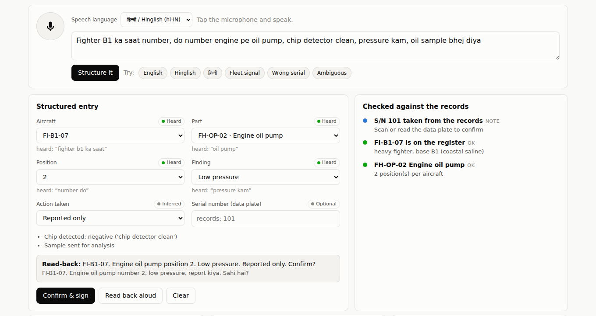
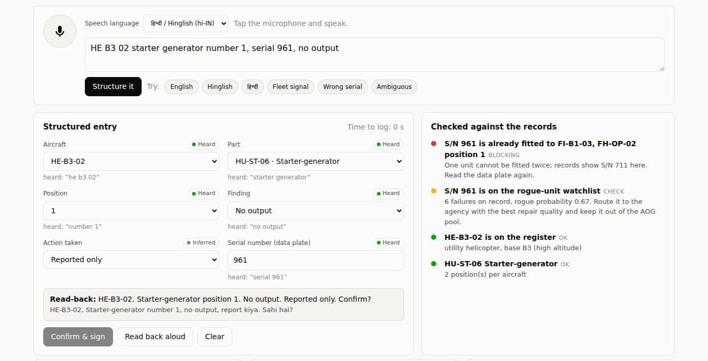

# NIRANTAR Milestone 2: SAARTHI snag entry

> **Status:** built and tested (68 tests passing in the whole repository). The SAARTHI tab of the web console takes a spoken or typed snag in Hindi, Hinglish or English, turns it into a structured record, checks it against the fleet records and signs it into the evidence ledger.
>
> All data is synthetic (BHARAT-FLEET). No number here is an IAF result.

SAARTHI (सारथी, "charioteer") is module S8 in [Document 3](03_NIRANTAR_PROPOSED_SOLUTION.md#613-saarthi-voice-first-capture-and-the-citation-locked-copilot). This milestone builds its first capability, **speak-to-log**. The troubleshooting copilot and the shift digest come later.

---

## 1. Why this matters

Every model in NIRANTAR is only as good as the maintenance records it learns from. Document 1 lists the usual defects: wrong serial numbers, missing removals, free-text snags that nobody can count, and late entries typed up at the end of a shift. The F-35 ALIS experience showed that extra data-entry burden on maintainers makes the data worse, not better.

SAARTHI attacks this at the source:
- The technician says what they found, in the language they think in.
- The record is structured, checked and signed while they are still standing at the aircraft.
- Errors are caught when they are cheapest to fix, before they reach e-MMS.

---

## 2. How to run

```bash
python -m nirantar serve            # http://127.0.0.1:8050 -> "SAARTHI snag entry" tab
python -m nirantar saarthi-eval     # extractor benchmark -> experiments/results/saarthi_eval.json
python -m pytest -q tests/test_saarthi.py
```

Voice input uses the browser's speech recogniser, so use **Chrome or Edge**. Typing works in every browser, and the six "Try" buttons fill in example snags for a demo without a microphone.

---

## 3. What happens to one snag

```
 speech (hi-IN / en-IN)        "Fighter B1 ka saat number, doosra hydraulic pump leak, badal diya"
        │
        ▼
 1. Normalise        lower-case, Devanagari digits and spelling variants unified
        │
        ▼
 2. Extract          tail, part, position, finding, action, serial
    (schema-        every value must exist in the fleet register; otherwise the field
     constrained)   stays open with a reason or a short list of options
        │
        ▼
 3. Check            against what the records say about this aircraft right now
        │
        ▼
 4. Read back        "FI-B1-07. Hydraulic pump position 2. Leak. Replaced from stores. Confirm?"
        │
        ▼
 5. Confirm & sign   Ed25519-signed, hash-chained ledger entry (CHITRAGUPTA);
                     fleet state rolls forward (unit out, spare in)
```



*A Hinglish snag. "Chip detector clean" becomes a negative finding, and "oil sample bhej diya" is recorded as a sample, not as the pump being sent away.*



*A spoken serial that the records place on another aircraft blocks the entry. The same unit is also on the rogue-unit watchlist.*

### 3.1 Extraction never invents a value

Each field carries where it came from, and the screen shows it next to the field:

| Source | Meaning | Example |
|---|---|---|
| **Heard** | Stated in the utterance | "doosra" → position 2 |
| **Inferred** | Deduced from the schema | B2 has only fighters, so "B2 tail 12" is FI-B2-12; a radar has one position |
| **Choose one** | Several schema values fit; SAARTHI offers buttons | "B1 05 pump" could be a fighter or a helicopter, and any of four pumps |
| **Needed** | Not said and not deducible | No position given for a two-position part |

The extractor also handles these cases:
- **Negations.** "chip detector clean" and "no leak" are recorded as negative findings, not as the fault.
- **Samples sent.** "Oil sample bhej diya" is recorded as a sample sent for analysis, not as the pump sent for repair.
- **"Fixed it" is not "OK".** "Leak, theek kiya" (leak, fixed it) is read as a rectification, not as "theek" (OK) negating the leak.
- **Impossible values.** "Brake 3" on a two-position brake, "FI-B1-32" (no such aircraft) and "crack" on a part whose recorded failure modes are only wear and leak are all refused with a reason.

The lexicon (`nirantar/saarthi/lexicon.py`) maps English, Romanised Hinglish and Devanagari words, including loanwords as browser speech recognition spells them (हाइड्रोलिक पंप, बाइट फेल), onto the closed sets in the schema. It is deterministic, has no model weights and runs offline.

### 3.2 Checks against the records

| Check | Status | Example |
|---|---|---|
| Aircraft on the register | OK / blocking | "FI-B1-07 is on the register: heavy fighter, base B1 (coastal saline)" |
| Part fits this aircraft type | blocking | A radar transmitter on a helicopter |
| Serial number vs records | OK / note / check / blocking | Serial spoken but already **fitted to another aircraft** blocks the entry ("One unit cannot be fitted twice"). This is SATYA's wrong-serial defect class, caught at the source |
| Position from serial | note | Serial given but no position: the records place it |
| Rogue-unit watchlist (SUSHRUTA) | check | "S/N 71 is on the rogue-unit watchlist: 7 failures on record, rogue probability 0.90. Route it to the agency with the best repair quality and keep it out of the AOG pool" |
| Fleet signal (DRISHTI) | note | "Matches a confirmed fleet signal: hydraulics corrosion in humid north-east: 2.6x the fleet rate per flight hour. This report adds evidence" |
| Spares at this base | OK / check | "No serviceable hydraulic pump at B1"; lateral-transfer options when another base has stock |
| Deferral | check | "Deferral needs supervisor authorisation." SAARTHI never relaxes a safety margin |
| Possible duplicate | check | Same aircraft, part, position and finding already logged |
| Missing fields | blocking | "Still needed: position" |

**Confirm & sign** stays disabled while anything is blocking. The server re-runs the checks on confirm and refuses an incomplete entry, so the browser cannot bypass them.

### 3.3 What is signed

Each `snag_entry` in the ledger records:
- the structured fields;
- the serial reported and the serial on record;
- the unit removed and the spare fitted;
- negative findings;
- the raw transcript;
- input mode (voice or typed) and language;
- seconds taken and fields corrected by hand;
- the check outcomes;
- the extractor version.

When the console restarts, the fleet state is rebuilt from the records plus these signed entries, so the checks stay consistent across sessions.

Technician-level data is shown only as unit totals (time to log, share left uncorrected). This follows Document 3's rule that SAARTHI data is "systems, not people", never used for performance policing.

---

## 4. Results

### 4.1 Hand-written gold set (36 utterances, 160 scored fields)

The gold set is in `tests/saarthi_gold.py`. It was written before the extractor was run on it and uses phrasing the generator does not produce: full sentences, "came on", "kaam nahi kar raha", "kabhi kabhi band ho jata hai", spelled letters, and Devanagari loanwords.

| Run | Utterances fully right | Fields right | Asked instead of answering | **Silent wrong** |
|---|---|---|---|---|
| First run (before any fix) | 32 / 36 | 156 / 160 | 3 | 1 |
| After review | 36 / 36 | 160 / 160 | 0 | **0** |

The four first-run misses:
- **Real bug (fixed).** In "starter generator two no output", the words "two no" were read as a position ("do number" style), which swallowed "no output".
- **My own gold-label errors (corrected, two cases).**
  - Twice I expected "crack" on a lead-lag damper, but the schema's damper failure modes are only wear and leak, so asking is the correct behaviour.
  - Once I expected SAARTHI to ask which "fuel pump", but only the fighter has one, so inferring the part is correct.

The "after" row is therefore not an independent test any more. The first-run row is the fair estimate.

### 4.2 Synthetic benchmark (900 utterances, 300 per language)

`python -m nirantar saarthi-eval` generates snags with known truth in each style an ASR produces:
- spelled tail letters ("f i b one zero seven", "एफ आई बी वन जीरो सेवन");
- number words in three scripts;
- fillers ("haan", "matlab", "तो");
- clauses in varying order, with or without punctuation.

| | English | Hinglish | Hindi | All |
|---|---|---|---|---|
| Complete and correct | 100% | 100% | 100% | 100% |
| Any silent error | 0% | 0% | 0% | 0% |

The first version of this benchmark scored 95%. It exposed the "theek kiya" bug described in §3.1, which was then fixed. The generator draws its part and failure words from the extractor's own lexicon, so 100% here shows **parsing robustness**: numbers, scripts, word order and ambiguity handling. It does not show vocabulary coverage. The gold set (§4.1) is the better guide to that.

### 4.3 What these numbers do not show

- **Real speech.** Nothing here was spoken on a flight line. Recognition errors under engine noise, accents and radio chatter come first and are not measured. The target in Document 3 (E10: under 30 s to log, SUS ≥ 75) needs a trial with real maintainers.
- **Real vocabulary.** Real fleets have thousands of part numbers and local slang. The lexicon covers the 16 synthetic part numbers. A production build would generate the part lexicon from the IPC (illustrated parts catalogue) and learn synonyms from past e-MMS free text, still without letting the extractor emit a value that is not in the register.
- **Time to log.** The console measures it from the first keystroke or microphone tap to the signature, but the only entries so far are from automated tests.

---

## 5. Design choices

| Choice | Why |
|---|---|
| A rule-based, schema-constrained extractor rather than an LLM | Deterministic, explainable, offline, no weights to accredit. It cannot hallucinate a part number. An LLM can be added later behind the same constraint (constrained decoding to the register) |
| Browser speech recognition for the demo | Zero install. **In Chrome, audio goes to the browser vendor's servers**, which the screen states. A field build would run an offline Indian-language recogniser (e.g. IndicConformer) on the tablet or base server |
| "Ask, don't guess" | A wrong value that looks right does more harm than an empty one. Every benchmark reports silent errors separately |
| Read-back before signing | The aviation habit of read-back and confirm. The entry is also spoken aloud on request |
| Fleet state rolled forward from signed entries | The checks see what earlier snags changed (unit removed, spare issued), even after a restart |

---

## 6. Files

| File | Role |
|---|---|
| `nirantar/saarthi/lexicon.py` | Vocabulary in three scripts, mapped to schema values |
| `nirantar/saarthi/extract.py` | Normaliser and schema-constrained extractor with per-field provenance |
| `nirantar/saarthi/service.py` | `SaarthiDesk`: checks against records, read-back, confirm and sign, state replay |
| `nirantar/saarthi/evaluate.py` | Synthetic utterance generator and scorer |
| `nirantar/ui/server.py` | `/api/saarthi/options`, `/parse`, `/check`, `/confirm`, `/entries` |
| `nirantar/ui/static/*` | SAARTHI tab: microphone, structured card, checks, signed-entry log |
| `tests/test_saarthi.py`, `tests/saarthi_gold.py` | 15 tests plus the gold set; one more endpoint test is in `tests/test_ui_server.py` |

## 7. Next steps

1. **Scan-to-log.** A QR data-plate scan fills the serial and removes the largest error class.
2. **Offline recogniser.** IndicConformer (or Whisper) on a base server, with the same extractor behind it.
3. **Citation-locked copilot.** "Similar past snags" from DRISHTI clusters, and approved-manual references; no citation means no answer.
4. **Usability trial (E10).** Volunteer ex-servicemen, measuring time to log, correction rate and SUS.
