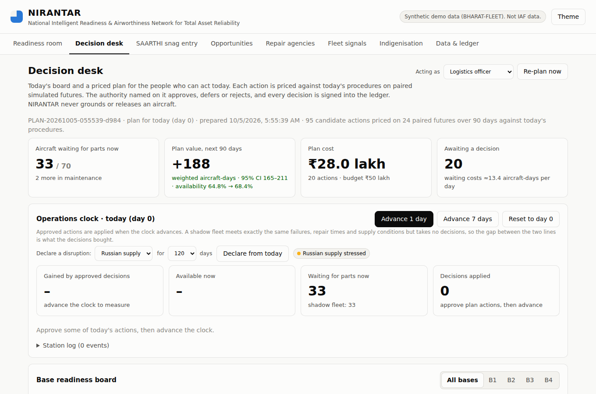
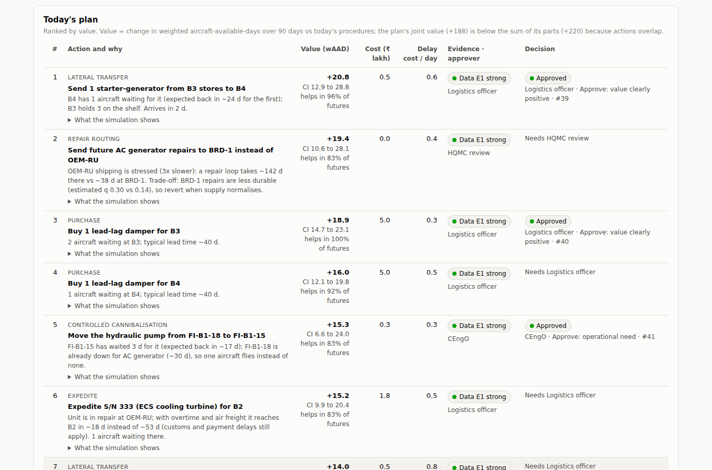
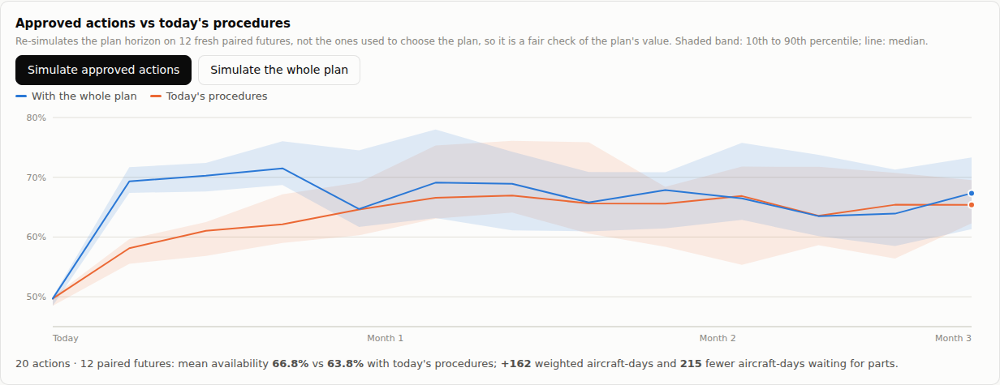

# NIRANTAR Milestone 3: CHANAKYA decision desk

> **Status:** built and tested (79 tests passing in the whole repository). The **Decision desk** tab shows today's fleet board and a priced plan of actions. Each action can be approved, deferred or rejected only by the role the Action Authority Matrix names, and every decision is signed into the ledger.
>
> All data is synthetic (BHARAT-FLEET). No number here is an IAF result.

This milestone turns the Milestone 1 engine into the daily **Base Readiness Huddle** of [Document 3 §4.1](03_NIRANTAR_PROPOSED_SOLUTION.md#41-the-rhythm). It answers the question an engineering officer faces every morning: *with what we have today, which actions return the most aircraft to the line, and who has to sign for each?*

---

## 1. How to run

```bash
python -m nirantar serve        # http://127.0.0.1:8050 -> "Decision desk" tab
python -m nirantar plan         # prepare today's plan offline (also signs it into the ledger)
```

A plan is already saved in `experiments/results/plan.json`, so the tab opens instantly. **Re-plan now** builds a fresh plan in the background (about 20 s on a 4-core machine, using all cores up to 8).

> Numbers below are re-priced as of Milestone 5. Two changes since this milestone was first built:
> - **Exact continuation (Milestone 4):** the desk continues the fleet state exactly, keeping remaining maintenance work, how long each aircraft has waited, and first-come-first-served order.
> - **Realistic expediting (Milestone 5):** expedited freight still pays a stressed supplier's customs and payment delays. A leg takes 2 days when supply is normal, 6 days when stressed and 16 days when disrupted.
>
> The same milestone added **repair routing** as an action.

---

## 2. What the desk does

```
 fleet state now (end of the records)
        │
        ▼
 1. Board         every aircraft: ready / in maintenance / waiting for parts,
                  what it waits for, when the repair pipeline should return a unit,
                  and its 7-day risk of a new failure (DHANVANTARI)
        │
        ▼
 2. Candidates    for each aircraft waiting for parts, the actions people can take today
                  (95 candidates on today's board)
        │
        ▼
 3. Price         paired simulation against today's procedures (MRV, common random numbers):
                  screen all on 8 futures, refine the promising ones on 24
        │
        ▼
 4. Select        certain value only (95% CI above zero, gains in ≥75% of futures),
                  evidence E1-E3, no resource used twice, within budget
        │
        ▼
 5. Verify        the whole plan simulated jointly; cost of a week's delay per action
        │
        ▼
 6. Decide        only the named authority can approve, defer or reject;
                  each decision is a signed ledger entry with role and reason code
```



### 2.1 Action types

New in the digital twin for this milestone:

| Action | What happens in the twin | Who approves (E1/E2) |
|---|---|---|
| **Controlled cannibalisation** | A part moves from an aircraft that is **already down** for another part to an aircraft waiting only for that part. One aircraft flies instead of none. The twin refuses the move if the donor is flyable. | CEngO |
| **Lateral transfer** | A spare on another base's shelf is sent across, arriving in 2 days | Logistics officer |
| **Expedite** | A unit already in the repair pipeline gets overtime (repair time × 0.7), air freight and the front of its agency's queue. Each shipping leg is capped at 2 days × the supplier's regime multiplier, because customs and payment delays still apply | Logistics officer |
| **Repair-queue priority** | A queued unit is repaired next | BRD Chief Engineer |
| **Purchase** | One new unit, offered only if its lead time fits the 90-day horizon | Logistics officer (Command logistics above ₹25 lakh) |
| **Repair routing** (added in Milestone 5) | Future repairs of a part go to another approved agency, offered when the default agency's supplier is stressed or disrupted | HQMC review |

Runs without these actions give bit-identical results to before, so every Milestone 1 number still holds.

### 2.2 Choosing a cannibalisation donor

Cannibalisation only helps if the donor would stay down longer than the receiver anyway. The board estimates, for every aircraft waiting for parts, when the repair pipeline will deliver its part:
- Units are given out first come, first served.
- Each unit's estimate counts the shipping and the remaining repair time.
- Shipping time is stretched by the supplier's current regime.

Donors are the two longest-waiting aircraft at the same base and of the same type. An aircraft takes part in at most one cannibalisation, never as both donor and receiver.

### 2.3 What each plan line tells the approver



Each plan line shows:
- **The action in plain words**, e.g. *"Move the hydraulic pump from FI-B1-18 to FI-B1-15"*.
- **Why**, e.g. *"FI-B1-15 has waited 3 d for it (expected back in ~17 d); FI-B1-18 is already down for AC generator (~30 d), so one aircraft flies instead of none."*
- **What the simulation shows.** It lists which aircraft lose waiting time and by how much (trace-diff).
- **Value.** Weighted aircraft-days over 90 days, with a 95% CI and the share of futures in which the action helps.
- **Cost** in ₹ lakh, and the **delay cost**: aircraft-days lost per day the decision waits.
- **Data evidence grade** (E1 to E5) and the **approving authority** from the Action Authority Matrix.
- **Decision controls**, shown only to the role allowed to decide. Anyone else sees *"Needs CEngO"*. The server enforces the same rule.

The 75 candidates that were *not* selected are listed with their reasons:
- value not certain;
- gains in too few futures;
- screened out;
- conflicts with a better action;
- the waiting aircraft are already covered by better actions.

---

## 3. Results on today's board

Today the fleet has **33 of 70 aircraft waiting for parts**, and 2 more in maintenance.

| | Value |
|---|---|
| Candidate actions generated | 95: 43 expedites, 36 cannibalisations, 7 transfers, 6 re-routings, 3 purchases |
| Refined on 24 futures after screening | 79 |
| **Selected** | **20**: 9 expedites, 5 controlled cannibalisations, 3 lateral transfers, 2 purchases, 1 re-routing |
| Approvers | 14 for the Logistics officer, 5 for the CEngO, 1 for HQMC review |
| Cost | ₹28.0 lakh (budget ₹50 lakh) |
| **Plan value, 90 days** (joint, on the 24 futures used to choose it) | **+188 weighted aircraft-days**, 95% CI 165 to 211; availability 64.8% → 68.4% |
| Sum of the 20 individual values | +220. The joint value is lower because actions overlap |
| Aircraft-days waiting for parts saved | 248 |
| **Fresh-future check** (12 futures not used to choose the plan) | **+162 weighted aircraft-days**; availability 63.8% → 66.8%; 215 fewer aircraft-days waiting for parts |
| Cost of waiting, all 20 pending | ≈13 aircraft-days lost per day of delay |



**The honest reading:**
1. **The plan buys time, not a new steady state.** Availability jumps in the first two weeks, as aircraft fly on cannibalised, transferred and expedited parts. The two lines converge by month 2, because the parts were arriving anyway. Lasting gains need what Milestone 1 measured: routing, the priced spares portfolio and rogue quarantine.
2. **Winner's curse.** On the futures used to choose the plan it is worth +188. On fresh futures it is worth +162, about 14% less. Choosing the best of 95 noisy estimates inflates the winners. The console's outcome check always uses fresh futures, and anyone using the +188 figure should quote the +162 next to it. Milestone 4's operations clock measures the realised gain on identical events (docs/07).
3. **Expediting dominates**, because Russian-sourced repairs carry long shipping legs, and Russian supply is already *stressed* (3× slower) when the records end. Expediting brings some OEM-RU units back in 6–18 days instead of 30–50, even though customs and payment delays still apply. How much premium freight can really shorten these legs is an assumption to validate with logistics staff.
4. **No repair-priority actions.** No agency has a queue when the records end, and none forms even under a declared disruption, because the repair agencies have spare capacity in this synthetic world. The action type is built and tested, and it would matter for a saturated depot.
5. **The baseline is today's procedures (P0):** no routine lateral transfers and first-in-first-out repair queues. Under the fully automated NIRANTAR policy (P3), some of these actions would already happen by rule, and their marginal value would be smaller.

---

## 4. Governance built in

| Rule (Document 3 §10) | How the desk enforces it |
|---|---|
| NIRANTAR never grounds or releases an aircraft | Cannibalisation donors must already be unserviceable; the twin refuses a flyable donor |
| Action Authority Matrix | Each action carries its approver for evidence grades E1–E3. The server refuses a decision from any other role. E4/E5 actions are not recommended |
| Asymmetric Evidence Principle | Every desk action is safety-neutral (logistics, repair order, consolidation of unserviceable aircraft). Deferrals and life extensions are not proposed |
| Reason codes for every decision | Approve, defer and reject each need a reason code from a fixed list. The decision, the role and the reason are signed together |
| Uncertainty by default | Every value shows a 95% CI and the share of futures in which it helps; the plan shows joint vs sum-of-parts, and a fresh-future check |

### 4.1 Ledger fix found while building this

Each console start used to create a new signing key under the same name, "web-console". After a restart, the first new signature replaced the old key in the ledger's trusted-key list, so all earlier "web-console" entries failed verification.

Now:
- Each console keeps a long-lived key in `keys/web-console.key` next to its results. The file is git-ignored and never committed.
- The signer's name carries the key's fingerprint, e.g. `web-console@23bb9287`.
- The ledger refuses an actor whose key changes.

A test covers restart, append and verify.

---

## 5. Files

| File | Role |
|---|---|
| `nirantar/sanjaya/twin.py` | New actions: `transfer`, `expedite`, `priority`, `cann`; snapshot adds who waits for what and remaining work |
| `nirantar/chanakya/desk.py` | Board, pipeline arrival estimates, candidate generation, two-stage pricing on a process pool, selection, joint check, Cost-of-Delay |
| `nirantar/chanakya/plan_service.py` | Plan build (background), signing, authority checks, reload, approved-plan simulation |
| `nirantar/chitragupta/ledger.py` | Persistent node keys; refuse silent re-keying |
| `nirantar/ui/*` | Decision desk tab, `/api/plan`, `/api/plan/build`, `/api/plan/outcome`; decisions carry a role |
| `nirantar/__main__.py` | `python -m nirantar plan` |
| `tests/test_desk.py`, `tests/test_ui_server.py`, `tests/test_ledger.py` | 11 new tests: twin actions, board, conflicts, serial = parallel, authority, reload, endpoints, key persistence |
| `experiments/results/plan.json` | Today's plan, ready to open |

## 6. Next steps

1. **Rolling days.** Advance the twin day by day with approved actions applied, so tomorrow's board reflects today's decisions and the override-outcome ledger can learn.
2. **Supply-shock desk.** Re-plan under the RU disruption scenario, where repair queues form and repair-priority actions matter.
3. **More action types.** Bundle a predicted task into a planned inspection window, and route individual carcasses by agency quality (SUSHRUTA).
4. **Ranking and selection (OCBA).** Spend more futures on close calls, which also reduces the winner's curse.
