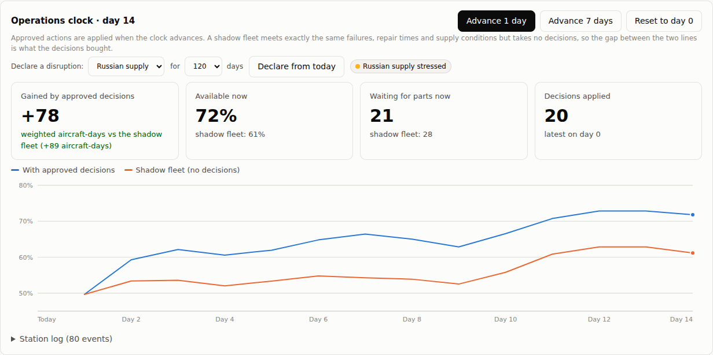

# NIRANTAR Milestone 4: Operations clock

> **Status:** built and tested (86 tests passing in the whole repository when built; 90 after Milestone 5). The Decision desk now runs the station forward in time. Approved actions are applied, aircraft fail and come back, a fresh plan is prepared for each new day, and a **shadow fleet** that meets identical events with no decisions shows what the decisions actually bought.
>
> All data is synthetic (BHARAT-FLEET). No number here is an IAF result.

Milestone 3 priced a plan for one frozen "today". A plan that never meets tomorrow cannot be judged. This milestone closes the loop of the daily readiness rhythm ([Document 3 §4](03_NIRANTAR_PROPOSED_SOLUTION.md#4-concept-of-operations-the-readiness-rhythm)):

```
 board → plan → approve (signed) → advance the clock → actions applied (signed "execution")
   ↑                                                            │
   └──── new board, new plan for the new day ◄── failures, repairs, arrivals
```

---

## 1. How to use it

```bash
python -m nirantar serve          # Decision desk tab -> "Operations clock" card
```

1. Pick a role under **Acting as**, then approve some of today's actions.
2. Press **Advance 1 day** or **Advance 7 days**. The approved actions are applied, and each one is signed into the ledger as an `execution` entry.
3. A new plan for the new day is prepared in the background, taking about 20 s. Decisions on the old plan are refused from then on.
4. Repeat. **Reset to day 0** goes back to the end of the records.

The clock state is kept in `experiments/results/live/`. Git ignores that folder, so every machine has its own station.



---

## 2. Live fleet and shadow fleet

Both fleets start from the same state and advance on the **same random events**: which part fails when, how long each repair takes, and how the supply regime moves. The only difference is that the live fleet receives the approved actions. So the gap between them is what the decisions bought, **measured on identical events**, not estimated from a model of the future.

This is the strongest form of evidence the console can give. It is still a simulation, so it shows what the decisions buy *in the synthetic world*, but it removes the "lucky week" explanation: both fleets had the same week.

### Result on the demo path

I approved all 20 actions of today's plan (₹28.0 lakh, re-priced in Milestone 5) and advanced the clock 7 + 7 days.

| After 14 days | Live (with decisions) | Shadow (no decisions) |
|---|---|---|
| Available now | 72% | 61% |
| Waiting for parts | 21 | 28 |
| **Gained by the decisions** | **+78 weighted aircraft-days (+89 aircraft-days)** | |

Compare this with the plan's forecasts for the full 90 days: +188 on the futures used to choose it, and +162 on fresh futures (docs/06). Most of a plan's value comes in the first weeks, as aircraft fly on cannibalised, transferred and expedited parts, so two weeks in it has realised about half. This is one path of many; another run of events would give a different number.

---

## 3. Continuing exactly from one day to the next

Advancing in steps must not change the physics. Each advance now continues exactly from the saved state:

| Carried across the step | Why it matters |
|---|---|
| Remaining maintenance work on each aircraft | Otherwise an inspection in progress would end at every step, inflating availability |
| How long each aircraft has waited, and first-come-first-served order | Parts go to the longest-waiting aircraft; the board's estimated return dates assume this |
| Repair pipeline (in transit, queued, in repair) and supply regime | Unchanged from earlier milestones |
| Units bought in earlier steps | New serial numbers survive into the next day (this broke at first and is now tested) |

**Check for step bias.** I ran 30 futures of 60 days two ways: as one run, and as 60 one-day steps. Mean availability was 62.3% and 62.8%. The difference, +0.5 points, is well inside the ±1.8-point 95% margin, so no step bias is detectable.

The Decision desk now prices from the same exact-resume state. This changed today's plan slightly; docs/06 has the re-priced numbers.

---

## 4. The audit trail

Every step of a decision's life is a signed, hash-chained ledger entry:

| Entry | Written when | Contents |
|---|---|---|
| `recommendation` | the plan is prepared | action, value with CI, cost, evidence grade, approving authority, plan id, day |
| `decision` | an approver signs | verdict, reason code, role |
| `execution` | the clock applies it | the recommendation it executes, the day applied |

An auditor can follow any action from recommendation through approval to execution, and see its effect in the live-versus-shadow log.

---

## 5. Limits

- **One path at a time.** The live-versus-shadow gap is exact for the events that happened, but those events are one sample. For the expected value, use the desk's fresh-future check.
- **Synthetic truth.** The twin is the ground truth here. A SAARTHI snag entry is a record, and it does not change the twin; after the clock advances, SAARTHI checks against the new day's state. In service it is the other way round: the records are all there is.
- **The reliability model is not refitted** as days pass. A rolling refit (DHANVANTARI) is the natural next step.
- **Fixed policy.** Both fleets run today's procedures (P0). The desk's actions are the only difference.

---

## 6. Files

| File | Role |
|---|---|
| `nirantar/sanjaya/clock.py` | `OperationsClock`: live and shadow fleets, daily log, station log, persistence, reset |
| `nirantar/sanjaya/twin.py` | `resume=True` (remaining work, waiting times, first-come order); purchased units carried in snapshots |
| `nirantar/chanakya/desk.py`, `plan_service.py` | Pricing from the exact-resume state; plans carry their day; approved-but-unapplied items |
| `nirantar/saarthi/service.py` | SAARTHI checks against the current day; snag entries carry their day |
| `nirantar/ui/*` | Clock card (advance, reset, live vs shadow chart, station log); `/api/clock`, `/api/clock/advance`, `/api/clock/reset` |
| `tests/test_clock.py`, `tests/test_ui_server.py` | 7 new tests: no gap without decisions, gap with them, waiting time carried, purchases across days, persistence and reset, endpoint flow |
