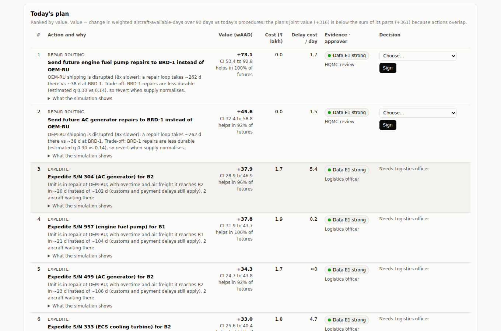
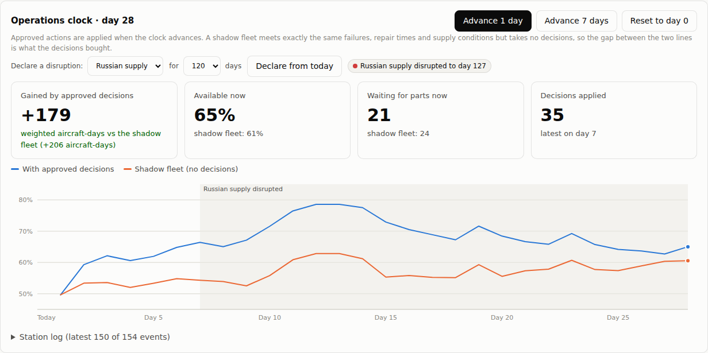

# NIRANTAR Milestone 5: Crisis mode (declared supply disruption)

> **Status:** built and tested (90 tests passing in the whole repository). On any day of the operations clock, exercise control can declare a supplier's shipping, customs and payments disrupted for 30 to 180 days. Both fleets feel it, the Decision desk re-plans for the crisis (re-routing repairs to Indian depots, expediting what is stuck), and the clock measures what the crisis decisions bought.
>
> All data is synthetic (BHARAT-FLEET). No number here is an IAF result.

This is step 5 of the demo storyline in [Document 3 §13.3](03_NIRANTAR_PROPOSED_SOLUTION.md#133-demo-storyline-7-minutes-72-hours-at-air-force-station-nirantar): *"Shock: inject 'foreign supply disrupted'."* It is also the situation the whole design is built for. Milestone 1 found that NIRANTAR's value concentrates under supply stress.

---

## 1. How to use it

In the **Decision desk** tab, in the Operations clock card:

1. Choose **Russian supply** or **French supply** and a length (30, 60, 120 or 180 days), then press **Declare from today**.
2. The disruption is signed into the ledger as a `scenario` entry, and a red badge shows it is active. The chart shades the disrupted period.
3. The desk prepares a **crisis plan** that knows the disruption and its declared end. While it is being prepared, signing is paused ("Re-planning…").
4. Approve the crisis actions, then advance the clock as usual. **Reset to day 0** clears the disruption.

---

## 2. What changes in a crisis

| | Normal supply | Russian supply stressed (3×) | Russian supply disrupted (8×) |
|---|---|---|---|
| OEM-RU repair loop (repair plus two shipping legs) | ~94 d | ~142 d | ~262 d |
| The same repair at BRD-1 (Indian depot, also approved for these parts) | ~38 d | ~38 d | ~38 d |
| Expedited shipping leg from OEM-RU | 2 d | 6 d | 16 d |

**Two modelling changes came with this milestone:**

1. **Expedited freight still pays customs and payment delays.** Before, an expedited unit flew home in 2 days even from a stressed supplier, which was unrealistic. The leg is now 2 days × the supplier's regime multiplier. This lowered and re-priced today's plan (docs/06).
2. **Repair routing is a desk action.** When a part's default repair agency is in a stressed or disrupted country, the desk proposes sending future repairs of that part to an approved agency in a country with normal supply. The approver is HQMC. Each proposal states the trade-off from the reliability model (SUSHRUTA), e.g. *"BRD-1 repairs are less durable (estimated q 0.30 vs 0.14), so revert when supply normalises."*

**The 90-day horizon flatters routing.** Faster but less durable repairs pay off within 90 days, while their cost, earlier repeat failures, lands later. The desk prices over 90 days, so routing proposals carry the durability warning, and the routing should be reverted when supply recovers.

---

## 3. Result on the demo path

Starting from the end of the records:
1. Approve all 20 actions of today's plan, then advance 7 days.
2. Declare **Russian supply disrupted for 120 days** (day 7 to day 127).
3. Approve the crisis plan, then advance 7 + 7 + 7 days.

**The crisis plan on day 7:**

| | Value |
|---|---|
| Candidates | 60 |
| Selected | **15**: 8 expedites, **3 re-routings** (engine fuel pump, AC generator and radar transmitter repairs to BRD-1), 3 controlled cannibalisations, 1 purchase |
| Approvers | 9 for the Logistics officer, 3 for HQMC review, 3 for the CEngO |
| Cost | ₹19.8 lakh |
| **Value, 90 days** (selection futures) | **+316 weighted aircraft-days**, 95% CI 286 to 345 |
| Top action | Re-route engine fuel pump repairs to BRD-1: **+73** (CI 53 to 93) at no purchase cost |

For comparison, today's normal-supply plan is worth +188 on the same basis. **The same desk finds about 70% more readiness to buy in a crisis**, mostly by re-routing repairs away from the disrupted supplier.

**On the clock, day 28** (three weeks into the disruption):

| | Live (with decisions) | Shadow (no decisions) |
|---|---|---|
| Available now | 65% | 61% |
| Waiting for parts | 21 | 24 |
| **Gained by the decisions since day 0** | **+179 weighted aircraft-days (+206 aircraft-days)** | |
| Decisions applied | 35 (20 on day 0, 15 on day 7) | 0 |

The shaded band is the disruption. Over the first two weeks of the crisis the live fleet ran 10 to 16 points above the shadow fleet, and the gap narrows as both fleets start receiving the parts they had been waiting for. This is one path of events; the fresh-future check on the desk gives the expected value.

---

## 4. Limits

- **A declared disruption is an exercise input.** The supplier regime model still drifts on its own, but a declared disruption forces the regime for the stated period. Real intelligence on how long a disruption lasts would feed in here.
- **Routing is all-or-nothing per part.** A real HQMC order might split work, or route only some bases' carcasses.
- **No repair queues form**, even in a disruption, because the synthetic agencies have spare capacity. So repair-priority actions do not appear. A saturated depot would make them matter.
- **Both fleets run today's procedures (P0).** The fully automated NIRANTAR policy (P3) already routes by expected downtime and would capture part of the routing value by itself.

---

## 5. Files

| File | Role |
|---|---|
| `nirantar/sanjaya/clock.py` | `disrupt()`, the declared-disruption scenario for each advance and for the plan horizon, disruption flags in the daily log |
| `nirantar/sanjaya/twin.py` | Expedited legs scale with the supplier's regime |
| `nirantar/chanakya/desk.py` | Scenario-aware board, pricing and outcome; crisis re-routing candidates with the durability trade-off |
| `nirantar/chanakya/plan_service.py` | Plans carry their scenario |
| `nirantar/ui/*` | Disruption controls, active badge, shaded band on the chart, signing paused while re-planning; `/api/clock/disrupt` |
| `tests/test_clock.py`, `tests/test_desk.py`, `tests/test_ui_server.py` | 4 new tests: disruption on both fleets with no gap, express-freight customs delay, routing candidates only under stress, endpoint flow |
